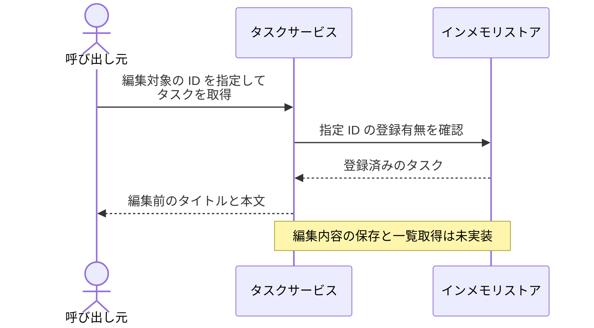
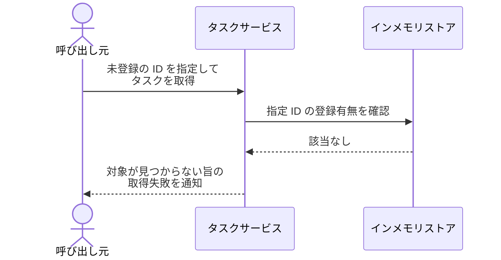

# タスク編集

一覧の中の 1 件のタスクのタイトルと本文を書き換えて保存する単一ユースケース。

- 対応テストファイル: `tests/e2e/単一ユースケース/test_タスク編集.py`

## 正常シナリオ

### セットアップ

| セットアップ | 説明 | 補足 |
| --- | --- | --- |
| Mock | なし（実環境で実行） | - |
| インメモリストア | 編集対象のタスクを 1 件登録済みのストア | `id="t1"` / `title="旧タイトル"` / `content="旧本文"` |

### フロー

### 期待値

- 取得したタスクに編集前のタイトルと本文が入っている

## 異常シナリオ（編集対象のタスクが存在しない）

### セットアップ

| セットアップ | 説明 | 補足 |
| --- | --- | --- |
| Mock | なし（実環境で実行） | - |
| インメモリストア | 編集対象の ID を登録していないストア | 取得失敗を決定的に誘発 |

### フロー

### 期待値

- 「task not found: {指定した ID}」を伴う取得失敗が返る
- ストアの中身が変わっていない
