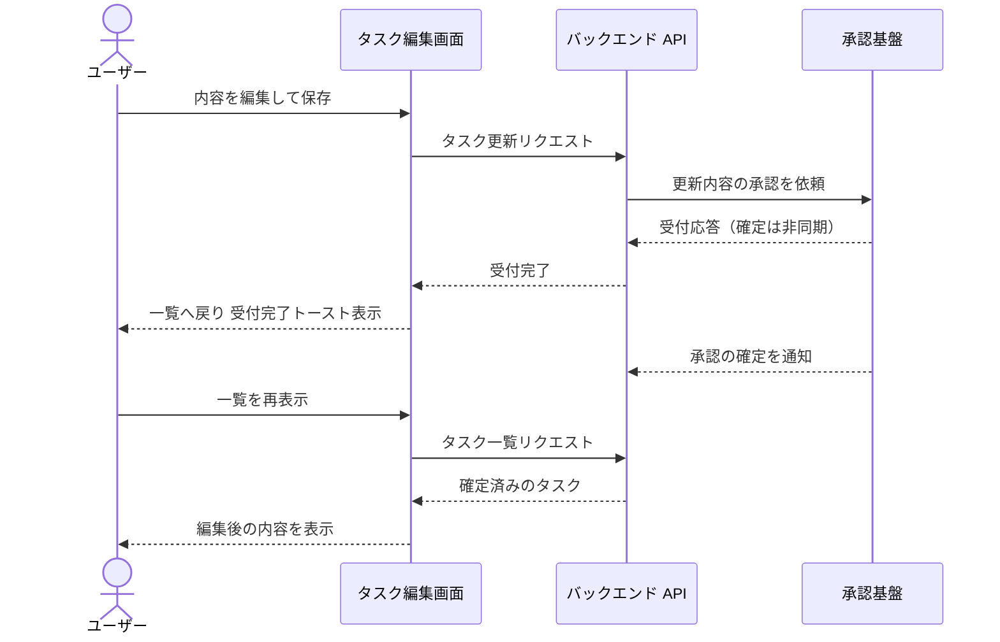
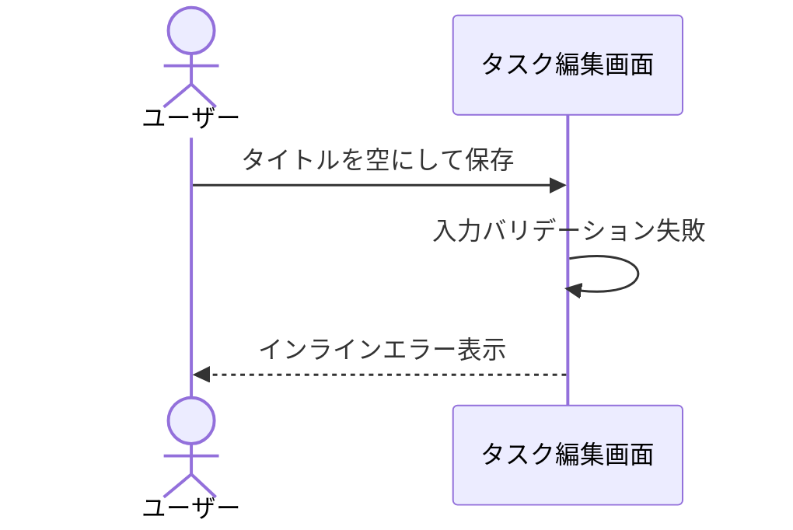
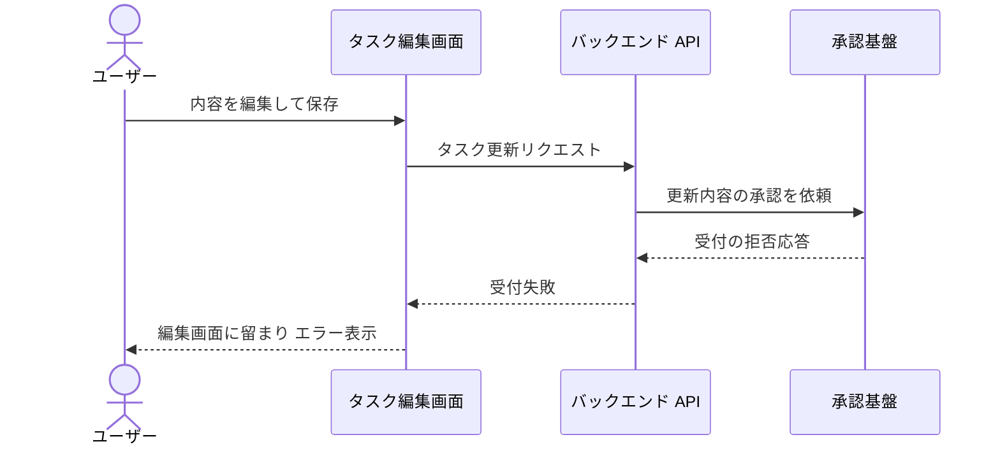

# タスク編集

一覧から選択したタスクの内容を編集して保存する単一ユースケース。

## 正常シナリオ

### セットアップ

| セットアップ | 説明 | 補足 |
| --- | --- | --- |
| Mock | 承認基盤（受付応答を返した後に確定を通知する） | 外部システムのため確定のタイミングを決定的にする |
| タスク | 編集対象のタスクを 1 件登録済み | - |

### フロー

### 期待値

- 保存の確定を待たずに一覧へ戻り、対象タスクが確定待ちとして表示されている
- 承認基盤の確定後、一覧に編集後の内容が表示されている

## 異常シナリオ（タイトルが空）

### セットアップ

| セットアップ | 説明 | 補足 |
| --- | --- | --- |
| Mock | なし（実環境で実行） | - |
| 入力 | タイトルを空にして保存 | 検証失敗を決定的に誘発 |

### フロー

### 期待値

- インラインエラーが表示され、保存されていない

## 異常シナリオ（承認基盤が受付を拒否）

### セットアップ

| セットアップ | 説明 | 補足 |
| --- | --- | --- |
| Mock | 承認基盤（受付を拒否する応答を返す） | 受付失敗を決定的に誘発 |
| タスク | 編集対象のタスクを 1 件登録済み | - |

### フロー

### 期待値

- 受付に失敗した旨のエラーが表示され、編集画面に留まっている
- 一覧に確定待ちのタスクが増えていない
