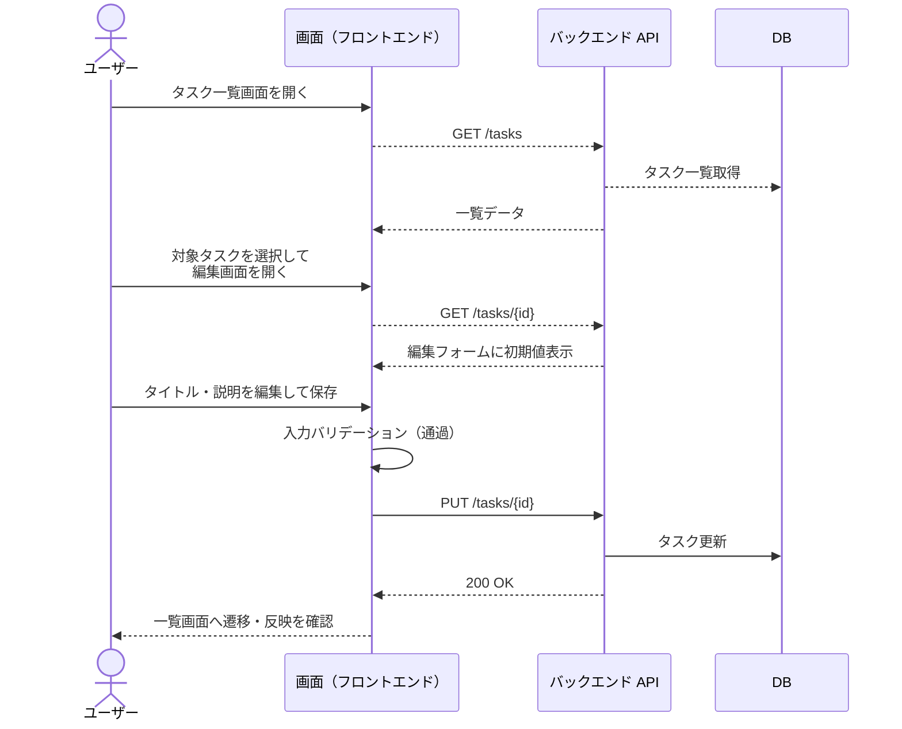
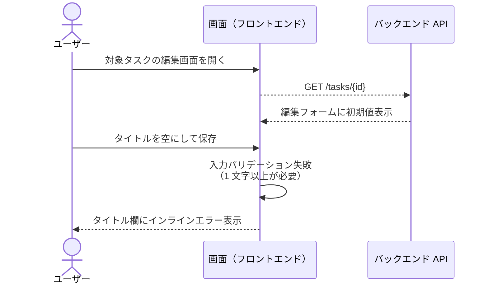
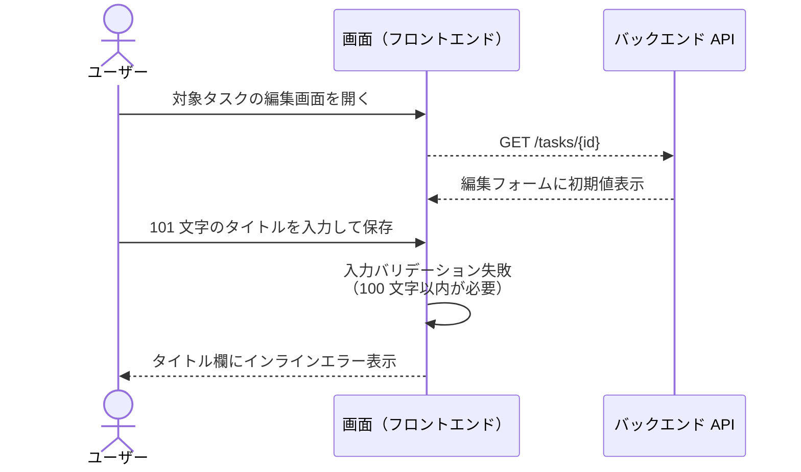

# タスク編集

ログイン中ユーザーが一覧から自分のタスクを選び、内容を編集して保存する単一ユースケース。

- 対応テストファイル: `tests/e2e/単一ユースケース/task_edit.spec.ts`

## 正常シナリオ

### セットアップ

| セットアップ | 説明 | 補足 |
| --- | --- | --- |
| Mock | なし（実環境で実行） | - |
| `createUser` | ログイン中ユーザー A | - |
| `createTask` | userA が所有する編集対象タスク | `title: 編集前タスク` |

### フロー

### 期待値

- タスク一覧画面に編集後のタイトルが表示されている
- DB の該当タスクレコードのタイトル・説明が編集後の値になっている

## 異常シナリオ（タイトル未入力での保存）

### セットアップ

| セットアップ | 説明 | 補足 |
| --- | --- | --- |
| Mock | なし（実環境で実行） | - |
| `createUser` | ログイン中ユーザー A | - |
| `createTask` | userA が所有する編集対象タスク | `title: 編集前タスク` |

### フロー

### 期待値

- タイトル欄の直下にインラインエラーが表示され、編集画面に留まっている
- DB の該当タスクレコードのタイトルが編集前の値のまま

## 異常シナリオ（タイトル 100 文字超での保存）

### セットアップ

| セットアップ | 説明 | 補足 |
| --- | --- | --- |
| Mock | なし（実環境で実行） | - |
| `createUser` | ログイン中ユーザー A | - |
| `createTask` | userA が所有する編集対象タスク | `title: 編集前タスク` |

### フロー

### 期待値

- タイトル欄の直下にインラインエラーが表示され、編集画面に留まっている
- DB の該当タスクレコードのタイトルが編集前の値のまま
