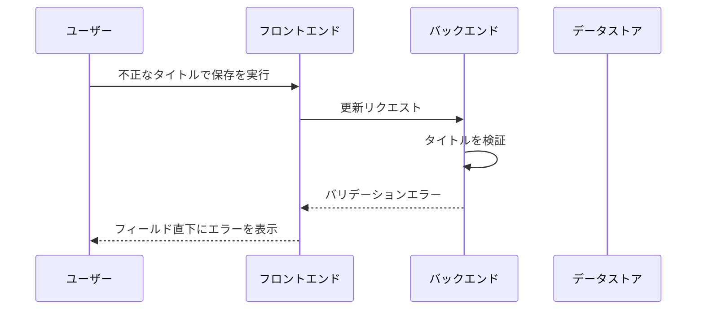

# タスク編集

現状の実装から起こした単一 UC。

## 正常シナリオ

### 期待値

- 一覧に編集後のタイトルと本文が表示されている
- バックエンドがタイトルの検証を通したうえで保存している

## 異常シナリオ（タイトルが不正）

タイトルの検証はフロントエンドだけに任せず、バックエンドでも行う。
フロントエンドの検証を迂回したリクエストでも保存されないことを確認する。

### セットアップ

- 編集対象のタスクが 1 件存在する

### フロー

### 期待値

- バックエンドがバリデーションエラーを返す
- データストアのタスクが更新されていない
- 一覧に編集前のタイトルと本文が表示されている
