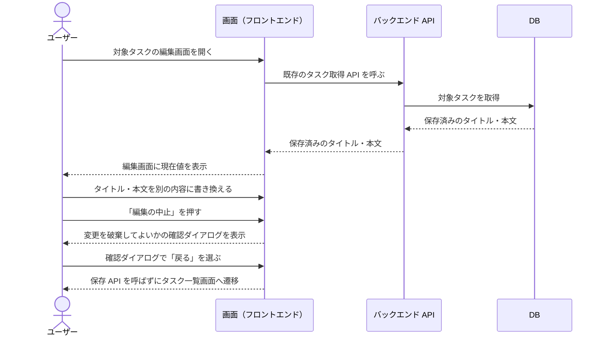
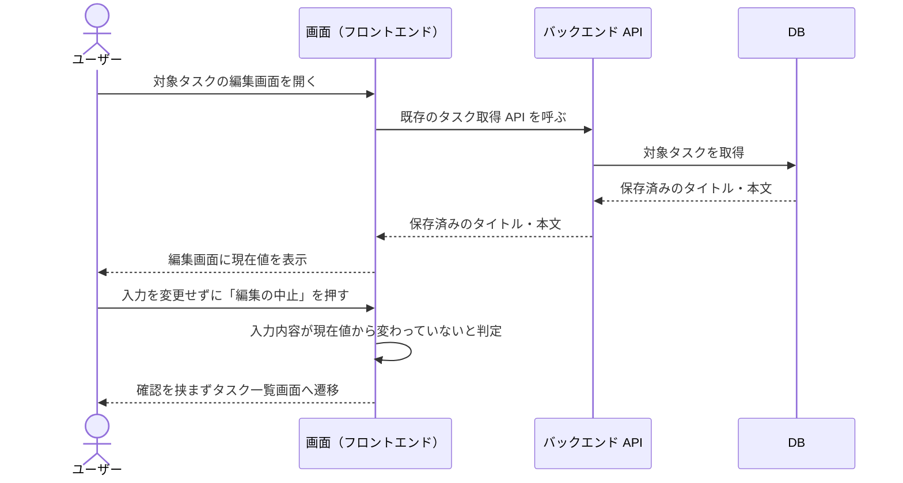
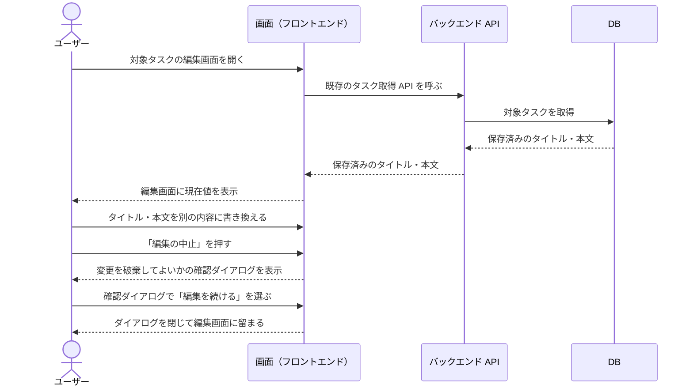
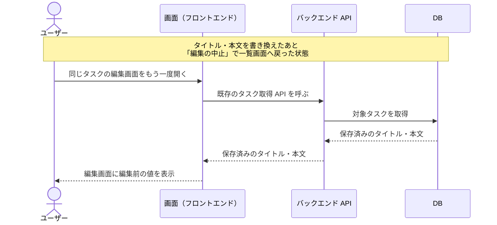

# タスク編集の中止

タスク編集画面を開いているユーザーが、入力した変更を保存せずに編集を中止してタスク一覧画面へ戻る単一ユースケース。
保存 API を呼ばずに画面上の入力内容だけを破棄するため、対象タスクの内容は編集前のまま保持される。

- 対応テストファイル: `tests/e2e/単一ユースケース/task_edit_cancel.spec.ts`

## 正常シナリオ（入力を変更してから中止する）

### セットアップ

| セットアップ | 説明 | 補足 |
| --- | --- | --- |
| Mock | なし（実環境で実行） | - |
| `createUser` | ログイン中ユーザー A | - |
| `createTask` | userA が所有する編集対象のタスク | タイトル・本文とも初期値を入れておく |

### フロー

### 期待値

- タスク一覧画面が表示されている
- 一覧の対象タスクが編集前のタイトルで表示されている
- 対象タスクのタイトル・本文が編集前の値のまま変わっていない

### 補足

- 戻り先は既存のタスク一覧画面をそのまま使う（epic 横断要件「編集画面からの離脱先はタスク一覧画面に統一する」「一覧画面のレイアウトは変更しない」に基づく）。
- 編集画面の初期表示に使うタスク取得は既存 API を利用し、中止時は保存 API を一切呼ばない（epic 横断要件「新規 API を追加しない」に基づく）。
- 対応環境は既存のタスク一覧画面と同じものを使う。編集の中止に固有の環境要件は設けない。

## 正常シナリオ（入力を変更せずに中止する）

### セットアップ

| セットアップ | 説明 | 補足 |
| --- | --- | --- |
| Mock | なし（実環境で実行） | - |
| `createUser` | ログイン中ユーザー A | - |
| `createTask` | userA が所有する編集対象のタスク | タイトル・本文とも初期値を入れておく |

### フロー

### 期待値

- タスク一覧画面が表示されている
- 確認ダイアログを経ずに遷移しており、画面上に確認ダイアログが存在しない
- 対象タスクのタイトル・本文が編集前の値のまま変わっていない

## 正常シナリオ（確認ダイアログで編集を続ける）

### セットアップ

| セットアップ | 説明 | 補足 |
| --- | --- | --- |
| Mock | なし（実環境で実行） | - |
| `createUser` | ログイン中ユーザー A | - |
| `createTask` | userA が所有する編集対象のタスク | タイトル・本文とも初期値を入れておく |

### フロー

### 期待値

- 編集画面が表示されたままである
- 書き換えたタイトル・本文が入力欄に保持されている
- 対象タスクのタイトル・本文が編集前の値のまま変わっていない

## 正常シナリオ（中止したあとに同じタスクの編集画面を開き直す）

### セットアップ

| セットアップ | 説明 | 補足 |
| --- | --- | --- |
| Mock | なし（実環境で実行） | - |
| `createUser` | ログイン中ユーザー A | - |
| `createTask` | userA が所有する編集対象のタスク | タイトル・本文とも初期値を入れておく |

### フロー

### 期待値

- 編集画面のタイトル・本文の入力欄に編集前の値が表示されている
- 中止する前に入力していた内容は編集画面のどこにも表示されていない

## 異常シナリオ

なし（保存 API を呼ばずに画面上の入力を破棄して戻るだけのため、業務的に意味のある異常が発生しない）。
編集画面を開く時点のタスク取得失敗・認可失敗は `タスク編集` の単一ユースケースと結合ドキュメント側で扱う。
