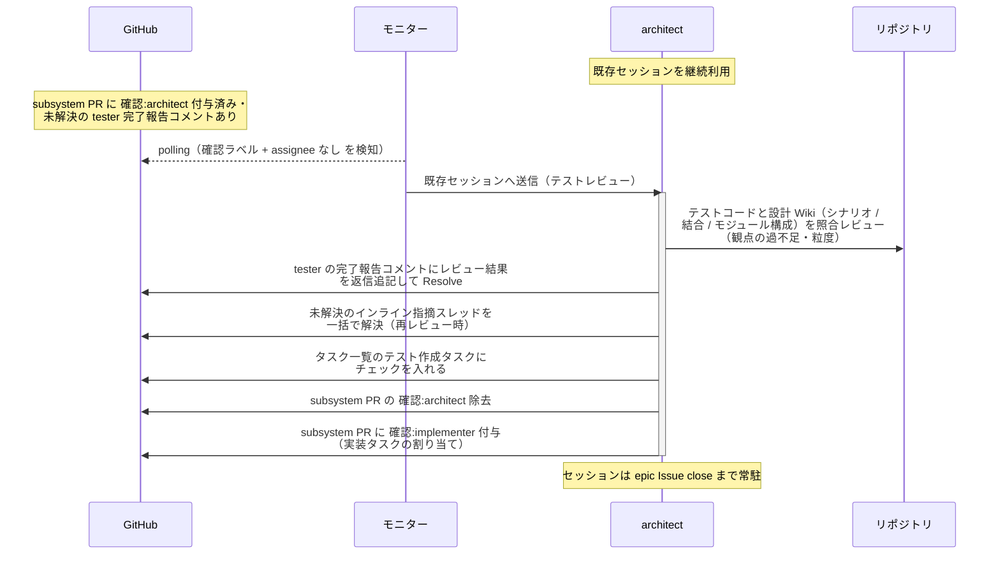
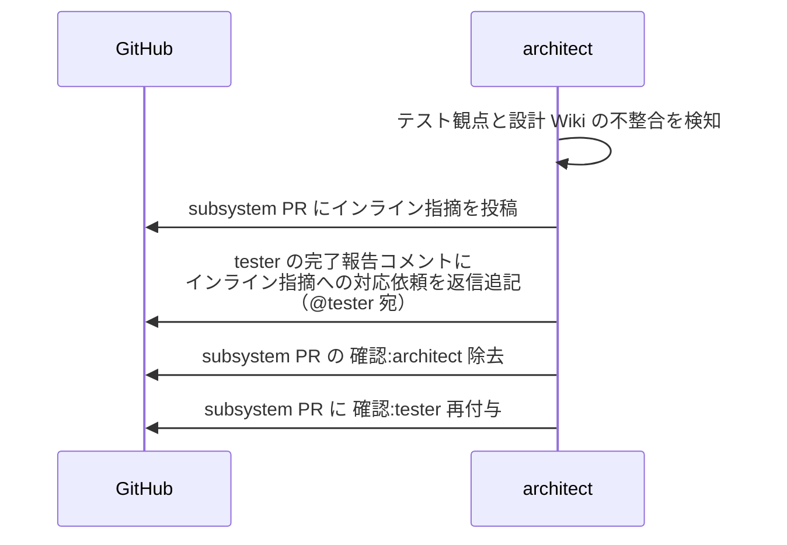

# テストレビュー

architect（設計 Wiki の作成者・内部パイプラインの指揮役）が tester の作成したテストコードを設計 Wiki（シナリオ / 結合 / モジュール構成）と照合し、設計どおりのテスト観点になっているかをレビューする単一ユースケース。
**ユーザーとのやり取りなし**（指摘は tester に直接差し戻し、指摘 → 修正の往復も本エージェントと tester で直接回す）。

対応エージェント: `architect`

## 正常シナリオ

### セットアップ

| セットアップ | 説明 | 補足 |
| --- | --- | --- |
| Mock | なし（実環境で実行） | - |
| subsystem Draft PR | `確認:architect` 付与済み + tester の完了報告コメント（自分宛・未解決）あり | - |
| テストコード | Red 状態で commit 済み・テスト結果表にテストファイル名記入済み | - |
| assignee | PR に未設定 | エージェント起動条件 |

### フロー

### 期待値

- tester の完了報告コメントのスレッドにレビュー結果が返信追記され、Resolve 済み
- インライン指摘スレッドが残っていない（再レビュー時は解決済みになっている）
- `## タスク一覧` のテスト作成タスクがチェック済み
- subsystem PR に `確認:implementer` が付与され、`確認:architect` が除去されている

## 異常シナリオ（テストへの指摘あり）

### セットアップ

| セットアップ | 説明 | 補足 |
| --- | --- | --- |
| Mock | なし（実環境で実行） | - |
| レビューの途中 | テスト観点に設計 Wiki との不整合を発見 | 例: シナリオの異常系がテストに存在しない |

### フロー

### 期待値

- インライン指摘が subsystem PR に投稿されている
- tester の完了報告コメントのスレッドにインライン指摘への対応依頼（@tester 宛）が返信追記されている（スレッドは未解決のまま = 修正確定まで同スレッドで往復する）
- subsystem PR に `確認:tester` が付与されている
- `確認:architect` が除去され、`## タスク一覧` のテスト作成タスクは未チェックのまま
