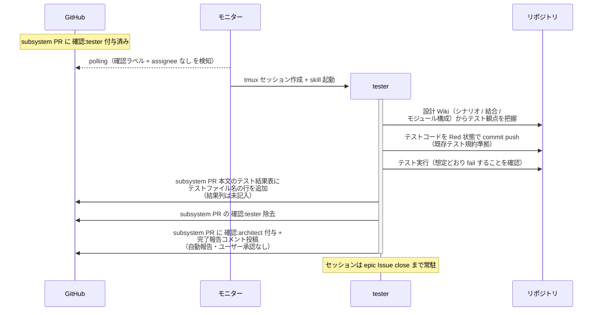
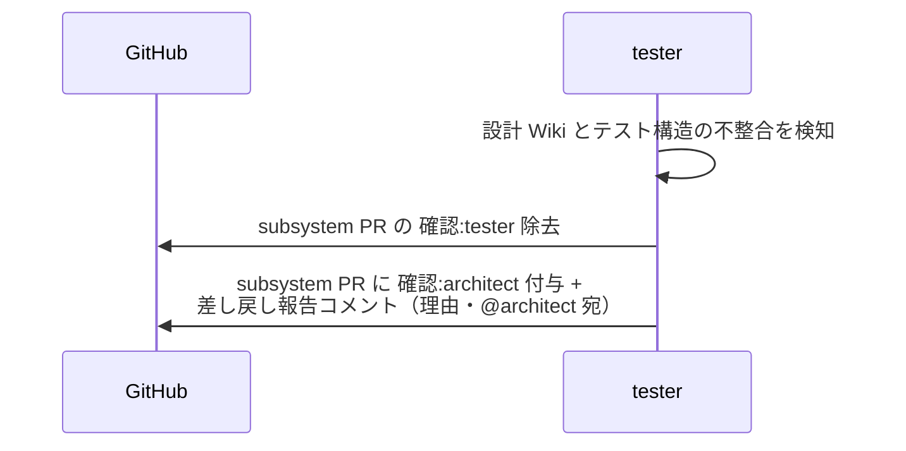

# テスト作成

tester が設計 Wiki（シナリオ / 結合 / モジュール構成）を元にテストコードを Red 状態で作成し、テスト結果表にテストファイル名を記入する単一ユースケース。
作成するのはテストコードとテスト用 fixture のみ（実装コード・データモデル・スタブは implementer の領分。実装ファイル不在による import エラーも Red として扱う）。

対応エージェント: `tester`

## 正常シナリオ

### セットアップ

| セットアップ | 説明 | 補足 |
| --- | --- | --- |
| Mock | なし（実環境で実行） | - |
| subsystem Draft PR | `確認:tester` 付与済み・設計 Wiki 確定済み・`## タスク一覧` 承認済み | - |
| assignee | PR に未設定 | エージェント起動条件 |

### フロー

### 期待値

- テスト結果表にテストファイル名の行が追加されている（結果列は未記入・`## タスク一覧` のチェックは未変更）
- テストを実行すると想定どおり fail する（Red）
- commit に実装コード（データモデル・スタブ含む）が含まれていない（テストコードとテスト用 fixture のみ）
- subsystem PR に `確認:architect` + 完了報告コメント（未解決）が付与・投稿されている（`議論中` 付与なし）
- `確認:tester` が除去されている

## 異常シナリオ（設計の見直しが必要）

### セットアップ

| セットアップ | 説明 | 補足 |
| --- | --- | --- |
| Mock | なし（実環境で実行） | - |
| テストコード作成の途中 | 設計 Wiki どおりに書けない構造問題を発見 | 例: 設計にないモジュール分割が必要 |

### フロー

### 期待値

- subsystem PR に `確認:architect` + 差し戻し報告コメント（理由・未解決）が付与・投稿されている
- `確認:tester` が除去されている
