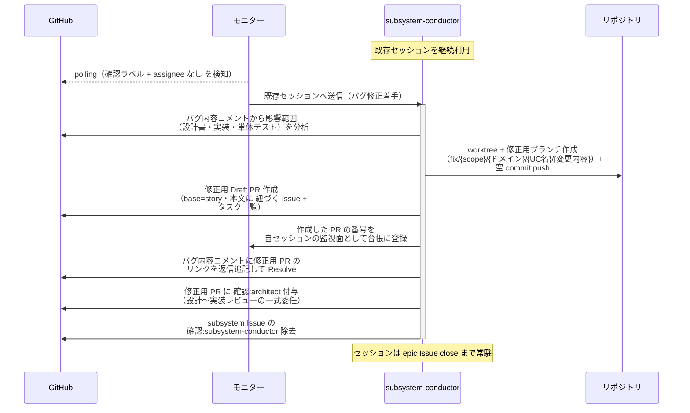
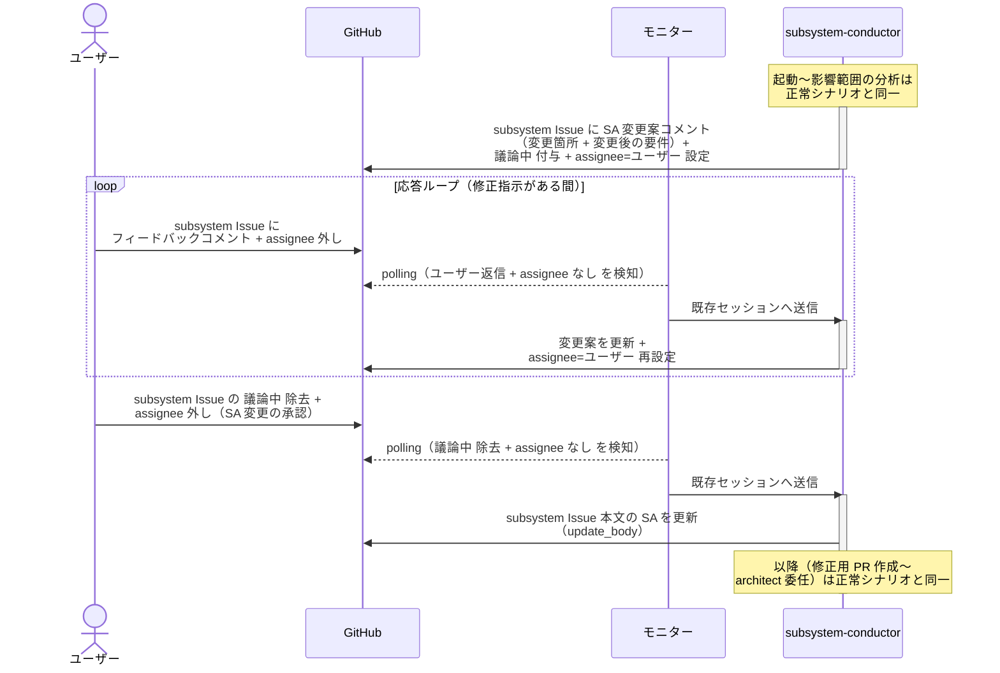

# バグ修正着手

subsystem-conductor（復帰呼び出し）が、上位 conductor から差し戻されたバグ内容コメントを受けて、影響範囲を分析し修正用 Draft PR + タスク一覧を作成して architect に委任する単一ユースケース。
対応方針は上位 conductor のゲートでユーザー承認済みのため、SA の確定・タスク一覧のユーザー確認はやり直さない（SA の変更が必要な場合のみユーザー確認を挟む）。

対応エージェント: `subsystem-conductor`（バグ内容コメントで復帰）

## 正常シナリオ

### セットアップ

| セットアップ | 説明 | 補足 |
| --- | --- | --- |
| Mock | なし（実環境で実行） | - |
| subsystem Issue | reopen 済み・`確認:subsystem-conductor` + バグ内容コメント（fail 内容 + 修正方針・自分宛・未解決）あり | 元の PR は story へ merged 済み・ブランチ削除済み |
| assignee | 未設定 | エージェント起動条件 |

### フロー

### 期待値

- 修正用 Draft PR（`base=親 story ブランチ`・ブランチ `fix/{scope}/{ドメイン}/{UC名}/{変更内容}`）が存在し、本文に `## 紐づく Issue` と `## タスク一覧`（設計書修正・実装修正・単体テスト修正）が記入されている
- 作成した PR の番号が自セッションの監視面（モニターの台帳）に登録されている
- 修正用 PR に `確認:architect` が付与されている
- バグ内容コメントのスレッドに修正用 PR のリンクが返信追記され、Resolve 済み
- subsystem Issue は open のままで `確認:subsystem-conductor` が除去されている

## 正常シナリオ（SA の変更あり）

### セットアップ

| セットアップ | 説明 | 補足 |
| --- | --- | --- |
| Mock | なし（実環境で実行） | - |
| subsystem Issue | reopen 済み・`確認:subsystem-conductor` + バグ内容コメント（自分宛・未解決）あり | バグの原因が要件の誤り。SA の変更を誘発 |
| ユーザー役 | SA 変更の承認（`議論中` 除去）を pytest が実施 | - |
| assignee | 未設定 | エージェント起動条件 |

### フロー

### 期待値

- subsystem Issue 本文の `## システム要件（SA）` が変更後の内容に更新されている（変更はユーザー承認済み）
- SA 変更案コメントが投稿されている（Resolve は完了処理時）

## 異常シナリオ

なし
