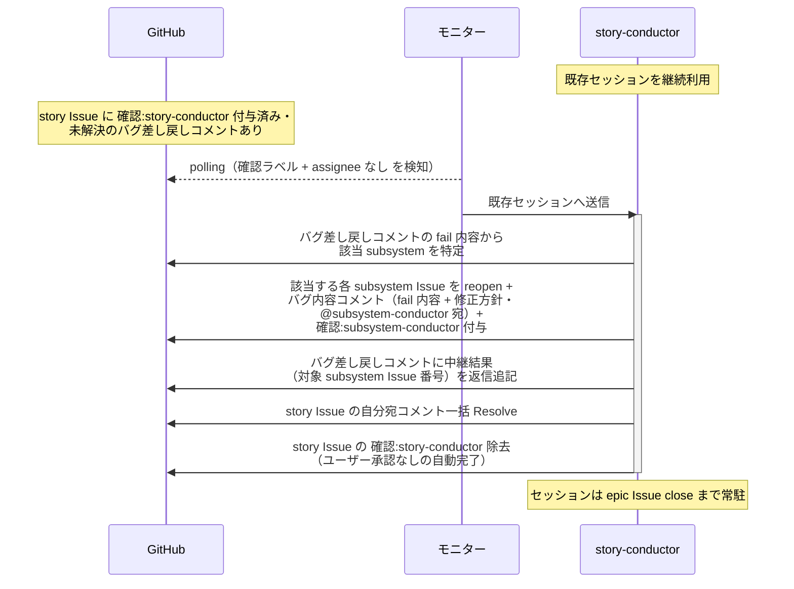
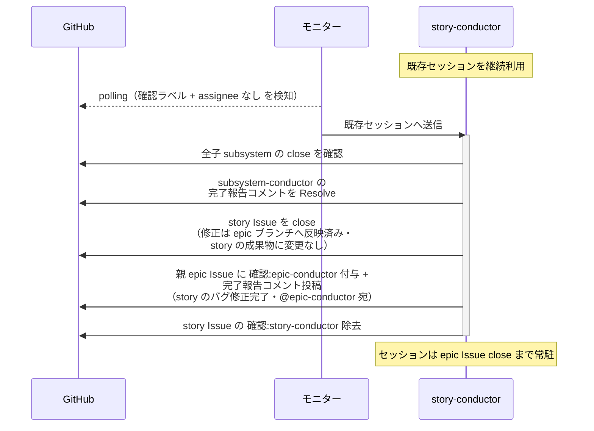

# バグ差し戻しの中継

story-conductor（復帰呼び出し）が epic レベルのバグ差し戻しを指揮系統 1 段ずつ中継する単一ユースケース。
下りは epic-conductor の差し戻しを受けて該当 subsystem へ渡し、上りは subsystem の修正完了報告を受けて story Issue を再クローズし epic-conductor へ報告する。

対応エージェント: `story-conductor`（epic-conductor のバグ差し戻しコメント / subsystem-conductor の修正完了報告コメントで復帰）

## 正常シナリオ（差し戻しの中継）

### セットアップ

| セットアップ | 説明 | 補足 |
| --- | --- | --- |
| Mock | なし（実環境で実行） | - |
| story Issue | reopen 済み + `確認:story-conductor` 付与済み + epic-conductor のバグ差し戻しコメント（fail 内容 + 修正方針・自分宛・未解決）あり | - |
| 該当 subsystem Issue | closed（PR は epic へ merged 済み） | 中継先 |
| assignee | 未設定 | エージェント起動条件 |

### フロー

### 期待値

- 該当 subsystem Issue が open（reopen 済み）で、`確認:subsystem-conductor` + バグ内容コメント（fail 内容 + 修正方針・@subsystem-conductor 宛・未解決）が付与・投稿されている
- バグ差し戻しコメントのスレッドに中継結果（対象 subsystem Issue 番号）が返信追記され、Resolve 済み
- `確認:story-conductor` が除去されている（story Issue は open のまま）

## 正常シナリオ（修正完了の中継）

### セットアップ

| セットアップ | 説明 | 補足 |
| --- | --- | --- |
| Mock | なし（実環境で実行） | - |
| story Issue | open（バグ差し戻しで reopen 済み）+ `確認:story-conductor` 付与済み + subsystem-conductor の完了報告コメント（バグ修正完了・自分宛・未解決）あり | - |
| 全子 subsystem Issue | closed（修正用 PR は epic ブランチへ merged 済み） | - |
| assignee | 未設定 | エージェント起動条件 |

### フロー

### 期待値

- subsystem-conductor の完了報告コメントが Resolve 済み
- story Issue が closed（再クローズ済み）
- 親 epic Issue に `確認:epic-conductor` + 完了報告コメント（story のバグ修正完了・@epic-conductor 宛・未解決）が付与・投稿されている
- `確認:story-conductor` が除去されている

## 異常シナリオ

なし
