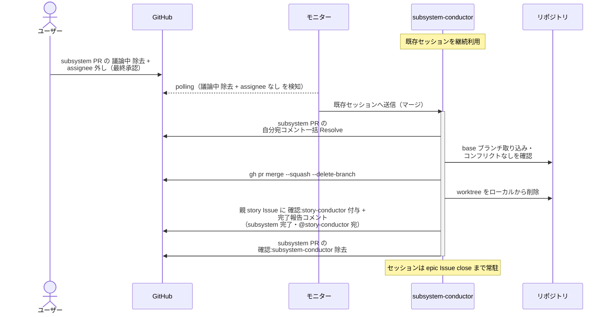
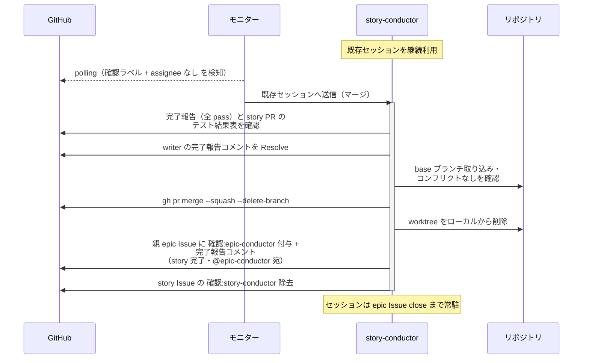
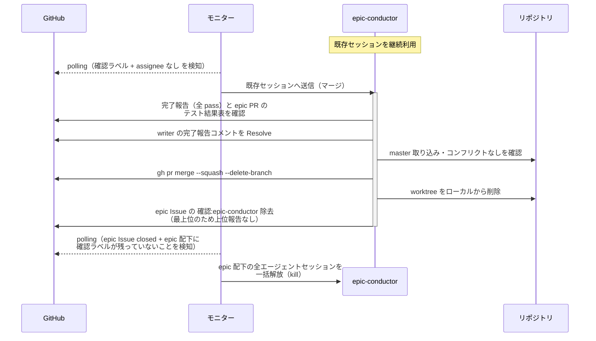
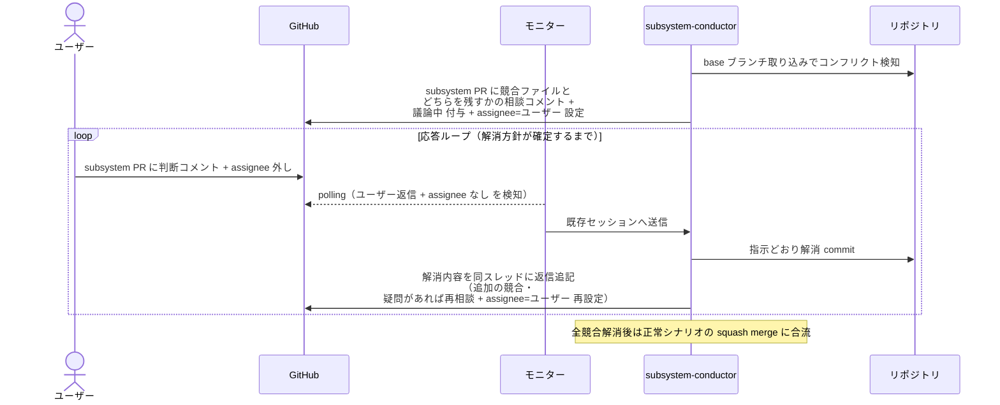

# マージ

各レイヤーの conductor が自分の配下 PR を base ブランチへ squash マージし、ブランチ / worktree を削除して上位レイヤーの conductor に完了報告する単一ユースケース（手順は `規約/マージ手順.md`）。
subsystem レベルはユーザー最終確認（`議論中` 除去）後に、story / epic レベルは scenario-writer の全 pass 報告後に自動で実行する。
文脈を持つ conductor 自身がマージすることで、コンフリクト解消の判断材料をそのまま使える。

対応エージェント: `subsystem-conductor` / `story-conductor` / `epic-conductor`

## 正常シナリオ（subsystem レベル・ユーザー承認後）

### セットアップ

| セットアップ | 説明 | 補足 |
| --- | --- | --- |
| Mock | なし（実環境で実行） | - |
| subsystem PR | Ready + タスク一覧 全チェック済み + `確認:subsystem-conductor` + `議論中` + `assignee=ユーザー`（マージ起動のゲート中） | - |
| ユーザー操作 | `議論中` 除去 + assignee 外し（最終承認） | 分岐を決定的に誘発 |
| base ブランチ | コンフリクトなし | - |

### フロー

### 期待値

- subsystem PR が merged 状態、リモートブランチ・ローカル worktree とも削除済み
- 紐づく subsystem Issue が自動 close されている
- 親 story Issue に `確認:story-conductor` + 完了報告コメント（subsystem 完了・@story-conductor 宛・未解決）が付与・投稿されている
- subsystem PR の自分宛コメントが全て Resolve 済みで、`確認:subsystem-conductor` が除去されている

## 正常シナリオ（story レベル・自動）

### セットアップ

| セットアップ | 説明 | 補足 |
| --- | --- | --- |
| Mock | なし（実環境で実行） | - |
| story Issue | `確認:story-conductor` 付与済み + single-scenario-writer の完了報告コメント（全 pass・自分宛・未解決）あり | - |
| base ブランチ | コンフリクトなし | - |
| assignee | 未設定 | エージェント起動条件 |

### フロー

### 期待値

- story PR が merged 状態、リモートブランチ・ローカル worktree とも削除済み
- 紐づく story Issue が自動 close されている
- writer の完了報告コメントが Resolve 済み
- 親 epic Issue に `確認:epic-conductor` + 完了報告コメント（story 完了・@epic-conductor 宛・未解決）が付与・投稿されている
- `確認:story-conductor` が除去されている

## 正常シナリオ（epic レベル・終端処理）

### セットアップ

| セットアップ | 説明 | 補足 |
| --- | --- | --- |
| Mock | なし（実環境で実行） | - |
| epic Issue | `確認:epic-conductor` 付与済み + complex-scenario-writer の完了報告コメント（全 pass・自分宛・未解決）あり | - |
| base ブランチ | master・コンフリクトなし | - |
| assignee | 未設定 | エージェント起動条件 |

### フロー

### 期待値

- epic PR が master へ merged 状態、リモートブランチ・ローカル worktree とも削除済み
- 紐づく epic Issue が自動 close され、epic 配下の Issue / PR に `確認:*` が 1 つも残っていない
- epic 配下の全エージェントの tmux セッションが解放済み（ゾンビセッションなし）

## 異常シナリオ（コンフリクト発生）

### セットアップ

| セットアップ | 説明 | 補足 |
| --- | --- | --- |
| Mock | なし（実環境で実行） | - |
| subsystem PR | マージ実行の直前まで完了（ユーザー最終承認済み） | 図は subsystem レベルで代表 |
| base ブランチ | 同一ファイルが base 側で先に変更済み | 意図的にコンフリクトを仕込む |

### フロー

### 期待値

- PR が merged 状態（解消 commit を含む）
- 解消内容が相談コメントのスレッドに記録されている
