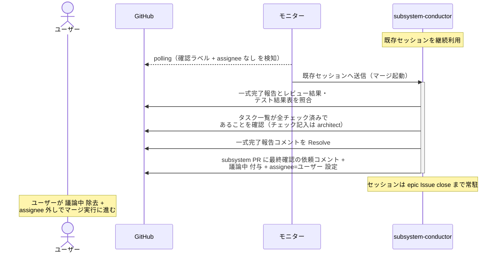

# マージ起動

subsystem-conductor（復帰呼び出し）が architect の一式完了報告を受けて、マージ前のユーザー最終確認ゲート（`議論中` + `assignee=ユーザー`）を開く単一ユースケース。
ユーザーの承認（`議論中` 除去）後のマージ実行はマージ UC で行う。
story / epic レベルはユーザー最終確認なし（scenario-writer の全 pass 報告からマージ UC に直行する）のため、本 UC は subsystem レベルのみ。

対応エージェント: `subsystem-conductor`（architect の一式完了報告コメントで復帰）

## 正常シナリオ

### セットアップ

| セットアップ | 説明 | 補足 |
| --- | --- | --- |
| Mock | なし（実環境で実行） | - |
| subsystem PR | `確認:subsystem-conductor` 付与済み + architect の一式完了報告コメント（自分宛・未解決）あり | Ready 状態・テスト結果表 全 ✅・タスク一覧 全チェック済み |
| assignee | PR に未設定 | エージェント起動条件 |

### フロー

### 期待値

- `## タスク一覧` の全行がチェック済み
- 一式完了報告コメントが Resolve 済み
- subsystem PR に最終確認の依頼コメント + `議論中` + `assignee=ユーザー` が付与・投稿されている
- `確認:subsystem-conductor` は保持されたまま（承認後のマージ実行で復帰するため）

## 異常シナリオ

なし
