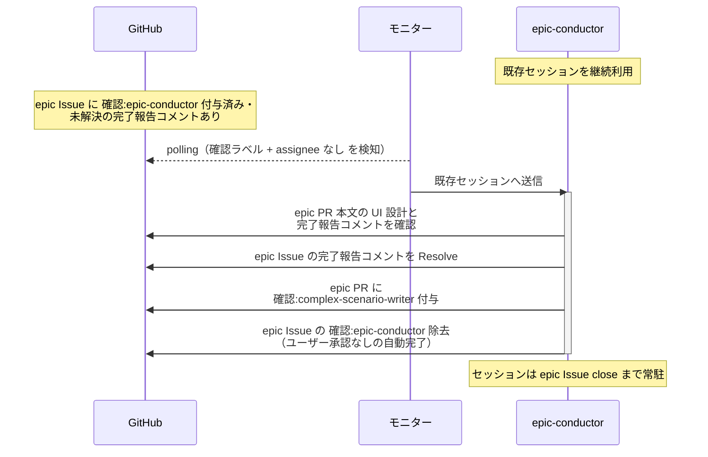

# モック完了確認

epic-conductor（復帰呼び出し）が mock-designer の完了報告を確認し、確定済みの UI 設計を前提に複合シナリオ設計へ引き継ぐ単一ユースケース。
モック・UI 設計は全体UI設計のユーザー承認ゲートで合意済みのため、ユーザー承認なしの自動完了で次フェーズへ進める。

対応エージェント: `epic-conductor`（mock-designer の完了報告コメントで復帰）

- 対応テストファイル: `tests/e2e/単一ユースケース/test_モック完了確認.py`

## 正常シナリオ

### セットアップ

| セットアップ | 説明 | 補足 |
| --- | --- | --- |
| Mock | なし（実環境で実行） | - |
| epic Issue | `確認:epic-conductor` 付与済み + mock-designer の完了報告コメント（自分宛・未解決）あり | - |
| epic PR | 本文に `## UI 設計`（画面一覧 / 画面遷移 / モック）記録済み | 全体UI設計の成果物 |
| assignee | 未設定 | エージェント起動条件 |

### フロー

### 期待値

- mock-designer の完了報告コメントが Resolve 済み
- epic PR に `確認:complex-scenario-writer` が付与されている
- `確認:epic-conductor` が除去されている（`議論中` 付与なし・assignee 未設定のまま）

## 異常シナリオ

なし
