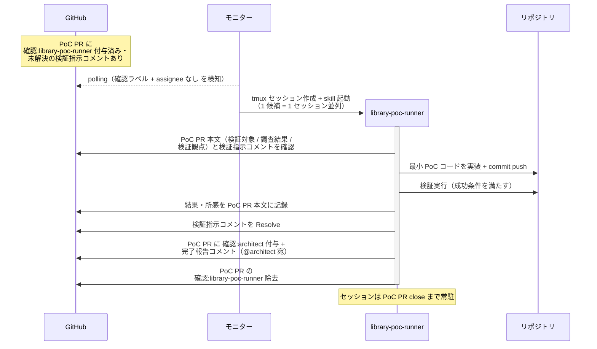
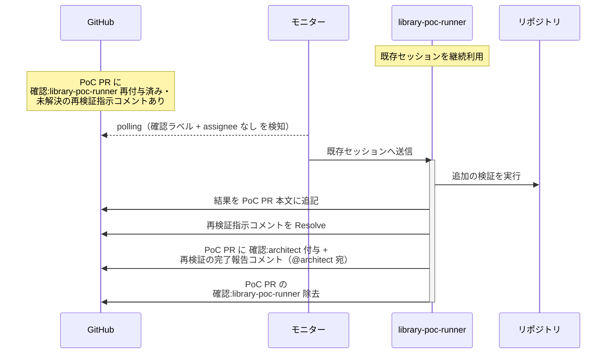
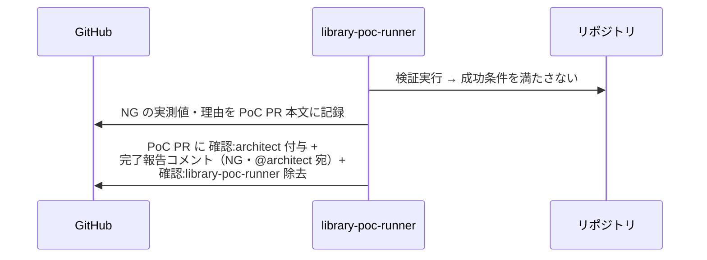

# ライブラリPoC検証

library-poc-runner が担当候補 1 つの PoC を検証する単一ユースケース。
発注元の architect が作成した PoC PR 上で、最小 PoC コードの実装 → 検証実行 → 結果記録を行い、発注元へ完了報告する。
監視・会話面は担当の PoC PR のみで、発注元からの検証指示にのみ応答する（ユーザーの質問・追加検証依頼は発注元の architect が subsystem PR 側で受ける）。
完了報告の宛先は発注元 = 検証指示コメントの送信者。

対応エージェント: `library-poc-runner`

## 正常シナリオ

### セットアップ

| セットアップ | 説明 | 補足 |
| --- | --- | --- |
| Mock | なし（実環境で実行） | - |
| PoC Draft PR | 発注元が作成済み（base=master・本文に検証対象 / 調査結果 / 検証観点を記載）+ `確認:library-poc-runner` + 検証指示コメント（@library-poc-runner 宛・未解決）あり | 本文だけで検証を開始できる |
| assignee | PoC PR に未設定 | エージェント起動条件 |

### フロー

### 期待値

- PoC PR 本文に検証結果（実測値・所感）が記録されている
- 検証指示コメントが Resolve 済み
- PoC PR に `確認:architect` + 完了報告コメント（@発注元宛・未解決）が付与・投稿されている
- `確認:library-poc-runner` が除去されている

## 正常シナリオ（再検証指示）

### セットアップ

| セットアップ | 説明 | 補足 |
| --- | --- | --- |
| Mock | なし（実環境で実行） | - |
| PoC PR | 完了報告済み・セッション常駐中 | - |
| 再検証指示 | 発注元の architect が `確認:library-poc-runner` を再付与し、再検証指示コメント（@library-poc-runner 宛・追加の検証観点）を投稿済み | ユーザーの質問・追加検証依頼を発注元が subsystem PR 側で受けたもの |

### フロー

### 期待値

- 追加検証の結果が PoC PR 本文に追記されている
- 再検証指示コメントが Resolve され、発注元への完了報告コメント（@発注元宛・未解決）が投稿されている
- `確認:library-poc-runner` が除去されている

## 異常シナリオ（成功条件を満たさない）

### セットアップ

| セットアップ | 説明 | 補足 |
| --- | --- | --- |
| Mock | なし（実環境で実行） | - |
| 検証実行まで完了 | 検証の結果、検証観点の成功条件を満たさない | 例: 性能目標未達・必須機能の欠落 |

### フロー

### 期待値

- NG の実測値・理由が PoC PR 本文に記録されている
- PoC PR に `確認:architect` + 完了報告コメント（NG・@発注元宛・未解決）が付与・投稿されている
- PoC PR が open のまま残っている（close されていない）
