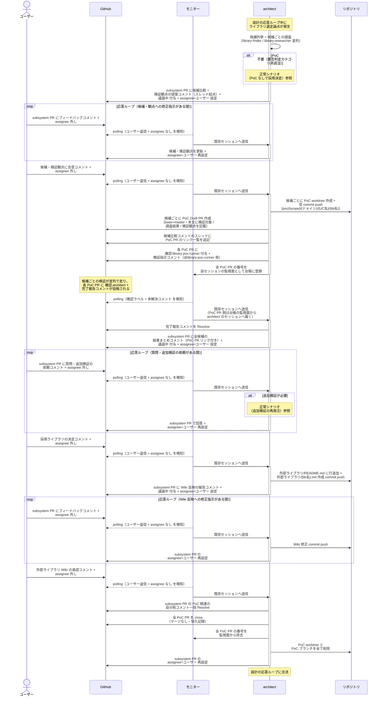
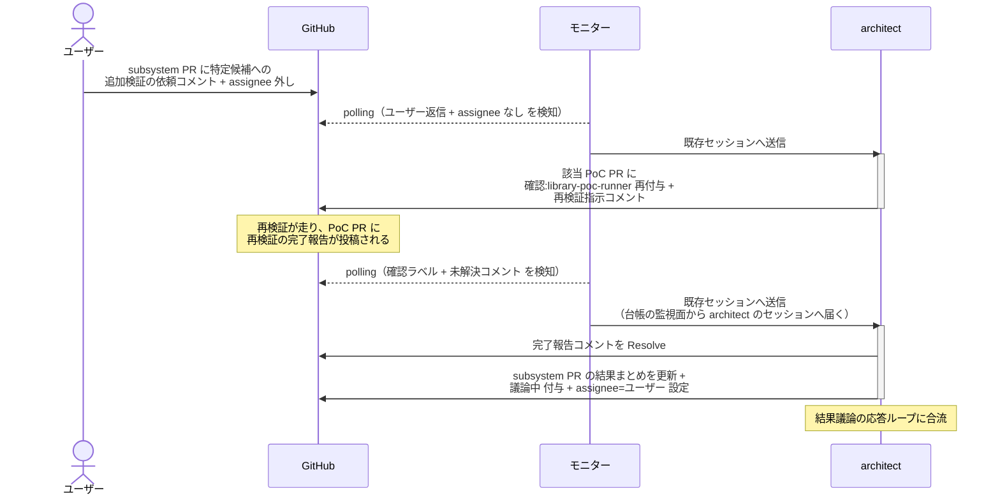
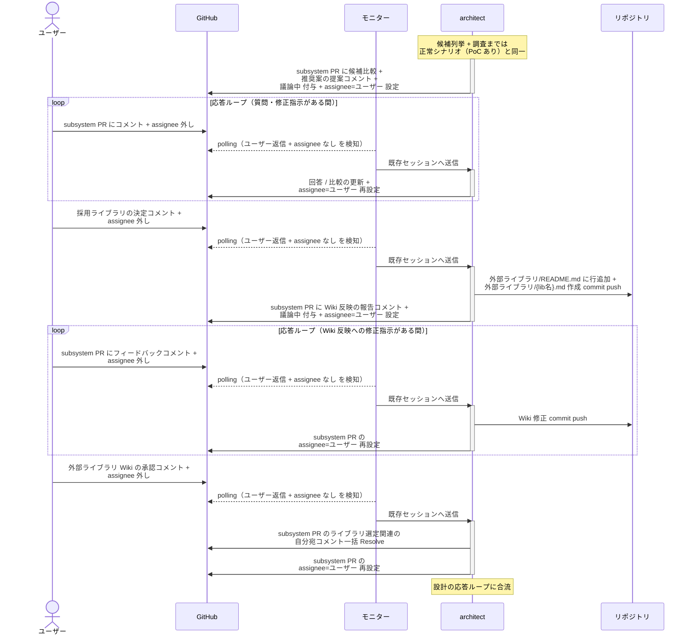
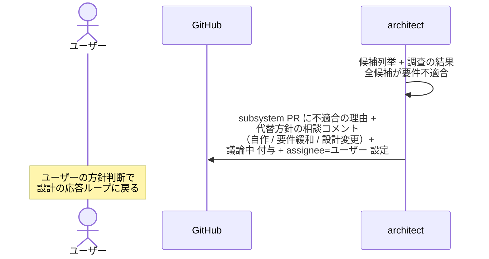
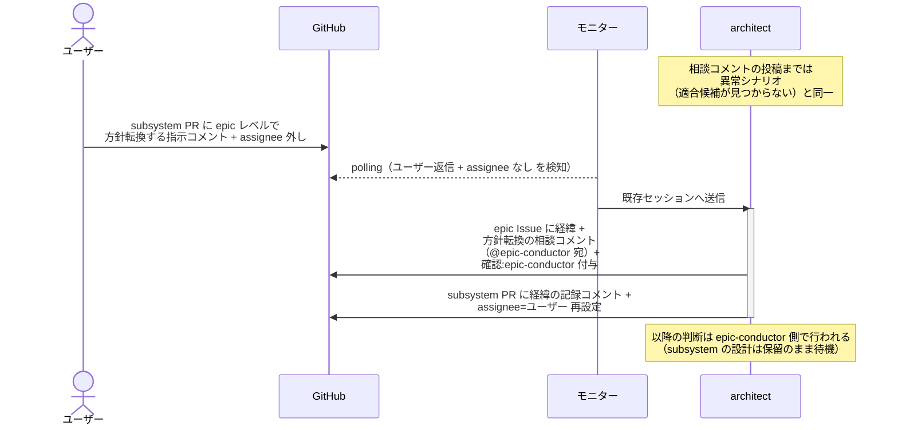

# ライブラリ選定

architect が設計の応答ループ中に発生したライブラリ選定論点について、候補比較 → （必要なら PoC 発注）→ 採用決定 → 外部ライブラリ Wiki 反映を行う単一ユースケース。
候補ごとの PoC 検証は `library-poc-runner` へ発注する（1 候補 = 1 PoC PR = 1 セッション並列）。
BE ライブラリ / UI ライブラリで共通のフロー。

対応エージェント: `architect`

## 正常シナリオ（PoC あり）

### セットアップ

| セットアップ | 説明 | 補足 |
| --- | --- | --- |
| Mock | なし（実環境で実行） | - |
| subsystem PR | 設計 Wiki の応答ループ中（担当 worker の確認ラベル + `議論中` あり） | - |
| ライブラリ選定論点 | 応答ループ中に発生 | 例: LLM クライアント / UI コンポーネントライブラリの採用 |
| 採用候補 | 未経験のライブラリで PoC 要否判定カテゴリ（A〜E）に該当 | PoC を誘発 |

### フロー

### 期待値

- 候補ごとに PoC PR（base=master・本文に検証対象 / 調査結果 / 検証観点入り・`確認:library-poc-runner` + 検証指示コメント付き）が作成されている
- 発注時点で architect セッションの監視面（モニターの台帳）に全 PoC PR の番号が登録され、close 後の完了処理で除去されている
- 候補比較コメントのスレッドに全 PoC PR のリンク一覧が残っている
- `外部ライブラリ/README.md` の行と `外部ライブラリ/{lib名}.md` が subsystem ブランチに commit されている
- 全 PoC PR が closed（マージなし）で残り、PoC worktree・PoC ブランチ（ローカル / リモートとも）が削除済み
- 候補比較・検証結果・採用判断の経緯がコメントに残っている
- PoC 関連の自分宛コメントが全て Resolve 済み

## 正常シナリオ（追加検証の再発注）

### セットアップ

| セットアップ | 説明 | 補足 |
| --- | --- | --- |
| Mock | なし（実環境で実行） | - |
| 結果まとめまで完了 | 全候補の結果まとめコメント投稿済み・`議論中` + `assignee=ユーザー` で待機中 | 正常シナリオ（PoC あり）と同一の経過 |
| ユーザー依頼 | 特定候補への追加検証を依頼するコメントを投稿する | 分岐を決定的に誘発 |

### フロー

### 期待値

- 該当 PoC PR の再検証指示コメント（@library-poc-runner 宛）と完了報告コメントが Resolve 済み
- subsystem PR の結果まとめコメントが追加検証の結果で更新されている
- subsystem PR に `議論中` + `assignee=ユーザー` が設定されている

## 正常シナリオ（PoC なしで採用決定）

### セットアップ

| セットアップ | 説明 | 補足 |
| --- | --- | --- |
| Mock | なし（実環境で実行） | - |
| subsystem PR | 設計 Wiki の応答ループ中にライブラリ選定論点が発生 | - |
| 採用候補 | 実績のある既知ライブラリで PoC 要否判定カテゴリに非該当 | PoC スキップを誘発 |

### フロー

### 期待値

- PoC PR・PoC worktree が一切作成されていない
- `外部ライブラリ/README.md` の行と `外部ライブラリ/{lib名}.md` が subsystem ブランチに commit されている
- ライブラリ選定関連の自分宛コメントが全て Resolve 済み

## 異常シナリオ（適合候補が見つからない）

### セットアップ

| セットアップ | 説明 | 補足 |
| --- | --- | --- |
| Mock | なし（実環境で実行） | - |
| ライブラリ選定論点 | 要件（ライセンス・対応環境・性能等）を満たす候補が存在しない | 例: 商用ライセンスのみ / 対応プラットフォーム外 |

### フロー

### 期待値

- 相談コメント（不適合の理由 + 代替方針）が投稿され、`議論中` + `assignee=ユーザー` が設定されている

## 異常シナリオ（適合候補が見つからない・epic へ方針転換）

### セットアップ

| セットアップ | 説明 | 補足 |
| --- | --- | --- |
| Mock | なし（実環境で実行） | - |
| 相談まで完了 | 全候補が要件不適合の相談コメントに対し、ユーザーが epic レベルの方針転換を指示 | 分岐を決定的に誘発 |

### フロー

### 期待値

- epic Issue に `確認:epic-conductor` + 経緯コメント（@epic-conductor 宛・未解決）が付与・投稿されている
- subsystem PR は `確認:architect` + `議論中` のまま（設計 Wiki への新規 commit が存在しない）
