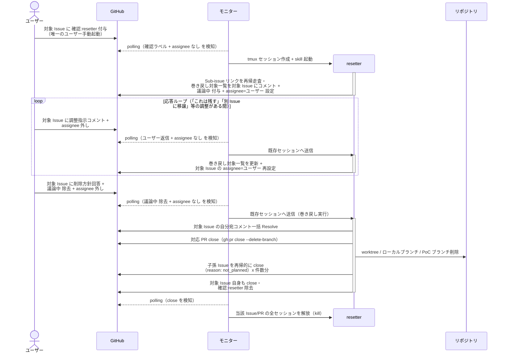

# リセット実行

resetter が不要化した Issue/PR の巻き戻し対象（子孫 Issue・PR・ブランチ・worktree・追記 Wiki）を洗い出し、ユーザー承認を経て全て削除・クローズする単一ユースケース。

対応エージェント: `resetter`

## 正常シナリオ

### セットアップ

| セットアップ | 説明 | 補足 |
| --- | --- | --- |
| Mock | なし（実環境で実行） | - |
| 対象 Issue/PR | ユーザーが手動で `確認:resetter` を付与 | 唯一のユーザー手動起動エージェント |
| 巻き戻し対象 | 子孫 Issue / Draft PR / worktree / PoC ブランチが存在 | 進行途中の状態 |
| マージ済み subsystem | 一部の subsystem PR は story ブランチへ merge 済み | 配下ブランチごと消えることの検証用 |
| assignee | 未設定 | エージェント起動条件 |

### フロー

### 期待値

- 子孫 Issue（孫以下含む）が全て close（`reason: not_planned`）
- 配下の PR が close、リモート / ローカルブランチ・worktree が削除済み（story にマージ済みの subsystem の commit もブランチごと消える）
- 追記 Wiki はブランチ削除により消滅
- 対象 Issue/PR に `確認:*` ラベルが残っていない
- 対象 Issue の自分宛コメントが全て Resolve 済み

## 異常シナリオ

なし
