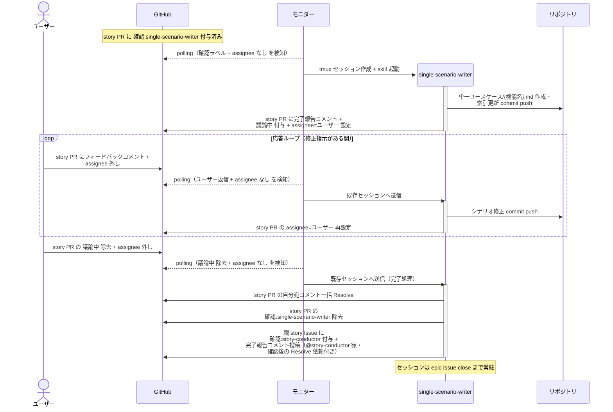

# 単一シナリオ設計

single-scenario-writer が story のユースケース要件をもとに単一ユースケースシナリオ（1 UC の正常系 + 異常系）を設計し、story ブランチに commit する単一ユースケース。

対応エージェント: `single-scenario-writer`

## 正常シナリオ

### セットアップ

| セットアップ | 説明 | 補足 |
| --- | --- | --- |
| Mock | なし（実環境で実行） | - |
| story Draft PR | `確認:single-scenario-writer` 付与済み | 本文は `## 紐づく Issue` のみ |
| story Issue | ユースケース要件 確定済み | シナリオの元ネタ |
| assignee | PR に未設定 | エージェント起動条件 |

### フロー

### 期待値

- story ブランチに `docs/wiki/設計図/シナリオ/単一ユースケース/{機能名}.md` が commit されている（ファイル名 = 親 epic ユースケース一覧の UC 名 = 複合シナリオのノード名）
- `設計図/シナリオ/README.md` の索引に行が追加されている
- 親 story Issue に `確認:story-conductor` が付与され、完了報告コメント（@story-conductor 宛・未解決）が投稿されている
- story PR の自分宛コメントが全て Resolve 済み

## 異常シナリオ

なし
