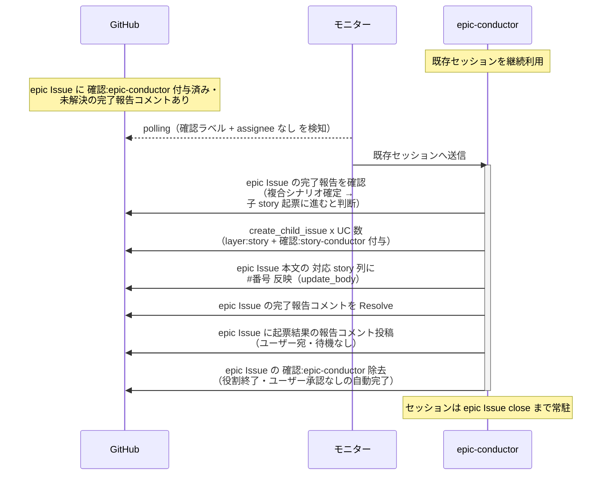

# 子story起票

epic-conductor（復帰呼び出し）が complex-scenario-writer の完了報告を確認し、複合シナリオ確定を受けて次フェーズ（子 story 起票）に進むと判断する単一ユースケース。
確定済みユースケース一覧の各 UC に対応する子 story Issue を起票し、対応 story 列にリンクを埋める。

対応エージェント: `epic-conductor`（complex-scenario-writer の完了報告コメントで復帰）

## 正常シナリオ

### セットアップ

| セットアップ | 説明 | 補足 |
| --- | --- | --- |
| Mock | なし（実環境で実行） | - |
| epic Issue | `確認:epic-conductor` 付与済み + complex-scenario-writer の完了報告コメント（自分宛・未解決）あり | - |
| ユースケース一覧 | 全行 `対応 story` 列が `未起票` | - |
| assignee | 未設定 | エージェント起動条件 |

### フロー

### 期待値

- ユースケース一覧の行数と同数の story Issue が epic の Sub-issue として存在する
- 各 story Issue に `layer:story` + `確認:story-conductor` が付与されている
- `対応 story` 列の `未起票` が全て `#番号` に置き換わっている
- epic Issue のラベルが `layer:epic` 系のみになっている（`確認:*` は除去、`議論中` 付与なし・assignee 設定なし）

## 異常シナリオ

なし
