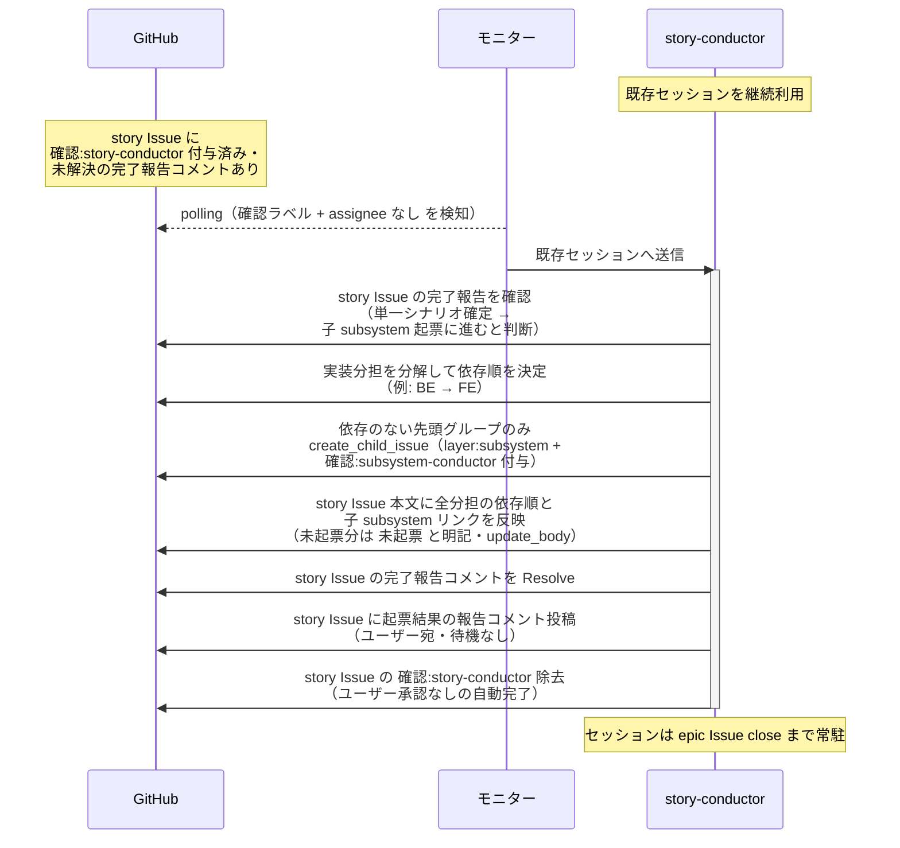
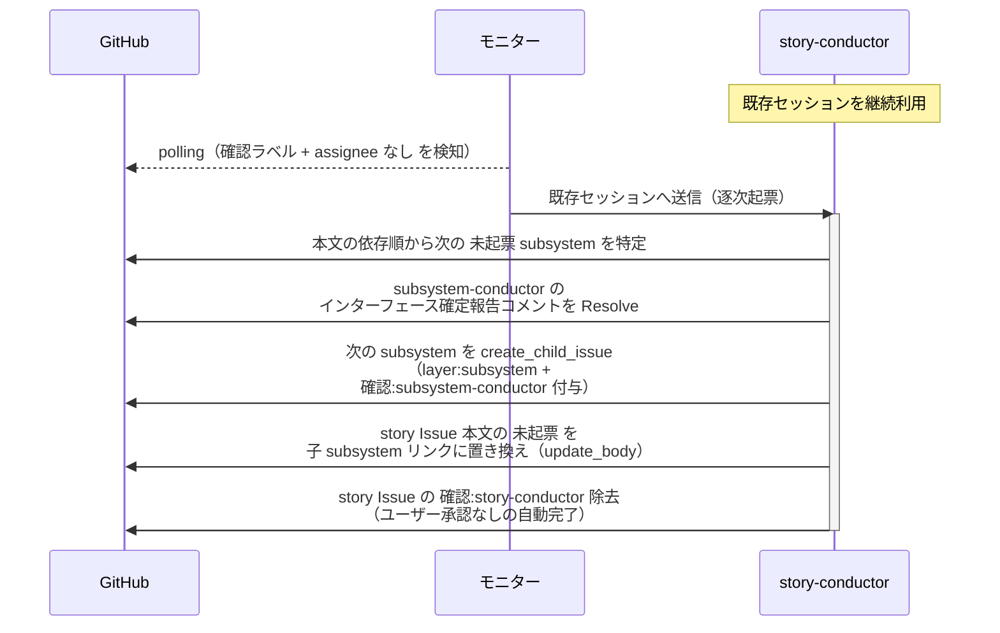

# 子subsystem起票

story-conductor（復帰呼び出し）が single-scenario-writer の完了報告を確認し、単一シナリオ確定を受けて次フェーズ（子 subsystem 起票）に進むと判断する単一ユースケース。
UC の実装に必要な subsystem（FE / BE / 外部連携 等）を洗い出して依存順（例: BE → FE）を決め、**依存のない先頭グループだけを起票する直列運用**。
後続の subsystem は先行 subsystem のインターフェース確定報告（subsystem-conductor が中継）を受けて逐次起票する（インターフェースの手戻り防止と後続の早期並列化を両立する）。

対応エージェント: `story-conductor`（single-scenario-writer / subsystem-conductor の完了報告コメントで復帰）

## 正常シナリオ（初回・依存順の決定と先頭の起票）

### セットアップ

| セットアップ | 説明 | 補足 |
| --- | --- | --- |
| Mock | なし（実環境で実行） | - |
| story Issue | `確認:story-conductor` 付与済み + single-scenario-writer の完了報告コメント（自分宛・未解決）あり | - |
| 単一 UC シナリオ | story ブランチに commit 済み | subsystem 洗い出しの元ネタ |
| assignee | 未設定 | エージェント起動条件 |

### フロー

### 期待値

- 依存のない先頭グループの subsystem Issue だけが story の Sub-issue として存在する（`layer:subsystem` + `確認:subsystem-conductor` 付き）
- story Issue 本文に全分担の依存順が記録され、未起票分に `未起票` と明記されている
- story Issue のラベルが `layer:story` 系のみになっている（`確認:*` は除去、`議論中` 付与なし・assignee 設定なし）

## 正常シナリオ（依存順の逐次起票）

### セットアップ

| セットアップ | 説明 | 補足 |
| --- | --- | --- |
| Mock | なし（実環境で実行） | - |
| story Issue | `確認:story-conductor` 付与済み + subsystem-conductor のインターフェース確定報告コメント（先行 subsystem のインターフェース確定・自分宛・未解決）あり | 本文の依存順に `未起票` の subsystem が残っている |
| 先行 subsystem | `バックエンド結合/{論理名}.md` の `## インターフェース` が確定済み・設計は続行中 | 逐次起票を誘発 |
| assignee | 未設定 | エージェント起動条件 |

### フロー

### 期待値

- 次の subsystem Issue が story の Sub-issue として存在する（`layer:subsystem` + `確認:subsystem-conductor` 付き）
- subsystem-conductor のインターフェース確定報告コメントが Resolve 済み
- story Issue 本文の該当行が `未起票` から子 subsystem リンクに置き換わっている
- `確認:story-conductor` が除去されている

## 異常シナリオ

なし
