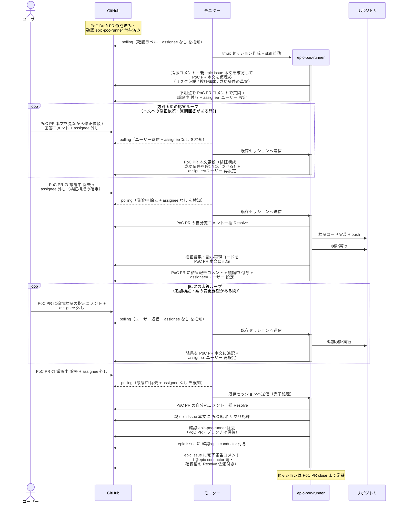
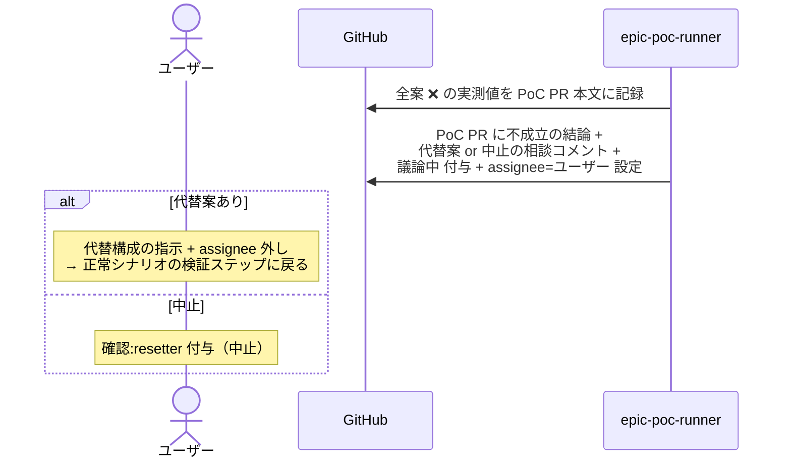

# 実現可能性PoC検証

epic-poc-runner が epic の成立条件になっている核心機構を最安直構成で検証し、結論を epic Issue 本文 `## PoC 結果` に記録する単一ユースケース。
ライブラリ銘柄選定はしない（subsystem の architect が担当）。

対応エージェント: `epic-poc-runner`

## 正常シナリオ

### セットアップ

| セットアップ | 説明 | 補足 |
| --- | --- | --- |
| Mock | なし（実環境で実行） | - |
| PoC Draft PR | 存在する（本文は `## 紐づく Issue` のみ）+ `確認:epic-poc-runner` + epic-conductor の指示コメント（@epic-poc-runner 宛・検証テーマの背景 + 成立条件の想定・未解決）付与済み | 起動時の仮埋めの情報源 |
| assignee | 未設定 | エージェント起動条件 |
| モニター | polling 中 | - |

### フロー

### 期待値

- epic Issue 本文に `## PoC 結果`（検証構成 / 成功条件 / 結果 / PoC PR リンク）が記録されている
- PoC PR は open のまま `確認:epic-poc-runner` だけが除去されている
- epic Issue に `確認:epic-conductor` が付与され、完了報告コメント（@epic-conductor 宛・未解決）が投稿されている
- PoC PR の自分宛コメントが全て Resolve 済み

### 補足

- PoC コードは main にマージしない（コードは捨てる・知見は残す）
- Wiki 外部ライブラリページは書かない（採用確定した subsystem の architect が書く）

## 異常シナリオ（核心機構が成立しない結論）

### セットアップ

| セットアップ | 説明 | 補足 |
| --- | --- | --- |
| Mock | なし（実環境で実行） | - |
| 検証実行まで完了 | 検証実行の結果、成功条件を満たさない | 全案 ❌ |

### フロー

### 期待値

- 不成立の実測値と理由が PoC PR 本文 + epic Issue `## PoC 結果` に記録されている
- epic Issue・PoC PR とも open のまま（close されていない）
