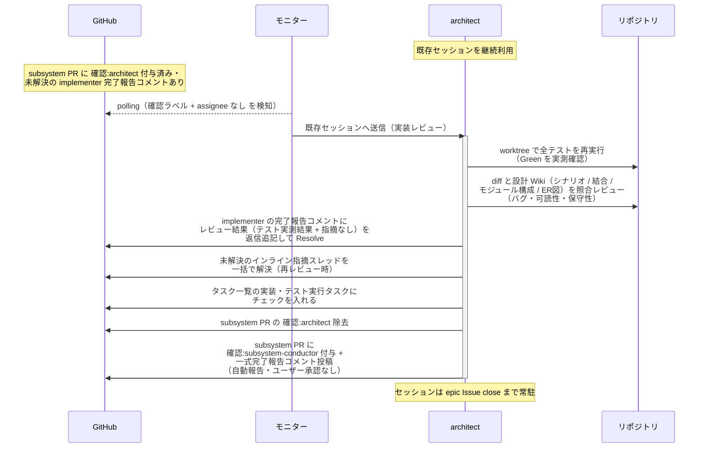
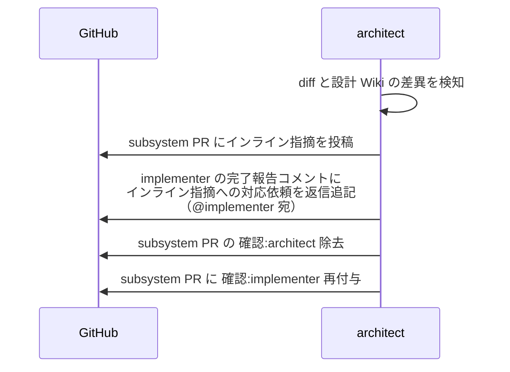

# 実装レビュー

architect（設計 Wiki の作成者・内部パイプラインの指揮役）が Ready 化された subsystem PR の diff を設計 Wiki と照合し、worktree でテストを再実行して Green を実測確認する単一ユースケース。
**ユーザーとのやり取りなし**（指摘は implementer に直接差し戻し、指摘 → 修正の往復も本エージェントと implementer で直接回す。ユーザーの最終確認は subsystem-conductor のマージ起動ゲートで行う）。

対応エージェント: `architect`

## 正常シナリオ

### セットアップ

| セットアップ | 説明 | 補足 |
| --- | --- | --- |
| Mock | なし（実環境で実行） | - |
| subsystem PR | Ready 状態 + `確認:architect` 付与済み + implementer の完了報告コメント（自分宛・未解決）あり | - |
| テスト結果表 | implementer の実行結果記入済み（全 ✅） | - |
| assignee | PR に未設定 | エージェント起動条件 |

### フロー

### 期待値

- worktree でのテスト再実行が全 pass（Green の実測確認）
- implementer の完了報告コメントのスレッドにレビュー結果（テスト実測結果 + 指摘なし）が返信追記され、Resolve 済み
- インライン指摘スレッドが残っていない（再レビュー時は解決済みになっている）
- `## タスク一覧` の全行がチェック済み
- subsystem PR に `確認:subsystem-conductor` + 一式完了報告コメント（未解決）が付与・投稿されている
- `確認:architect` が除去されている

### 補足

- パフォーマンスチェックは行わない（動作確認はテストで担保）

## 異常シナリオ（実装への指摘あり）

### セットアップ

| セットアップ | 説明 | 補足 |
| --- | --- | --- |
| Mock | なし（実環境で実行） | - |
| レビューの途中 | diff に設計 Wiki との差異 or バグ・可読性・保守性の問題を発見 | 例: 結合ドキュメントにないレスポンス形式 |

### フロー

### 期待値

- インライン指摘が subsystem PR に投稿されている
- implementer の完了報告コメントのスレッドにインライン指摘への対応依頼（@implementer 宛）が返信追記されている（スレッドは未解決のまま = 修正確定まで同スレッドで往復する）
- subsystem PR に `確認:implementer` が付与されている
- `確認:architect` が除去され、`## タスク一覧` の実装・テスト実行タスクは未チェックのまま
