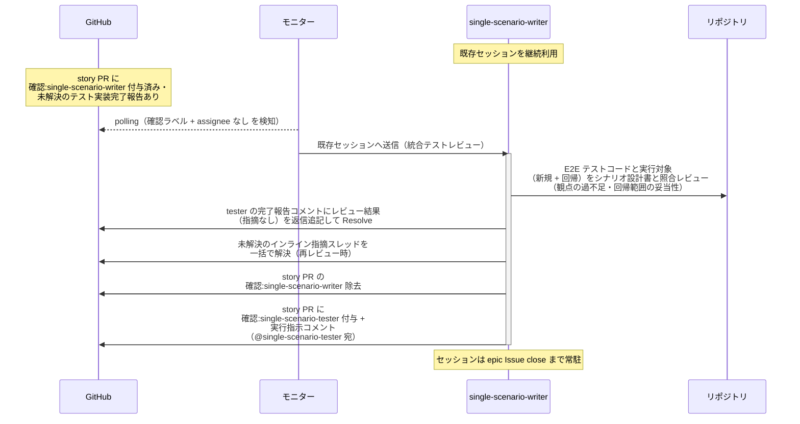
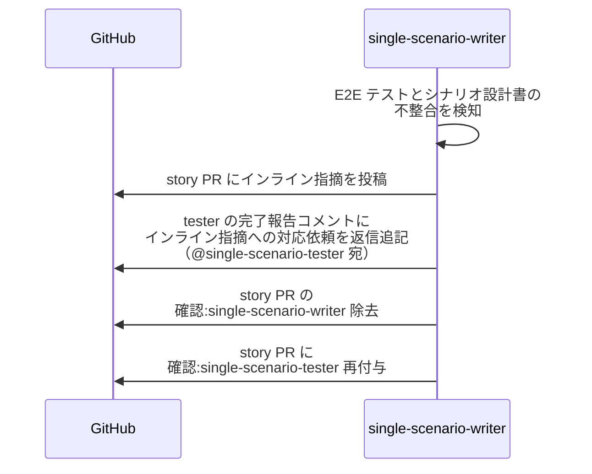

# 統合テストレビュー

single-scenario-writer / complex-scenario-writer（シナリオ設計書の作成者・統合テストの指揮役）が、配下の scenario-tester の実装した E2E テストコードと実行対象（新規 + 回帰）をシナリオ設計書と照合し、実行前にレビューする単一ユースケース。
**ユーザーとのやり取りなし**（指摘は tester に直接差し戻し、指摘 → 修正の往復も本エージェントと tester で直接回す）。

対応エージェント: `single-scenario-writer` / `complex-scenario-writer`

図は単一 UC（story レベル）で代表する。
複合 UC（epic レベル）は以下を読み替えて同型。

| 図の表記 | 複合 UC での読み替え |
| --- | --- |
| single-scenario-writer | complex-scenario-writer |
| single-scenario-tester | complex-scenario-tester |
| story PR / story ブランチ | epic PR / epic ブランチ |

## 正常シナリオ

### セットアップ

| セットアップ | 説明 | 補足 |
| --- | --- | --- |
| Mock | なし（実環境で実行） | - |
| story PR | `確認:single-scenario-writer` 付与済み + tester のテスト実装完了報告コメント（自分宛・未解決）あり | - |
| E2E テスト | story ブランチに commit 済み・テスト結果表に新規 + 回帰の行あり（結果列は未記入） | - |
| assignee | PR に未設定 | エージェント起動条件 |

### フロー

### 期待値

- tester のテスト実装完了報告コメントのスレッドにレビュー結果（指摘なし）が返信追記され、Resolve 済み
- インライン指摘スレッドが残っていない（再レビュー時は解決済みになっている）
- story PR に `確認:single-scenario-tester` + 実行指示コメント（@single-scenario-tester 宛・未解決）が付与・投稿されている
- `確認:single-scenario-writer` が除去されている

## 異常シナリオ（テストへの指摘あり）

### セットアップ

| セットアップ | 説明 | 補足 |
| --- | --- | --- |
| Mock | なし（実環境で実行） | - |
| レビューの途中 | E2E テストにシナリオ設計書との不整合を発見 | 例: 異常シナリオのケースが未実装 / 回帰対象の漏れ |

### フロー

### 期待値

- インライン指摘が story PR に投稿されている
- tester の完了報告コメントのスレッドにインライン指摘への対応依頼（@single-scenario-tester 宛）が返信追記されている（スレッドは未解決のまま = 修正確定まで同スレッドで往復する）
- story PR に `確認:single-scenario-tester` が付与されている
- `確認:single-scenario-writer` が除去されている
