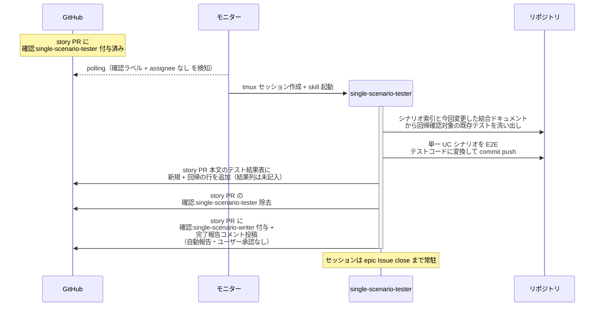
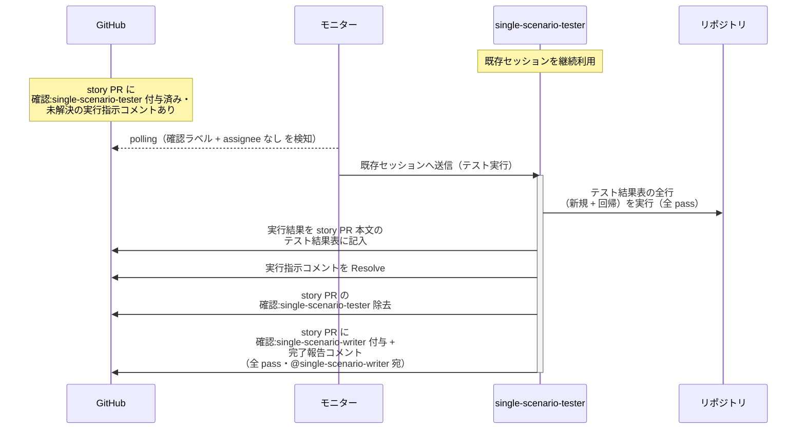
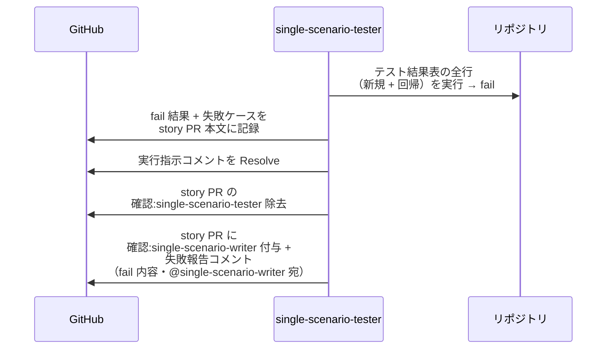

# 統合テスト実装と実行

single-scenario-tester / complex-scenario-tester が担当レベルのシナリオの E2E テスト実装（回帰確認対象の洗い出し含む）と、テストレビュー後の実行を担当する単一ユースケース。
指揮役は scenario-writer（タスク割り当て・報告の相手は全て writer）。
実装と実行は別フェーズで、間に writer の統合テストレビューを挟む（E2E は実行が重いため、実行前にレビューで無駄実行を防ぐ）。

対応エージェント: `single-scenario-tester` / `complex-scenario-tester`

図は単一 UC（story レベル）で代表する。
複合 UC（epic レベル）は以下を読み替えて同型。

| 図の表記 | 複合 UC での読み替え |
| --- | --- |
| single-scenario-tester | complex-scenario-tester |
| single-scenario-writer | complex-scenario-writer |
| story PR / story ブランチ | epic PR / epic ブランチ |
| 全 subsystem マージ済み | 全 story マージ済み |
| 単一 UC シナリオ | 複合 UC シナリオ（各 UC 箱の操作手順は対応する単一 UC テストを再利用） |
| 回帰洗い出しの元 = 今回変更した結合ドキュメント | 今回変更した単一 UC |
| fail を誘発するバグ埋込 = subsystem 実装のバグ | UC 間の受け渡しの不整合（単一 UC 単体は pass） |

## 正常シナリオ（テスト実装）

### セットアップ

| セットアップ | 説明 | 補足 |
| --- | --- | --- |
| Mock | なし（実環境で実行） | - |
| story PR | 全 subsystem マージ済み + `確認:single-scenario-tester` 付与済み（writer が割り当て） | 実行指示コメントなし = 実装フェーズ |
| 単一 UC シナリオ | story ブランチに存在 | テスト実装の元ネタ |
| assignee | PR に未設定 | エージェント起動条件 |

### フロー

### 期待値

- 単一 UC シナリオの正常 + 異常の E2E テストコードが story ブランチに commit されている
- story PR 本文のテスト結果表に新規 + 回帰の行が追加されている（結果列は未記入）
- story PR に `確認:single-scenario-writer` + 完了報告コメント（未解決）が付与・投稿されている
- `確認:single-scenario-tester` が除去されている

## 正常シナリオ（テスト実行・全 pass）

### セットアップ

| セットアップ | 説明 | 補足 |
| --- | --- | --- |
| Mock | なし（実環境で実行） | - |
| story PR | 統合テストレビュー済み + `確認:single-scenario-tester` 付与済み + writer の実行指示コメント（@single-scenario-tester 宛・未解決）あり | - |
| assignee | PR に未設定 | エージェント起動条件 |

### フロー

### 期待値

- テスト結果表の結果列が全て記入されている（新規 + 回帰とも全 ✅）
- 実行指示コメントが Resolve 済み
- story PR に `確認:single-scenario-writer` + 完了報告コメント（全 pass・未解決）が付与・投稿されている
- `確認:single-scenario-tester` が除去されている

## 異常シナリオ（E2E テスト fail）

### セットアップ

| セットアップ | 説明 | 補足 |
| --- | --- | --- |
| Mock | なし（実環境で実行） | - |
| story PR | 統合テストレビュー済み + `確認:single-scenario-tester` + 実行指示コメントあり | - |
| バグ埋込 | subsystem 実装に意図的なバグを仕込む | fail 誘発 |

### フロー

### 期待値

- fail 結果と失敗ケースがテスト結果表に記録されている
- story PR に `確認:single-scenario-writer` + 失敗報告コメント（fail 内容・未解決）が付与・投稿されている
- `確認:single-scenario-tester` が除去されている
