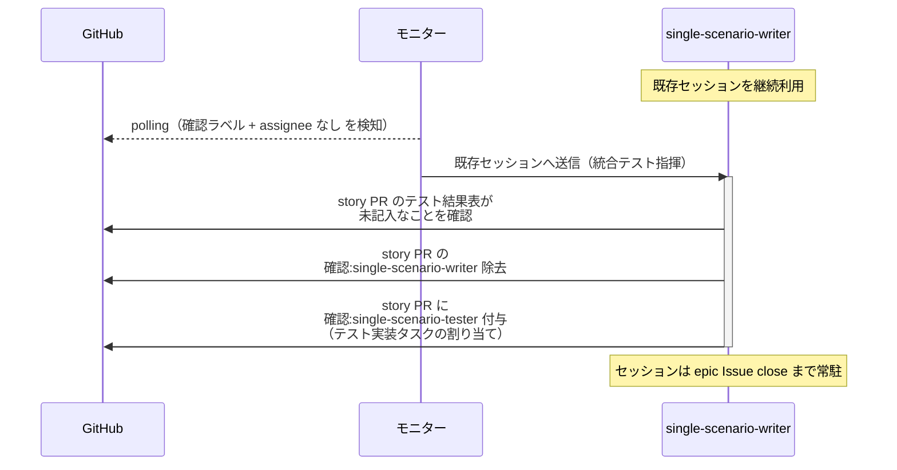
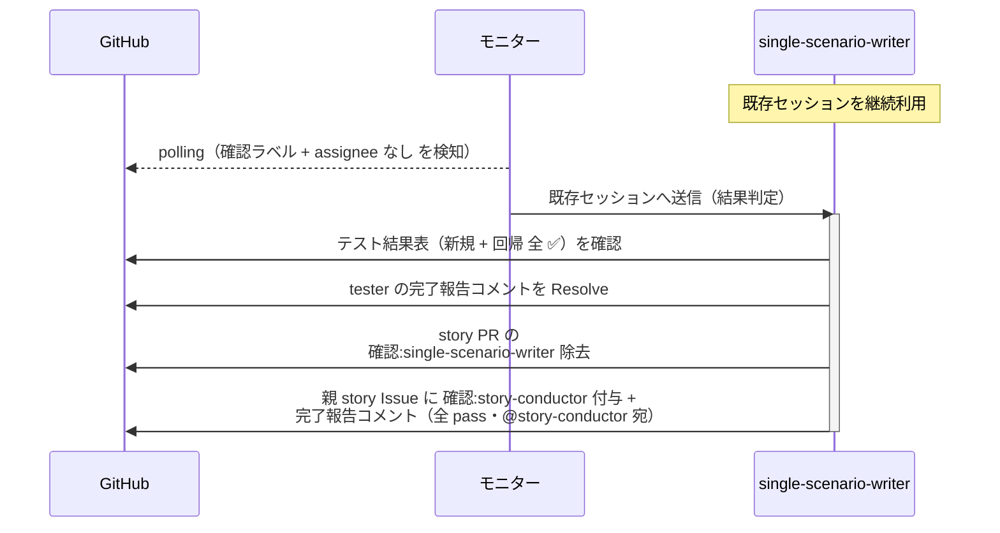
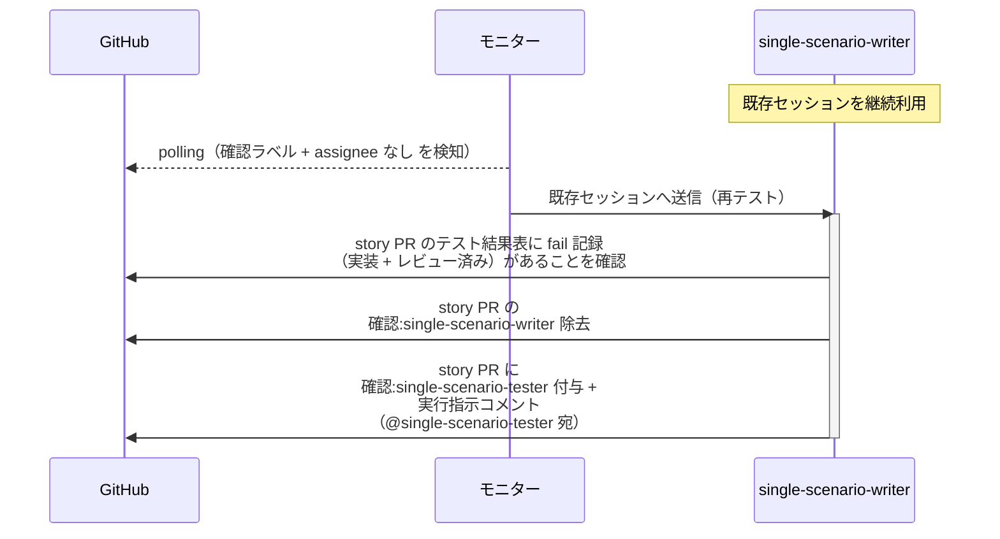
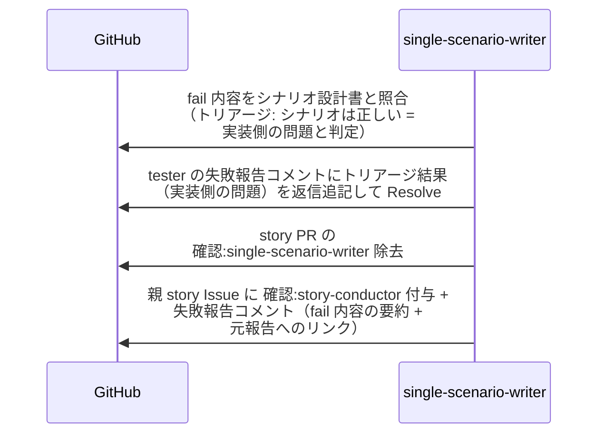
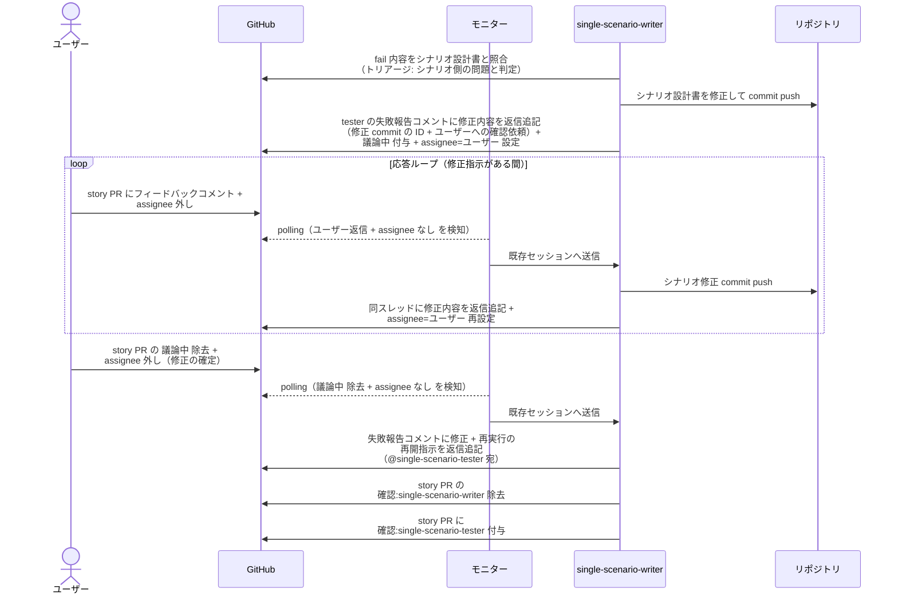
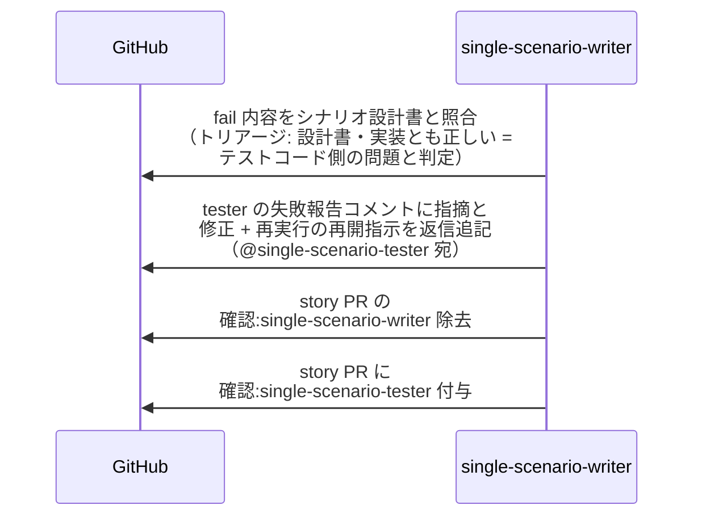

# 統合テスト指揮

single-scenario-writer / complex-scenario-writer（統合テストの指揮役）が、conductor から委任された統合テスト一式について配下の scenario-tester にタスクを割り当て、実行結果を判定して conductor へ報告する単一ユースケース。

対応エージェント: `single-scenario-writer` / `complex-scenario-writer`

図は単一 UC（story レベル）で代表する。
複合 UC（epic レベル）は以下を読み替えて同型。

| 図の表記 | 複合 UC での読み替え |
| --- | --- |
| single-scenario-writer | complex-scenario-writer |
| single-scenario-tester | complex-scenario-tester |
| story PR / 親 story Issue | epic PR / 親 epic Issue |
| story-conductor | epic-conductor |

## 正常シナリオ（テスト実装の起動）

### セットアップ

| セットアップ | 説明 | 補足 |
| --- | --- | --- |
| Mock | なし（実環境で実行） | - |
| story PR | `確認:single-scenario-writer` 付与済み（conductor の委任）・テスト結果表が未記入 | - |
| assignee | PR に未設定 | エージェント起動条件 |

### フロー

### 期待値

- story PR に `確認:single-scenario-tester` が付与されている（実行指示コメントなし）
- `確認:single-scenario-writer` が除去されている

## 正常シナリオ（全 pass の完了報告）

### セットアップ

| セットアップ | 説明 | 補足 |
| --- | --- | --- |
| Mock | なし（実環境で実行） | - |
| story PR | `確認:single-scenario-writer` 付与済み + single-scenario-tester の完了報告コメント（全 pass・自分宛・未解決）あり | テスト結果表 全 ✅ |
| assignee | PR に未設定 | エージェント起動条件 |

### フロー

### 期待値

- tester の完了報告コメントが Resolve 済み
- 親 story Issue に `確認:story-conductor` + 完了報告コメント（全 pass・未解決）が付与・投稿されている
- `確認:single-scenario-writer` が除去されている

## 正常シナリオ（再テストの実行指示）

### セットアップ

| セットアップ | 説明 | 補足 |
| --- | --- | --- |
| Mock | なし（実環境で実行） | - |
| story PR | `確認:single-scenario-writer` 付与済み（conductor の委任）・テスト結果表に fail 記録あり（実装 + レビュー済み） | 再テストを誘発 |
| assignee | PR に未設定 | エージェント起動条件 |

### フロー

### 期待値

- story PR に `確認:single-scenario-tester` + 実行指示コメント（@single-scenario-tester 宛・未解決）が付与・投稿されている（レビュー済みテストの再実行のため実装フェーズは経由しない）
- `確認:single-scenario-writer` が除去されている

## 異常シナリオ（fail・実装側の問題）

### セットアップ

| セットアップ | 説明 | 補足 |
| --- | --- | --- |
| Mock | なし（実環境で実行） | - |
| story PR | `確認:single-scenario-writer` 付与済み + tester の失敗報告コメント（fail 内容・自分宛・未解決）あり | - |
| fail の原因 | subsystem 実装に意図的なバグを仕込む（シナリオ設計書は正しい） | 実装側の問題と判定させる |

### フロー

### 期待値

- tester の失敗報告コメントのスレッドにトリアージ結果（実装側の問題）が返信追記され、Resolve 済み
- 親 story Issue に `確認:story-conductor` + 失敗報告コメント（fail 内容の要約 + 元報告へのリンク・未解決）が付与・投稿されている（バグ差し戻しは story-conductor）
- `確認:single-scenario-writer` が除去されている

## 異常シナリオ（fail・シナリオ側の問題）

### セットアップ

| セットアップ | 説明 | 補足 |
| --- | --- | --- |
| Mock | なし（実環境で実行） | - |
| story PR | `確認:single-scenario-writer` 付与済み + tester の失敗報告コメント（fail 内容・自分宛・未解決）あり | - |
| fail の原因 | シナリオ設計書に実装と矛盾する期待値を仕込む（実装は要件どおり） | シナリオ側の問題と判定させる |
| ユーザー役 | シナリオ修正の承認（`議論中` 除去）を pytest が実施 | - |

### フロー

### 期待値

- シナリオ設計書の修正 commit が story ブランチに積まれている（修正はユーザー承認済み）
- tester の失敗報告コメントのスレッドに修正内容（修正 commit の ID）と修正 + 再実行の再開指示（@single-scenario-tester 宛）が返信追記されている（スレッドは未解決のまま = tester が処理時に Resolve する）
- story PR に `確認:single-scenario-tester` が付与されている
- `確認:single-scenario-writer` が除去されている

## 異常シナリオ（fail・テストコード側の問題）

### セットアップ

| セットアップ | 説明 | 補足 |
| --- | --- | --- |
| Mock | なし（実環境で実行） | - |
| story PR | `確認:single-scenario-writer` 付与済み + tester の失敗報告コメント（fail 内容・自分宛・未解決）あり | - |
| fail の原因 | E2E テストコードに誤りを仕込む（シナリオ設計書・実装は正しい） | テストコード側の問題と判定させる |

### フロー

### 期待値

- tester の失敗報告コメントのスレッドに指摘と修正 + 再実行の再開指示（@single-scenario-tester 宛）が返信追記されている（スレッドは未解決のまま = tester が処理時に Resolve する）
- story PR に `確認:single-scenario-tester` が付与され、`確認:single-scenario-writer` が除去されている
- シナリオ設計書・実装コードへの変更が発生していない
