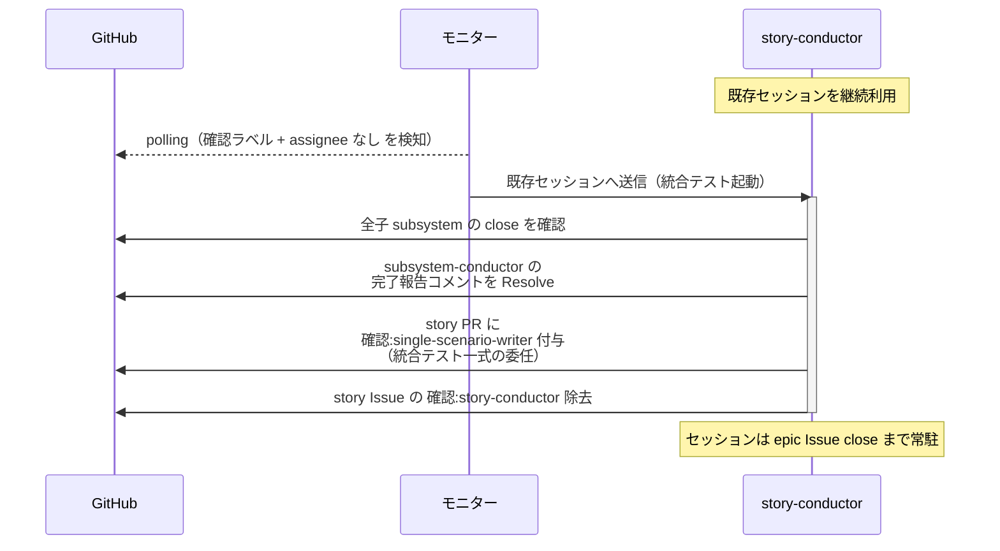
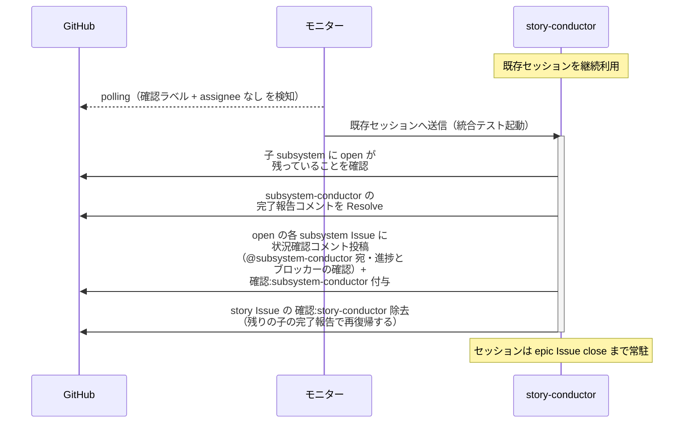
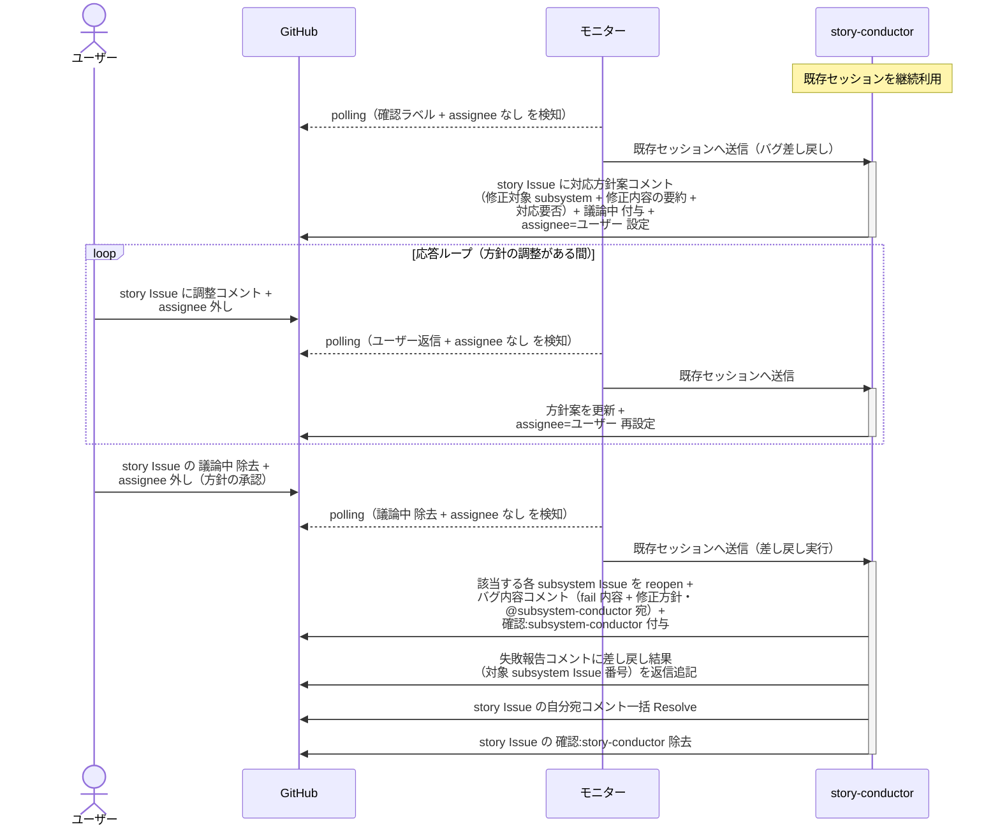

# 統合テスト起動

story-conductor / epic-conductor（復帰呼び出し）が、配下 conductor からの完了報告（全子完了）を受けて統合テスト一式を scenario-writer に委任し、writer からの失敗報告を受けて該当 subsystem Issue にバグを差し戻す単一ユースケース。
統合テストの内部工程（実装 → レビュー → 実行）は scenario-writer が指揮する。

対応エージェント: `story-conductor`（単一 UC テスト）/ `epic-conductor`（複合 UC テスト）

- 対応テストファイル: `tests/e2e/単一ユースケース/test_統合テスト起動.py`（epic レベルの読み替えで検証）

図は story レベルで代表する。
epic レベルは以下を読み替えて同型。

| 図の表記 | epic レベルでの読み替え |
| --- | --- |
| story-conductor | epic-conductor |
| single-scenario-writer | complex-scenario-writer |
| story Issue / story PR | epic Issue / epic PR |
| subsystem-conductor / 全子 subsystem | story-conductor / 全子 story |

## 正常シナリオ（統合テストの委任）

### セットアップ

| セットアップ | 説明 | 補足 |
| --- | --- | --- |
| Mock | なし（実環境で実行） | - |
| story Issue | `確認:story-conductor` 付与済み + subsystem-conductor の完了報告コメント（最後の subsystem 完了・自分宛・未解決）あり | 全子 subsystem Issue が closed |
| assignee | 未設定 | エージェント起動条件 |

### フロー

### 期待値

- subsystem-conductor の完了報告コメントが Resolve 済み
- story PR に `確認:single-scenario-writer` が付与されている
- `確認:story-conductor` が除去されている（`議論中` は付与されず assignee は未設定のまま）

## 正常シナリオ（未完了の子が残っている場合）

### セットアップ

| セットアップ | 説明 | 補足 |
| --- | --- | --- |
| Mock | なし（実環境で実行） | - |
| story Issue | `確認:story-conductor` 付与済み + subsystem-conductor の完了報告コメント（自分宛・未解決）あり | - |
| 子 subsystem Issue | open の subsystem が残っている | 完了報告した subsystem 以外が進行中 |
| assignee | 未設定 | エージェント起動条件 |

### フロー

### 期待値

- subsystem-conductor の完了報告コメントが Resolve 済み
- open の subsystem Issue に状況確認コメント（@subsystem-conductor 宛・未解決）+ `確認:subsystem-conductor` が投稿・付与されている
- `確認:story-conductor` が除去されている（統合テストの委任は発生しない）

## 正常シナリオ（バグ差し戻し）

### セットアップ

| セットアップ | 説明 | 補足 |
| --- | --- | --- |
| Mock | なし（実環境で実行） | - |
| story Issue | `確認:story-conductor` 付与済み + single-scenario-writer の失敗報告コメント（実装側の問題・fail 内容・自分宛・未解決）あり | - |
| 該当 subsystem Issue | closed（PR は story へ merged 済み） | 差し戻し先 |
| ユーザー役 | 対応方針の承認（`議論中` 除去）を pytest が実施 | 実装修正 = 設計書の修正を伴うため差し戻し前に確認 |
| assignee | 未設定 | エージェント起動条件 |

### フロー

### 期待値

- 該当 subsystem Issue が open（reopen 済み）で、`確認:subsystem-conductor` + バグ内容コメント（fail 内容 + 修正方針・@subsystem-conductor 宛・未解決）が付与・投稿されている
- 失敗報告コメントのスレッドに差し戻し結果（対象 subsystem Issue 番号）が返信追記され、Resolve 済み
- story Issue に対応方針案コメントが投稿されている（Resolve 済み）
- `確認:story-conductor` が除去されている（`議論中` はユーザーが除去済み）

## 異常シナリオ

なし
