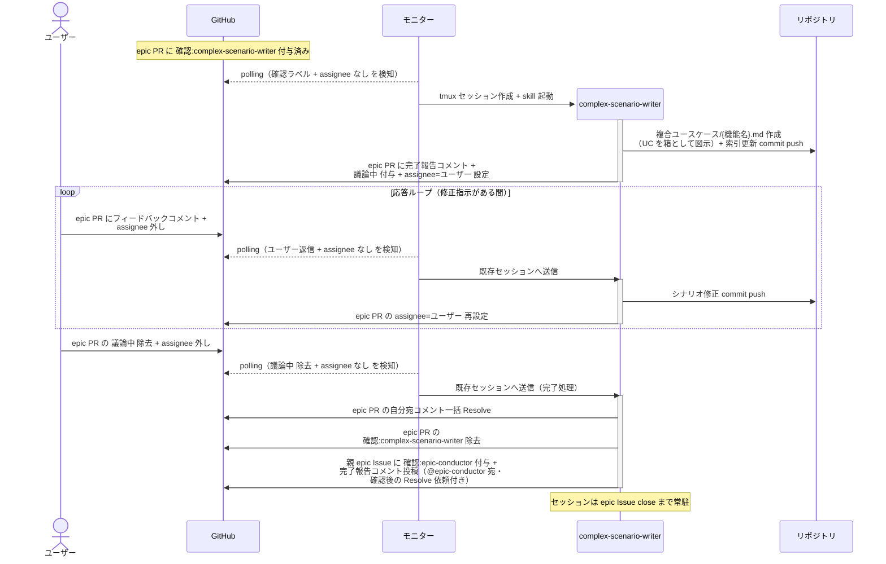

# 複合シナリオ設計

complex-scenario-writer が epic 本文のユースケース一覧をもとに複合ユースケースシナリオ（UC を箱として連鎖させた業務フロー）を設計し、epic ブランチに commit する単一ユースケース。

対応エージェント: `complex-scenario-writer`

## 正常シナリオ

### セットアップ

| セットアップ | 説明 | 補足 |
| --- | --- | --- |
| Mock | なし（実環境で実行） | - |
| epic Draft PR | `確認:complex-scenario-writer` 付与済み | 本文は `## 紐づく Issue` のみ |
| epic Issue | 5 セクション確定済み | ユースケース一覧が UC 名の SoT |
| 画面の方向性 | 画面変更ありの epic では epic PR の `## UI 設計` + モック確定済み | シナリオは確定済み画面を前提に書く |
| assignee | PR に未設定 | エージェント起動条件 |

### フロー

### 期待値

- epic ブランチに `docs/wiki/設計図/シナリオ/複合ユースケース/{機能名}.md` が commit されている（正常 + 異常シナリオ、中間ノードは UC 名と 1:1 の粒度ルール準拠）
- `設計図/シナリオ/README.md` の索引に行が追加されている
- 親 epic Issue に `確認:epic-conductor` が付与され、完了報告コメント（@epic-conductor 宛・未解決）が投稿されている
- epic PR の自分宛コメントが全て Resolve 済み

## 異常シナリオ

なし
