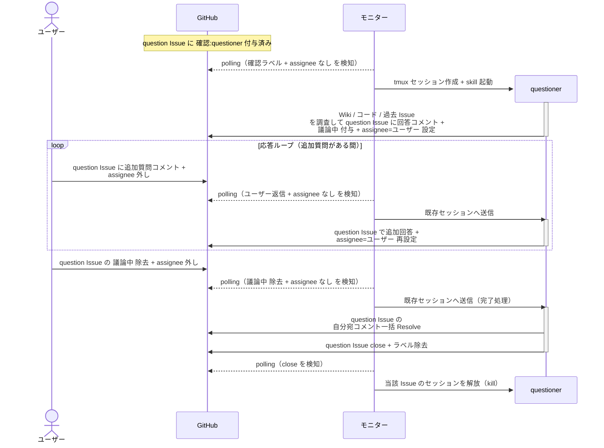
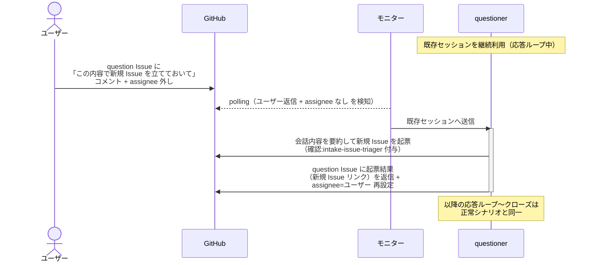

# 質疑応答

questioner が `type:question` Issue に対してコメントループで回答し、回答確定後に Issue をクローズする単一ユースケース。
実装は行わない。
会話中に依頼された場合は、会話内容を元に新規 Issue を起票して intake-issue-triager に引き継ぐ。

対応エージェント: `questioner`

## 正常シナリオ

### セットアップ

| セットアップ | 説明 | 補足 |
| --- | --- | --- |
| Mock | なし（実環境で実行） | - |
| question Issue | `type:question` + `確認:questioner` 付きで存在 | 本文に質問が書かれている |
| assignee | 未設定 | エージェント起動条件 |

### フロー

### 期待値

- 回答コメントが投稿され、Issue が close されている
- 実装コード・Wiki への変更が一切発生していない
- 自分宛コメントが全て Resolve 済み

### 補足

- 追加質問はユーザーがコメント + assignee 外しで返し、応答ループで追加回答する

## 正常シナリオ（会話からの新規 Issue 起票）

### セットアップ

| セットアップ | 説明 | 補足 |
| --- | --- | --- |
| Mock | なし（実環境で実行） | - |
| question Issue | `確認:questioner` + `議論中` 付与済み・回答コメント投稿済み | 応答ループ中 |
| ユーザーコメント | 「この内容で新規 Issue を立てておいて」の依頼 + assignee 外し | 起票を誘発 |

### フロー

### 期待値

- 新規 Issue が存在し `確認:intake-issue-triager` が付与されている（本文は会話内容の要約）
- question Issue のスレッドに新規 Issue へのリンクが返信されている

## 異常シナリオ

なし
