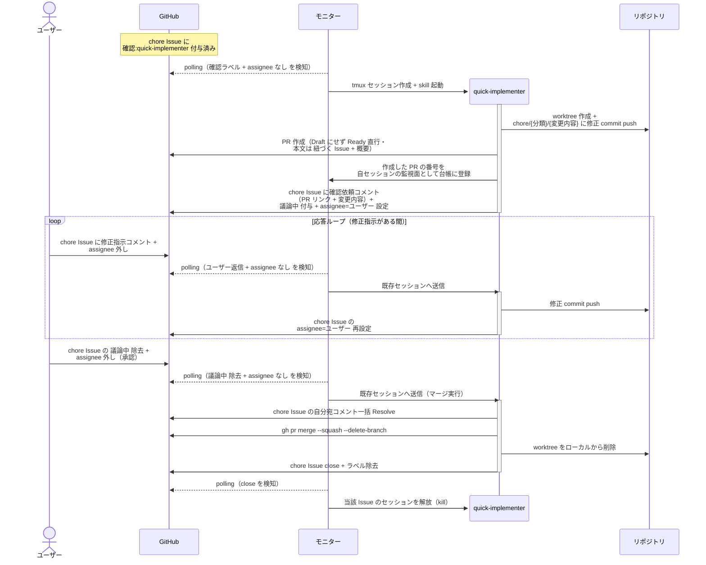
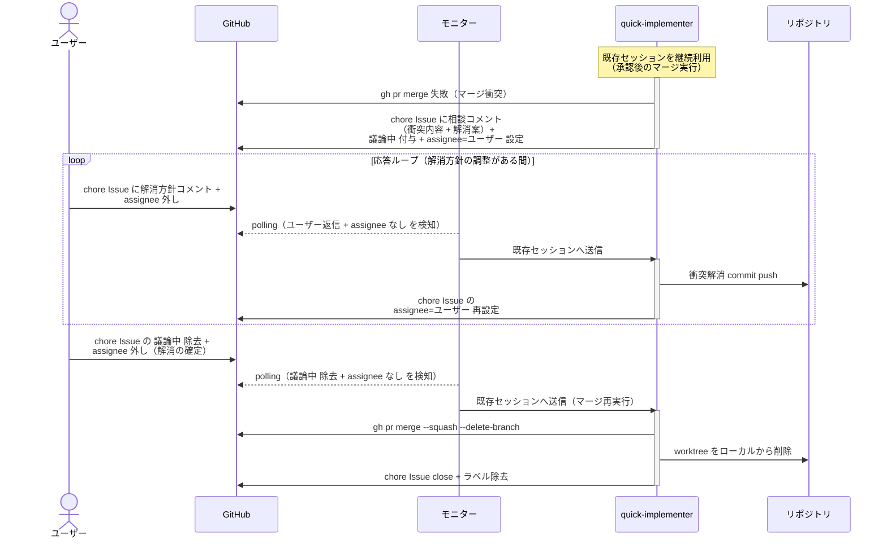

# 軽微修正の直接マージ

quick-implementer が chore Issue の指示どおりに直接修正し、TDD・Wiki 更新・レビューをスキップして、push 内容のユーザー確認（応答ループ）を経てマージする単一ユースケース。

対応エージェント: `quick-implementer`

## 正常シナリオ

### セットアップ

| セットアップ | 説明 | 補足 |
| --- | --- | --- |
| Mock | なし（実環境で実行） | - |
| chore Issue | `layer:chore` + `確認:quick-implementer` 付きで存在 | - |
| 修正対象 | 軽微修正対象のファイルが存在（typo 等） | - |
| assignee | 未設定 | エージェント起動条件 |

### フロー

### 期待値

- master に修正 commit が入っている
- PR が merged 状態（Draft を経由していない）・本文に `## 紐づく Issue` と `## 概要` が記入されている
- chore Issue が close、worktree / ブランチが削除済み
- 自分宛コメントが全て Resolve 済み

## 異常シナリオ（マージ衝突）

### セットアップ

| セットアップ | 説明 | 補足 |
| --- | --- | --- |
| Mock | なし（実環境で実行） | - |
| chore Issue | `確認:quick-implementer` 付与済み・push とユーザー承認まで完了 | マージ実行フェーズ |
| master | chore ブランチと同一ファイルを変更する commit が先行して入っている | 衝突を誘発 |

### フロー

### 期待値

- master に修正 commit（衝突解消込み）が入っている
- PR が merged 状態
- chore Issue が close、worktree / ブランチが削除済み
