# Issueから自動マージまで

ai-monitor のメインフロー: 監視対象プロジェクトに新規機能相当の Issue が起票されてから、intake → epic → story → subsystem を経て master にマージされるまでの複合ユースケース。

**E2E テストの位置付け:** ai-monitor プラグイン + モニターの全エージェントを一気通しで動作確認する最上位シナリオ。
実行時間は数十分〜数時間規模、Claude Code Max プランで無料実行、`pytest -m e2e_full` タグ付きで手動起動のみ。

## 正常シナリオ

### セットアップ

シナリオは DB Factory ではなく **sandbox GitHub リポの初期状態** + **ai-monitor プロセスの起動状態** を前提として扱う。

| セットアップ | 説明 | 補足 |
| --- | --- | --- |
| Mock | なし（実環境で実行） | - |
| sandbox リポ存在 | `shuhei1101/ai-monitor-e2e` が存在し空プロジェクト状態 | Pages 有効 |
| ai-monitor プラグイン | marketplace 経由でインストール済み（user scope）かつ **最新版に更新済み** | `/plugin marketplace update ai-monitor` → 未インストールなら `/plugin install ai-monitor@ai-monitor`。tmux 内の `claude "/ai-monitor:{skill}"` が前提 |
| ラベル定義 | `AI_MONITOR_LABEL_*` 全てが `gh label create` 済み | `plugins/ai-monitor/constants.env` から一括作成 |
| Wiki 配置 | sandbox に `docs/wiki/` 一式が存在 | ai-monitor 本体からコピー |
| ai-monitor 起動 | モニターが sandbox を polling 中 | `settings.yaml` に E2E プロジェクト宣言済み |
| ユーザーログイン | `gh auth status` OK、sandbox に対して write 権限 | テスト実行者 |
| 過去テスト残骸なし | sandbox の open Issue / open PR / worktree が全て clean | 前回テストの teardown 完了 |

### フロー

```mermaid
flowchart TD
  U0([ユーザー]) -->|監視対象リポで Issue 起票 +<br>確認:intake ラベル付与| UC1([Issue分解と子起票:正常シナリオ])
  UC1 -->|epic Issue + 確認:epic-conductor| UC2([epic要件確定:正常シナリオ<br>（PoC 不要・画面変更あり）])
  UC2 -->|epic Draft PR + 確認:mock-designer +<br>指示コメント| UC4B([全体UI設計:正常シナリオ])
  UC4B -->|完了報告 → epic-conductor が epic PR に<br>確認:complex-scenario-writer 付与| UC4([複合シナリオ設計:正常シナリオ])
  UC4 -->|親 epic に 確認:epic-conductor +<br>完了報告コメント| UC5([子story起票:正常シナリオ])
  UC5 -->|story Issue x N + 確認:story-conductor| UC6([story要件確定:正常シナリオ])
  UC6 -->|story Draft PR +<br>確認:single-scenario-writer| UC8([単一シナリオ設計:正常シナリオ])
  UC8 -->|親 story に 確認:story-conductor +<br>完了報告コメント| UC9([子subsystem起票:正常シナリオ<br>（初回・依存順の決定と先頭の起票）])
  UC9 -->|subsystem Issue x M +<br>確認:subsystem-conductor| UC10([subsystem要件確定:正常シナリオ])
  UC10 -->|subsystem Draft PR + 確認:architect| UC13([SS設計:正常シナリオ])
  UC13 -->|設計確定 → architect が 確認:tester 付与| UC14([テスト作成:正常シナリオ])
  UC14 -->|完了報告 → architect が直接レビュー| UC14B([テストレビュー:正常シナリオ])
  UC14B -->|指摘なし → architect が<br>確認:implementer 付与| UC15([実装:正常シナリオ])
  UC15 -->|Ready 化 + 完了報告 →<br>architect が直接レビュー| UC16([実装レビュー:正常シナリオ])
  UC16 -->|一式完了報告 +<br>確認:subsystem-conductor| UC16B([マージ起動:正常シナリオ])
  UC16B -->|最終確認依頼 + 議論中 +<br>assignee=ユーザー → ユーザー承認| UC17([マージ:正常シナリオ<br>（subsystem レベル・ユーザー承認後）])
  UC17 -->|subsystem-conductor の完了報告<br>（全 subsystem 完了）→ story-conductor が<br>確認:single-scenario-writer 付与| UC18A([統合テスト指揮:正常シナリオ<br>（テスト実装の起動）])
  UC18A -->|確認:single-scenario-tester 付与| UC18([統合テスト実装と実行:正常シナリオ<br>（テスト実装）])
  UC18 -->|テスト実装完了報告 →<br>writer が直接レビュー| UC18B([統合テストレビュー:正常シナリオ])
  UC18B -->|指摘なし → 確認:single-scenario-tester +<br>実行指示| UC18C([統合テスト実装と実行:正常シナリオ<br>（テスト実行・全 pass）])
  UC18C -->|全 pass 報告 → writer| UC18D([統合テスト指揮:正常シナリオ<br>（全 pass の完了報告）])
  UC18D -->|story-conductor へ全 pass 報告 →<br>story-conductor がマージ実行| UC19([マージ:正常シナリオ<br>（story レベル・自動）])
  UC19 -->|story-conductor の完了報告（全 story 完了）→<br>epic-conductor が epic PR に<br>確認:complex-scenario-writer 付与| UC20A([統合テスト指揮:正常シナリオ<br>（テスト実装の起動）])
  UC20A -->|確認:complex-scenario-tester 付与| UC20([統合テスト実装と実行:正常シナリオ<br>（テスト実装）])
  UC20 -->|テスト実装完了報告 →<br>writer が直接レビュー| UC20B([統合テストレビュー:正常シナリオ])
  UC20B -->|指摘なし → 確認:complex-scenario-tester +<br>実行指示| UC20C([統合テスト実装と実行:正常シナリオ<br>（テスト実行・全 pass）])
  UC20C -->|全 pass 報告 → writer| UC20D([統合テスト指揮:正常シナリオ<br>（全 pass の完了報告）])
  UC20D -->|epic-conductor へ全 pass 報告 →<br>epic-conductor がマージ実行| UC21([マージ:正常シナリオ<br>（epic レベル・終端処理）])
  UC21 -->|全 Sub-issue closed →<br>モニターが intake close| DONE([intake Issue close・epic が master 反映済み])

  click UC1 "../単一ユースケース/Issue分解と子起票.md#正常シナリオ"
  click UC2 "../単一ユースケース/epic要件確定.md#正常シナリオpoc-不要画面変更あり"
  click UC4B "../単一ユースケース/全体UI設計.md#正常シナリオ"
  click UC4 "../単一ユースケース/複合シナリオ設計.md#正常シナリオ"
  click UC5 "../単一ユースケース/子story起票.md#正常シナリオ"
  click UC6 "../単一ユースケース/story要件確定.md#正常シナリオ"
  click UC8 "../単一ユースケース/単一シナリオ設計.md#正常シナリオ"
  click UC9 "../単一ユースケース/子subsystem起票.md#正常シナリオ初回依存順の決定と先頭の起票"
  click UC10 "../単一ユースケース/subsystem要件確定.md#正常シナリオ"
  click UC13 "../単一ユースケース/SS設計.md#正常シナリオ"
  click UC14 "../単一ユースケース/テスト作成.md#正常シナリオ"
  click UC14B "../単一ユースケース/テストレビュー.md#正常シナリオ"
  click UC15 "../単一ユースケース/実装.md#正常シナリオ"
  click UC16 "../単一ユースケース/実装レビュー.md#正常シナリオ"
  click UC16B "../単一ユースケース/マージ起動.md#正常シナリオ"
  click UC17 "../単一ユースケース/マージ.md#正常シナリオsubsystem-レベルユーザー承認後"
  click UC18A "../単一ユースケース/統合テスト指揮.md#正常シナリオテスト実装の起動"
  click UC18 "../単一ユースケース/統合テスト実装と実行.md#正常シナリオテスト実装"
  click UC18B "../単一ユースケース/統合テストレビュー.md#正常シナリオ"
  click UC18C "../単一ユースケース/統合テスト実装と実行.md#正常シナリオテスト実行全-pass"
  click UC18D "../単一ユースケース/統合テスト指揮.md#正常シナリオ全-pass-の完了報告"
  click UC19 "../単一ユースケース/マージ.md#正常シナリオstory-レベル自動"
  click UC20A "../単一ユースケース/統合テスト指揮.md#正常シナリオテスト実装の起動"
  click UC20 "../単一ユースケース/統合テスト実装と実行.md#正常シナリオテスト実装"
  click UC20B "../単一ユースケース/統合テストレビュー.md#正常シナリオ"
  click UC20C "../単一ユースケース/統合テスト実装と実行.md#正常シナリオテスト実行全-pass"
  click UC20D "../単一ユースケース/統合テスト指揮.md#正常シナリオ全-pass-の完了報告"
  click UC21 "../単一ユースケース/マージ.md#正常シナリオepic-レベル終端処理"
```

### 期待値

- intake Issue が close（`state: closed`、`reason: completed`）
- epic PR が master へ merge 済み（`gh pr view --json state,mergedAt`）
- 全ての中間 Issue / PR が close 済み、対応ブランチが削除済み
- モニタープロセスが稼働継続している
- 全 Issue/PR の close / merge に伴い、対応する tmux セッションが全て解放済み（ゾンビセッションなし）
- `AI_MONITOR_LABEL_PROCESSING_*` ラベルがどの Issue / PR にも残っていない

## 異常シナリオ

なし
