# epic統合テスト失敗からのバグ修正

epic レベル（複合UC E2E）の統合テスト実行時に fail が発生した場合の複合ユースケース。
complex-scenario-writer のトリアージを経て epic-conductor が該当 story へ差し戻し、story-conductor が該当 subsystem へ中継してバグ修正フローで修正 → 完了報告が story → epic へ遡上 → 再テストで pass → epic マージまでを確認する。
指揮系統は 1 段ずつ辿る（epic-conductor は story までしか差し戻さない）。
修正用 PR の base は統合テストを実行している epic ブランチ（story ブランチはマージ済みで削除されているため）。

## 正常シナリオ

### セットアップ

| セットアップ | 説明 | 補足 |
| --- | --- | --- |
| Mock | なし（実環境で実行） | - |
| sandbox リポ状態 | 全 story PR が epic ブランチへ merge 済み・全 story / subsystem Issue closed。epic PR 自体は未マージで統合テスト待機中 | メインフローの epic 統合テスト直前を想定 |
| ai-monitor プラグイン | marketplace 経由でインストール済みかつ最新版に更新済み | tmux 内の `claude "/ai-monitor:{skill}"` が前提 |
| バグ埋込 | 該当 subsystem の実装に意図的なバグを仕込む | 複合UC E2E が fail するように |
| ai-monitor 起動 | モニターが polling 中 | - |
| ラベル状態 | epic PR に `確認:complex-scenario-tester` + 実行指示コメント付与済み（テスト実装 + 統合テストレビュー済み） | fail を誘発する起点 |
| ユーザー役 | epic-conductor の対応方針案の承認（`議論中` 除去）と subsystem マージ最終承認を pytest が実施 | - |

### フロー

```mermaid
flowchart TD
  A0([complex-scenario-writer]) -->|epic PR に 確認:complex-scenario-tester +<br>実行指示コメントを付与| UC1

  subgraph FOCUS1["検証対象: fail → 1 段ずつの差し戻し → 中継"]
    UC1([統合テスト実装と実行:異常シナリオ<br>（E2E テスト fail）]) -->|fail・確認:complex-scenario-writer +<br>失敗報告| UC2([統合テスト指揮:異常シナリオ<br>（fail・実装側の問題）])
    UC2 -->|確認:epic-conductor + 失敗報告| UC3([統合テスト起動:正常シナリオ<br>（バグ差し戻し）])
    UC3 -->|方針承認後に該当 story Issue を reopen +<br>バグ内容コメント + 確認:story-conductor| UC4([バグ差し戻しの中継:正常シナリオ<br>（差し戻しの中継）])
    UC4 -->|該当 subsystem Issue を reopen +<br>バグ内容コメント +<br>確認:subsystem-conductor| UC5([バグ修正着手:正常シナリオ])
  end

  UC5 -->|修正用 Draft PR（base=epic）+<br>確認:architect| UC6([SS設計:正常シナリオ])
  UC6 -->|設計確定 → architect が 確認:tester 付与| UC7([テスト作成:正常シナリオ])
  UC7 -->|完了報告 → architect が直接レビュー| UC8([テストレビュー:正常シナリオ])
  UC8 -->|指摘なし → architect が<br>確認:implementer 付与| UC9([実装:正常シナリオ])
  UC9 -->|Ready 化 + 完了報告 →<br>architect が直接レビュー| UC10([実装レビュー:正常シナリオ])
  UC10 -->|一式完了報告 +<br>確認:subsystem-conductor| UC11([マージ起動:正常シナリオ])
  UC11 -->|最終確認依頼 + 議論中 +<br>assignee=ユーザー → ユーザー承認| UC12([マージ:正常シナリオ<br>（subsystem レベル・ユーザー承認後）])

  subgraph FOCUS2["検証対象: 完了報告の遡上 → 再テスト → epic マージ"]
    UC12 -->|親 story に 確認:story-conductor +<br>完了報告（バグ修正完了）| UC13([バグ差し戻しの中継:正常シナリオ<br>（修正完了の中継）])
    UC13 -->|story Issue close + 親 epic に<br>確認:epic-conductor + 完了報告| UC14([統合テスト起動:正常シナリオ<br>（統合テストの委任）])
    UC14 -->|epic PR に<br>確認:complex-scenario-writer 付与| UC15([統合テスト指揮:正常シナリオ<br>（再テストの実行指示）])
    UC15 -->|確認:complex-scenario-tester + 実行指示| UC16([統合テスト実装と実行:正常シナリオ<br>（テスト実行・全 pass）])
    UC16 -->|全 pass 報告 → writer| UC17([統合テスト指揮:正常シナリオ<br>（全 pass の完了報告）])
  end

  UC17 -->|epic-conductor へ全 pass 報告| UC18([マージ:正常シナリオ<br>（epic レベル・終端処理）])
  UC18 --> DONE([epic PR: master へ merged 済み])

  click UC1 "../単一ユースケース/統合テスト実装と実行.md#異常シナリオe2e-テスト-fail"
  click UC2 "../単一ユースケース/統合テスト指揮.md#異常シナリオfail実装側の問題"
  click UC3 "../単一ユースケース/統合テスト起動.md#正常シナリオバグ差し戻し"
  click UC4 "../単一ユースケース/バグ差し戻しの中継.md#正常シナリオ差し戻しの中継"
  click UC5 "../単一ユースケース/バグ修正着手.md#正常シナリオ"
  click UC6 "../単一ユースケース/SS設計.md#正常シナリオ"
  click UC7 "../単一ユースケース/テスト作成.md#正常シナリオ"
  click UC8 "../単一ユースケース/テストレビュー.md#正常シナリオ"
  click UC9 "../単一ユースケース/実装.md#正常シナリオ"
  click UC10 "../単一ユースケース/実装レビュー.md#正常シナリオ"
  click UC11 "../単一ユースケース/マージ起動.md#正常シナリオ"
  click UC12 "../単一ユースケース/マージ.md#正常シナリオsubsystem-レベルユーザー承認後"
  click UC13 "../単一ユースケース/バグ差し戻しの中継.md#正常シナリオ修正完了の中継"
  click UC14 "../単一ユースケース/統合テスト起動.md#正常シナリオ統合テストの委任"
  click UC15 "../単一ユースケース/統合テスト指揮.md#正常シナリオ再テストの実行指示"
  click UC16 "../単一ユースケース/統合テスト実装と実行.md#正常シナリオテスト実行全-pass"
  click UC17 "../単一ユースケース/統合テスト指揮.md#正常シナリオ全-pass-の完了報告"
  click UC18 "../単一ユースケース/マージ.md#正常シナリオepic-レベル終端処理"
```

### 期待値

- 該当 story / subsystem Issue が reopen を経て再び close 済み（新規のバグ Issue は存在しない）
- 修正用 PR（base=epic ブランチ）が epic ブランチへ merge 済み
- epic PR の `## 複合ユースケースシナリオテスト結果` に fail → pass の履歴が記録されている
- epic PR が master へ merged 状態になっている

## 異常シナリオ

なし
