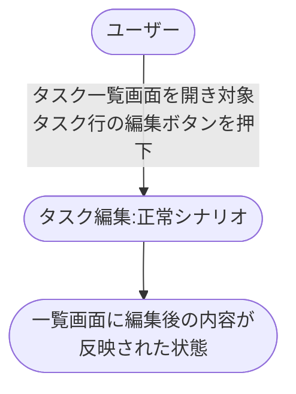
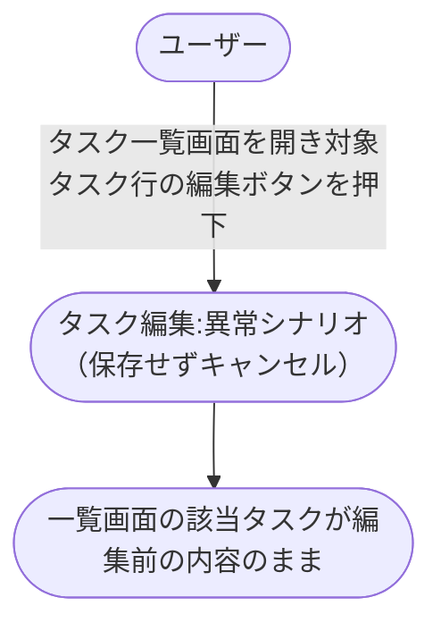

# タスク一覧からのタスク編集

タスク一覧から既存タスクを選択して編集画面へ遷移し、編集内容を保存後に一覧へ戻って反映を確認する業務シナリオ。

- 対応テストファイル: `tests/e2e/複合ユースケース/タスク一覧からのタスク編集.spec.ts`

## 正常シナリオ

### セットアップ

| セットアップ | 説明 | 補足 |
| --- | --- | --- |
| Mock | なし（実環境で実行） | - |
| `createUser` | ログイン中ユーザー A | - |
| `createTask` | userA が所有する編集対象の既存タスク | `title: "既存タスク"`, `status: "未完了"` |

### フロー

### 期待値

- タスク一覧画面に編集後のタスクタイトル・内容が表示されている
- DB の該当タスクレコードが編集後の値になっている

### 補足

- 検証対象は「一覧 → 編集画面 → 一覧」の遷移と一覧への反映（UC 内部の編集フォーム操作・保存 API 呼び出しは `単一ユースケース/タスク編集.md` の責務）
- 横断要件「保存時は既存 API を利用する」に従い、単一 UC 側では既存 API エンドポイントを利用する

## 異常シナリオ（編集を保存せずキャンセルする）

### セットアップ

| セットアップ | 説明 | 補足 |
| --- | --- | --- |
| Mock | なし（実環境で実行） | - |
| `createUser` | ログイン中ユーザー A | - |
| `createTask` | userA が所有する編集対象の既存タスク | `title: "既存タスク"`, `status: "未完了"` |

### フロー

### 期待値

- タスク一覧画面の該当タスクが編集前のタイトル・内容のまま表示されている
- DB の該当タスクレコードが変更されていない

### 補足

- 「途中まで編集したが保存せずキャンセル」した際に、一覧に中間状態が漏れないことを検証する（横断要件「保存時は既存 API を利用する」= キャンセル時は API を呼ばないことの複合側での確認）
