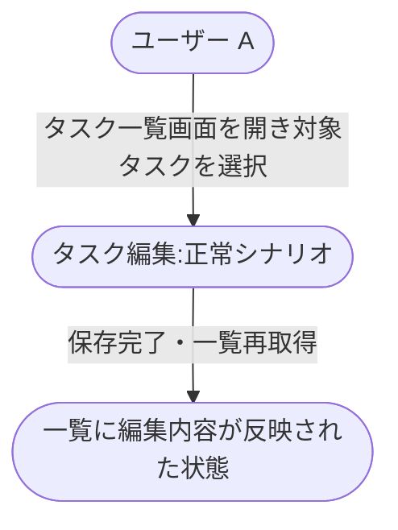
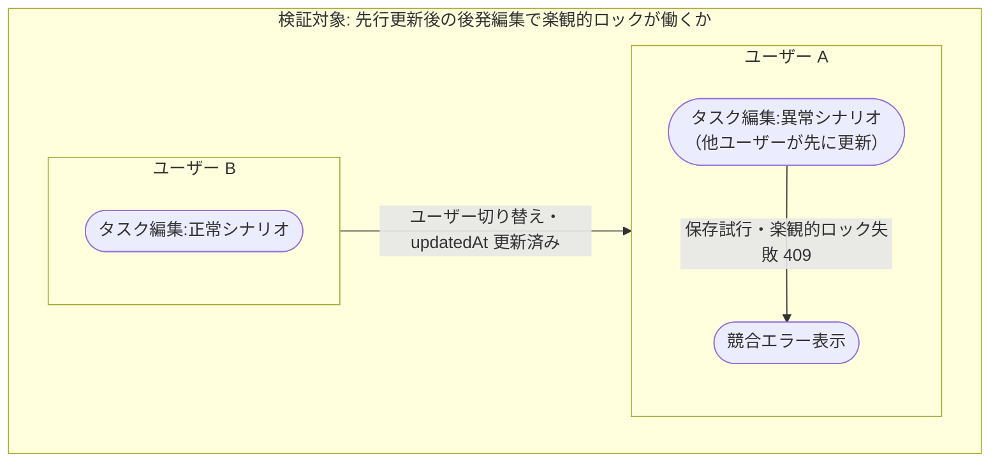

# タスク編集

既存タスクを一覧から選択して編集内容を保存する業務シナリオ。

- 対応テストファイル: `tests/e2e/複合ユースケース/task_edit.spec.ts`

## 正常シナリオ

### セットアップ

| セットアップ | 説明 | 補足 |
| --- | --- | --- |
| Mock | なし（実環境で実行） | - |
| `createUser` | ログイン中ユーザー A | - |
| `createTask` | userA が所有する編集対象タスク | - |

### フロー

### 期待値

- 一覧画面に編集後の内容が表示されている
- DB のタスクレコードが編集後の値になっている

## 異常シナリオ（他ユーザーが先に更新）

### セットアップ

| セットアップ | 説明 | 補足 |
| --- | --- | --- |
| Mock | なし（実環境で実行） | - |
| `createUser` | ログイン中ユーザー A | - |
| `createUser` | ログイン中ユーザー B | - |
| `createTask` | userA が所有し両者で編集する対象タスク | 編集対象タスク |

### フロー

### 期待値

- ユーザー A に競合エラーが表示されている
- DB のタスクレコードが B の更新内容のまま（A の変更は保存されていない）
