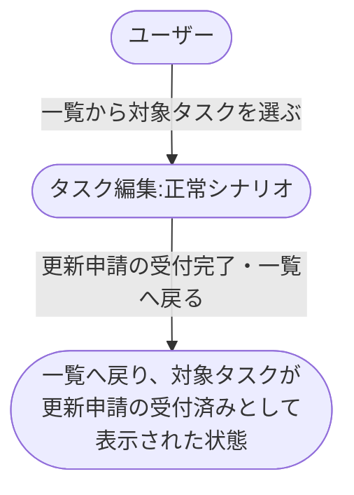

# タスク編集から一覧反映

タスクを編集して保存し、更新申請の受付完了をもって一覧画面へ戻るまでの業務シナリオ。
更新の確定は外部承認基盤から非同期で返るため、承認結果の反映は本シナリオの範囲に含めない。

## 正常シナリオ

### セットアップ

| セットアップ | 説明 | 補足 |
| --- | --- | --- |
| Mock | 外部承認基盤（申請の受付応答のみ返す） | 承認結果の非同期通知は本 epic のスコープ外のため Mock でも扱わない |
| タスク | 編集対象のタスクを 1 件登録済み | - |

### フロー

### 期待値

- 編集画面から一覧へ戻っている
- 一覧の対象タスクが更新申請の受付済みとして識別できる

## 異常シナリオ

なし
