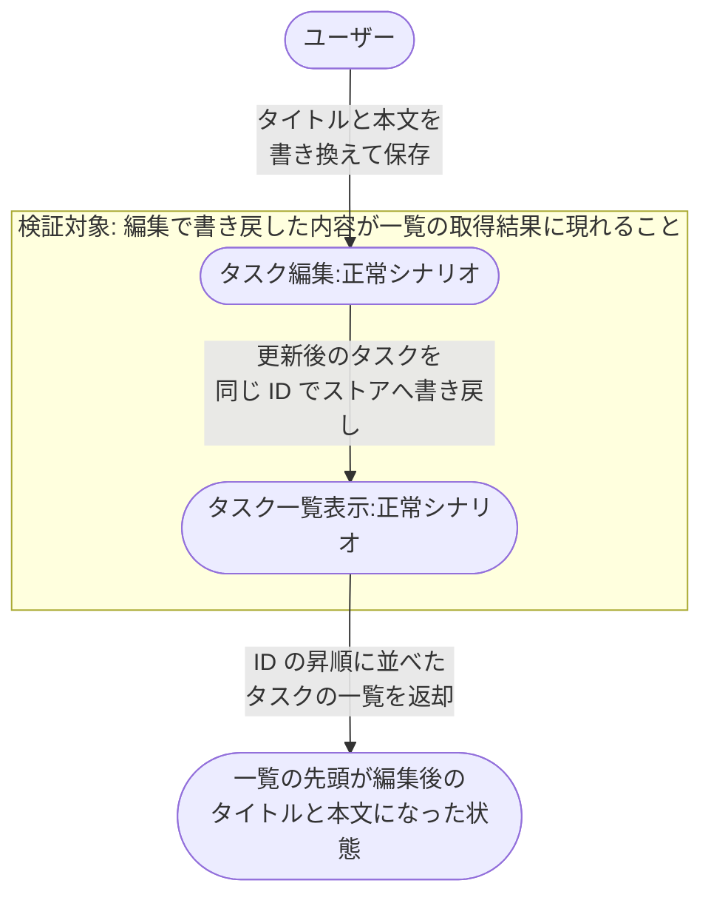
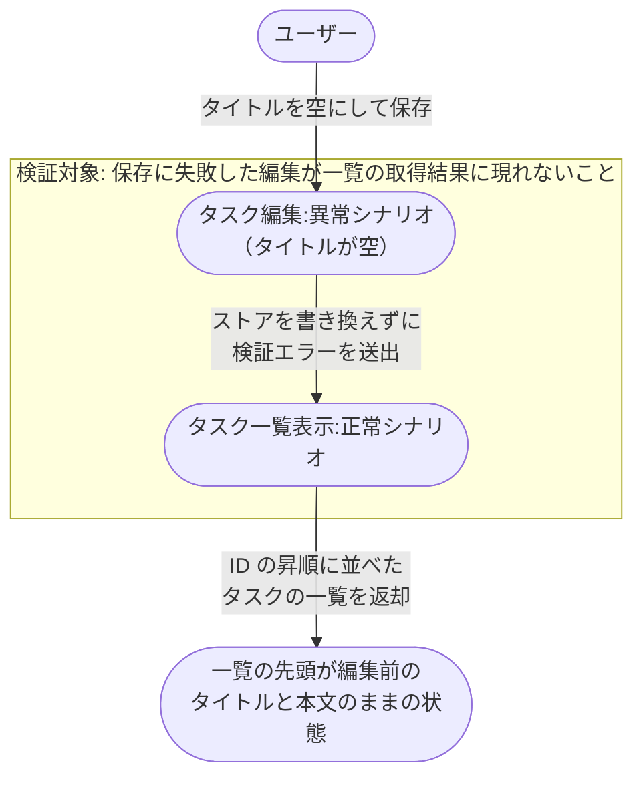

# タスク編集から一覧反映

登録済みのタスクを編集して保存し、その結果が一覧の取得結果に現れるまでの業務シナリオ。

- 対応テストファイル: `tests/e2e/複合ユースケース/test_タスク編集から一覧反映.py`

## 正常シナリオ

### セットアップ

| セットアップ | 説明 | 補足 |
| --- | --- | --- |
| Mock | なし（実環境で実行） | - |
| タスクストア | 編集対象のタスクを 1 件だけ保持した辞書 | `id: t1` / `title: 旧タイトル` / `content: 旧本文` |

### フロー

### 期待値

- 一覧の先頭のタスクのタイトルが編集後の値になっている
- 一覧の先頭のタスクの本文が編集後の値になっている

## 異常シナリオ（タイトルが空）

### セットアップ

| セットアップ | 説明 | 補足 |
| --- | --- | --- |
| Mock | なし（実環境で実行） | - |
| タスクストア | 編集対象のタスクを 1 件だけ保持した辞書 | `id: t1` / `title: 旧タイトル` / `content: 旧本文` |
| 入力 | タイトルを空文字にして保存 | タイトルの文字数下限を割らせて検証失敗を決定的に誘発 |

### フロー

### 期待値

- 保存が検証エラーで打ち切られている
- 一覧の先頭のタスクのタイトルが編集前の値のままになっている
- 一覧の先頭のタスクの本文が編集前の値のままになっている
