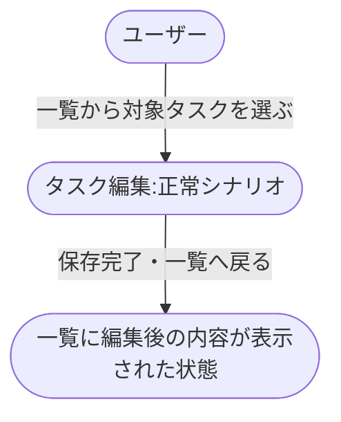
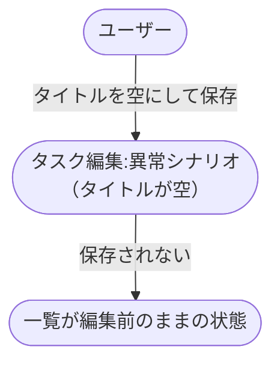

# タスク編集から一覧反映

タスクを編集して保存し、一覧に反映されるまでの業務シナリオ。

- 対応テストファイル: `tests/e2e/複合ユースケース/test_タスク編集から一覧反映.py`

## 正常シナリオ

### セットアップ

| セットアップ | 説明 | 補足 |
| --- | --- | --- |
| Mock | なし（実環境で実行） | - |
| タスク | 編集対象のタスクを 1 件登録済み | - |

### フロー

### 期待値

- 一覧に編集後のタイトルと本文が並んでいる

## 異常シナリオ（タイトルが空）

### セットアップ

| セットアップ | 説明 | 補足 |
| --- | --- | --- |
| Mock | なし（実環境で実行） | - |
| タスク | 編集対象のタスクを 1 件登録済み | - |
| 入力 | タイトルを空にして保存 | 検証失敗を決定的に誘発 |

### フロー

### 期待値

- 一覧が編集前の内容のまま変わっていない
