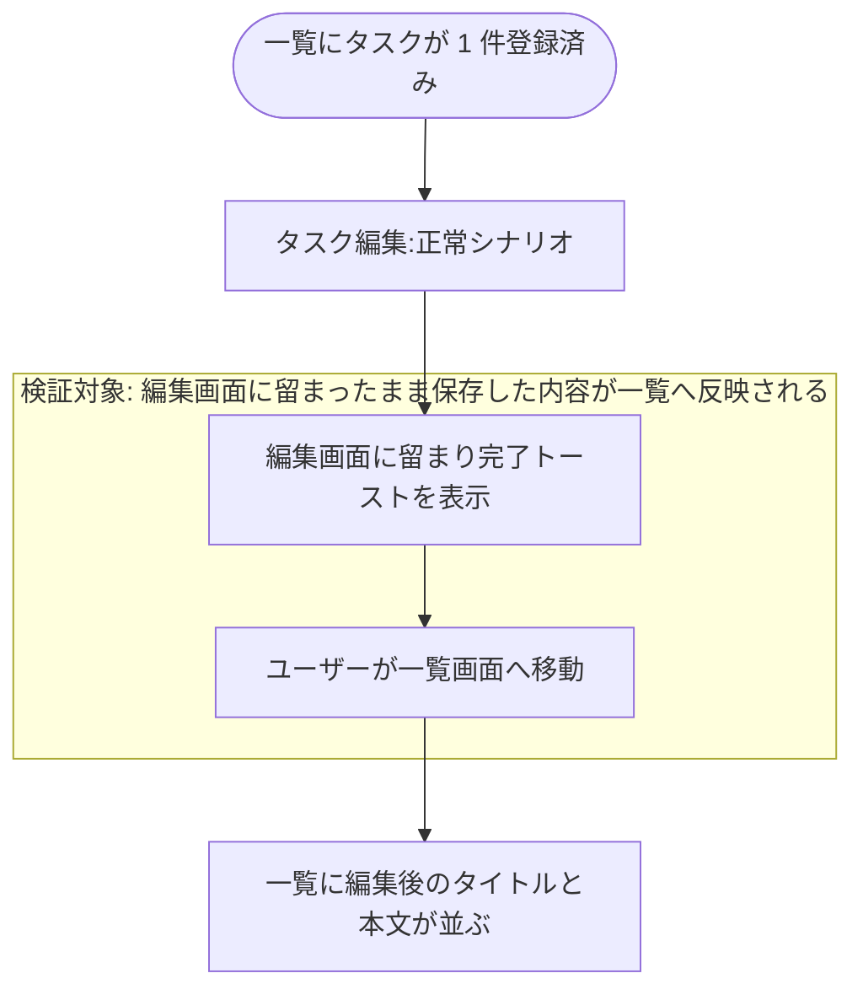
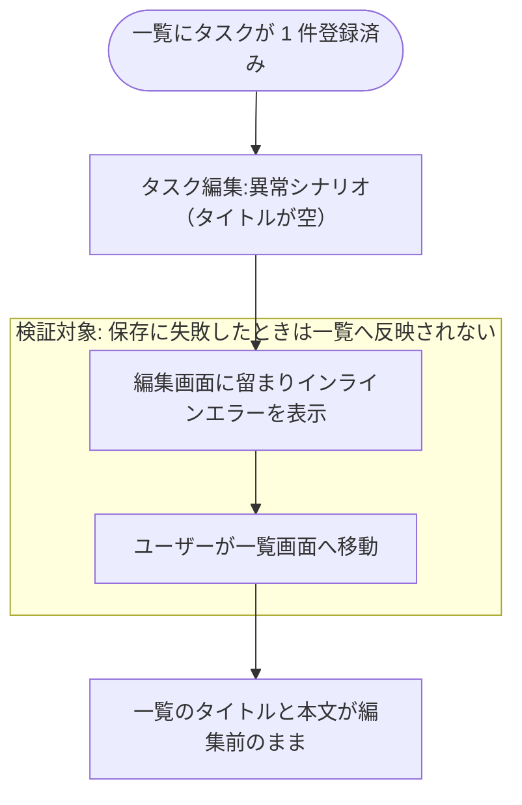

# タスク編集から一覧反映

現状の実装から起こした複合 UC。
保存後は一覧へ戻らず編集画面に留まる仕様のため、編集画面での保存完了と、ユーザーが一覧へ移動した後の反映内容が繋がっているかを検証する。

## 正常シナリオ

### セットアップ

| セットアップ | 説明 | 補足 |
| --- | --- | --- |
| Mock | なし（実環境で実行） | - |
| タスク | 編集対象のタスクを 1 件登録済み | - |

### フロー

### 期待値

- 保存直後は編集画面に留まり、完了トーストが表示されている
- 保存直後に一覧画面へ自動遷移していない
- 一覧に編集後のタイトルと本文が並んでいる

## 異常シナリオ（タイトルが空）

### セットアップ

| セットアップ | 説明 | 補足 |
| --- | --- | --- |
| Mock | なし（実環境で実行） | - |
| 入力 | タイトルを空にして保存 | 検証失敗を決定的に誘発 |

### フロー

### 期待値

- 編集画面に留まりインラインエラーが表示され、完了トーストは表示されない
- 一覧のタイトルと本文が編集前のまま変わっていない
