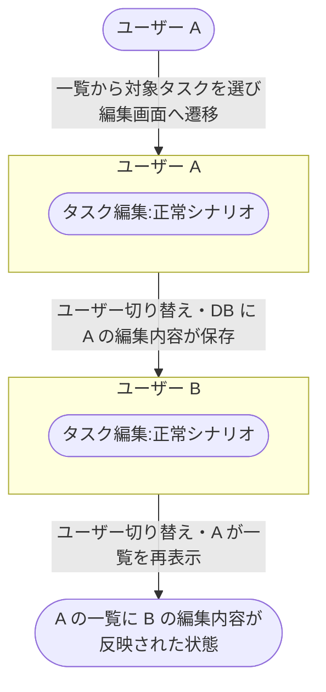
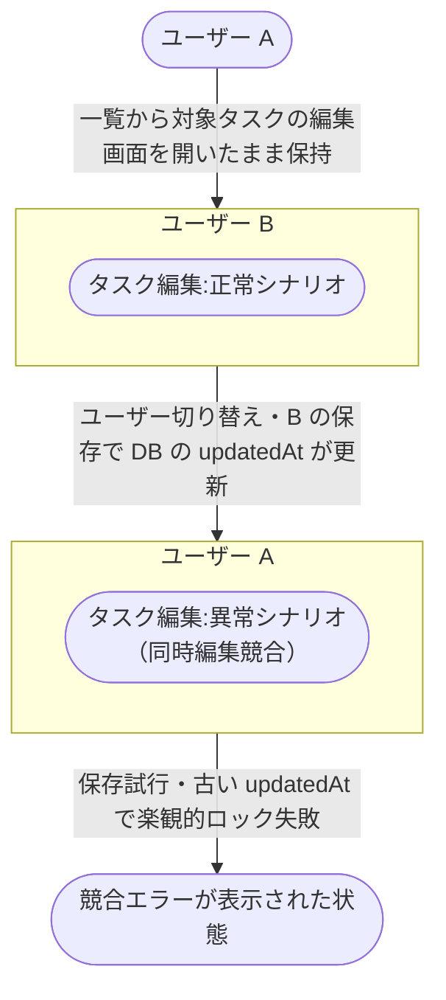

# タスク編集から他ユーザー編集

既存タスクをユーザー A が一覧から編集し、続けて別ユーザー B が同じタスクを編集して、A 側の一覧に最新内容が反映されるまでの業務シナリオ。
検証対象は「タスク編集の保存結果が、別ユーザーのタスク編集にそのまま引き継がれるか」というユースケース間のつなぎ目。

- 対応テストファイル: `tests/e2e/複合ユースケース/task_edit_by_other_user.spec.ts`

## 正常シナリオ

### セットアップ

| セットアップ | 説明 | 補足 |
| --- | --- | --- |
| Mock | なし（実環境で実行） | - |
| `createUser` | ログイン中ユーザー A（対象タスクの所有者） | - |
| `createUser` | ログイン中ユーザー B（同じタスクを編集する別ユーザー） | - |
| `createTask` | userA が所有する編集対象タスク | `title: 初期タイトル` |

### フロー

### 期待値

- ユーザー A の一覧画面に、B が保存した編集後のタイトルが表示されている
- DB の対象タスクレコードが B の編集後の値になっている

### 補足

- 各ノードは `単一ユースケース/タスク編集.md` と 1:1 で対応する。
  編集画面への遷移・入力・保存の手順は単一ユースケース側に書く。
- ユーザー A / B はそれぞれ別ブラウザコンテキスト（Playwright `context.newPage()`）で操作する。
- 各 subgraph は E2E テスト内の 1 フェーズ（`test.step('ユーザー A: タスク編集', ...)`）に対応する。
- subgraph 間の実線矢印はユーザー切り替えと DB を介したデータ伝播を示す（直接呼び出しではない）。

## 異常シナリオ（同時編集競合）

### セットアップ

| セットアップ | 説明 | 補足 |
| --- | --- | --- |
| Mock | なし（実環境で実行） | - |
| `createUser` | ログイン中ユーザー A（対象タスクの所有者） | - |
| `createUser` | ログイン中ユーザー B（同じタスクを編集する別ユーザー） | - |
| `createTask` | userA が所有する編集対象タスク | A が編集画面を開いた時点の `updatedAt` を保持する |

### フロー

### 期待値

- ユーザー A の編集画面に競合エラー（他ユーザーが更新済みである旨）が表示されている
- DB の対象タスクレコードが B の編集内容のままで、A の変更は保存されていない
