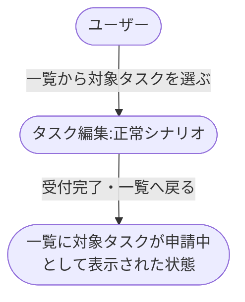

# タスク編集から申請中表示

タスクを編集して保存を申請し、受付完了が一覧に申請中として表れるまでの業務シナリオ。
承認基盤による確定は非同期のため、確定後の一覧反映は本シナリオの射程外とする。

## 正常シナリオ

### セットアップ

| セットアップ | 説明 | 補足 |
| --- | --- | --- |
| Mock | なし（実環境で実行） | - |
| タスク | 編集対象のタスクを 1 件登録済み | - |

### フロー

### 期待値

- 一覧に対象タスクが申請中として表示されている

## 異常シナリオ

なし
