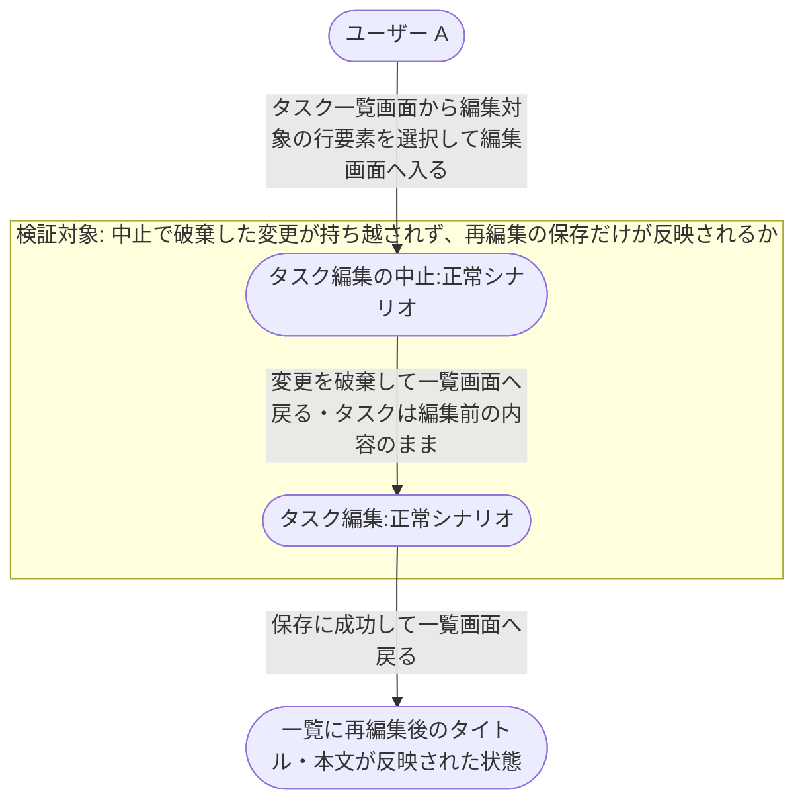
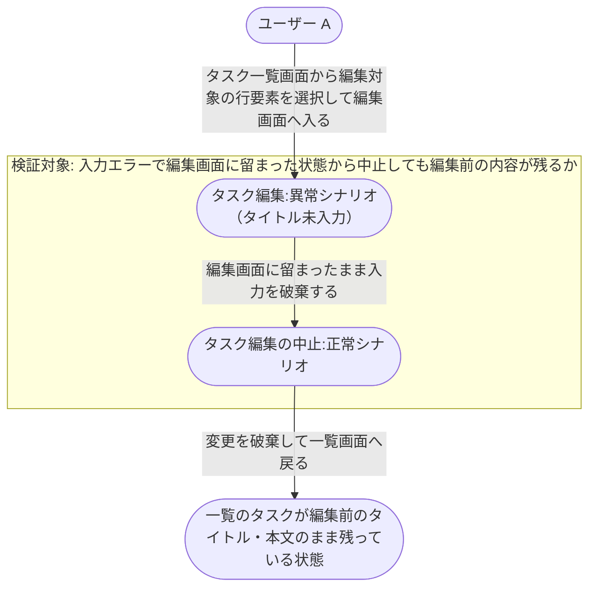

# タスク編集の中止から再編集

タスク一覧画面から編集画面へ入ったユーザーが、いったん編集を中止して一覧画面へ戻り、改めて同じタスクを編集して保存するまでの業務シナリオ。
`タスク編集の中止` と `タスク編集` の 2 つのユースケースを 1 件のタスクに対して連続で適用したときに、中止で破棄した内容が後続の編集へ持ち越されないことを確認する。

- 対応テストファイル: `tests/e2e/複合ユースケース/task_edit_cancel_then_edit.spec.ts`

## 正常シナリオ

### セットアップ

| セットアップ | 説明 | 補足 |
| --- | --- | --- |
| Mock | なし（実環境で実行） | - |
| `createUser` | ログイン中ユーザー A | - |
| `createTask` | userA が所有する編集対象のタスク | タイトル・本文とも初期値を入れておく |

### フロー

### 期待値

- タスク一覧画面に再編集後のタイトルが表示されている
- 対象タスクのタイトル・本文が再編集後の値になっている
- 中止したときに入力していた内容はタスクに反映されていない

### 補足

- 1 回目の編集画面と 2 回目の編集画面では、それぞれ別の内容をタイトル・本文に入力する。
  1 回目の入力内容が保存されていないことを 2 回目の編集画面の初期表示でも確認する。
- 各 UC ノードの内部（編集画面の入力手順・保存 API の呼び出し・一覧への戻り方）は単一ユースケース側に書く。
- 一覧画面から編集画面への遷移導線は #1070 の担当のため、本シナリオでは「一覧の行要素を選択して編集画面へ入る」ところまでを前提として扱う。

## 異常シナリオ（タイトル未入力で保存したあと編集を中止する）

### セットアップ

| セットアップ | 説明 | 補足 |
| --- | --- | --- |
| Mock | なし（実環境で実行） | - |
| `createUser` | ログイン中ユーザー A | - |
| `createTask` | userA が所有する編集対象のタスク | タイトル・本文とも初期値を入れておく |

### フロー

### 期待値

- タスク一覧画面に編集前のタイトルが表示されている
- 対象タスクのタイトル・本文が編集前の値のまま変わっていない
- タイトルを空にしたまま保存を試みた内容はタスクに反映されていない

### 補足

- タイトル未入力のまま保存を押した時点では編集画面に留まり、タイトル欄直下にインラインのエラーメッセージが表示される（PR #1072 の `## UI 設計` で確定した挙動）。
- 編集の中止では確認ダイアログを挟まず、そのまま一覧画面へ戻る。
