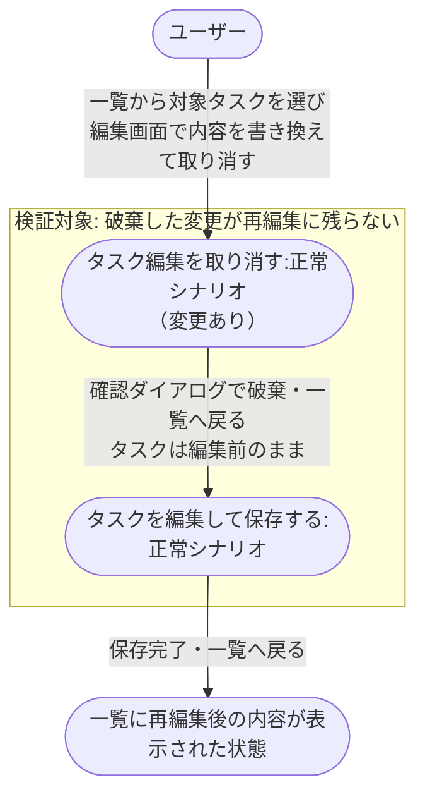
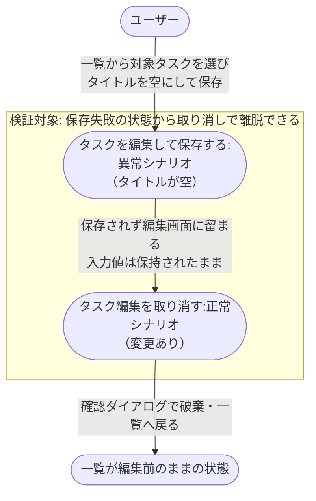

# タスク編集の取り消しから再編集保存

編集を取り消して変更を破棄したあと、あらためて編集して保存し一覧へ反映するまでの業務シナリオ。
編集画面からの離脱（取り消し）と再進入（再編集）のつなぎ目を検証する。

- 対応テストファイル: `tests/e2e/複合ユースケース/test_タスク編集の取り消しから再編集保存.py`

## 正常シナリオ

### セットアップ

| セットアップ | 説明 | 補足 |
| --- | --- | --- |
| Mock | なし（実環境で実行） | - |
| タスク | 編集対象のタスクを 1 件登録済み | タイトル・本文とも初期値を入れておく |

### フロー

### 期待値

- 一覧に再編集後のタイトルと本文が表示されている
- 取り消し時に入力していた内容は一覧にも対象タスクにも残っていない

### 補足

- 再編集で編集画面を開き直した時点の入力欄には、取り消し前の入力ではなく編集前の現在値が入っている。
- 破棄が効いているかは再編集の入力欄ではなく、最終的な一覧の表示で判定する（中間状態をアサートしない）。

## 異常シナリオ（保存に失敗した後に取り消す）

### セットアップ

| セットアップ | 説明 | 補足 |
| --- | --- | --- |
| Mock | なし（実環境で実行） | - |
| タスク | 編集対象のタスクを 1 件登録済み | タイトル・本文とも初期値を入れておく |
| 入力 | タイトルを空にして保存 | 既存 API のバリデーション失敗を決定的に誘発 |

### フロー

### 期待値

- 一覧に編集前のタイトルと本文が表示されている
- 対象タスクが編集前の内容のまま更新されていない

### 補足

- 保存失敗はエラー表示そのものではなく、失敗後も取り消し導線で離脱できて一覧が汚れないことを検証する。
- 保存失敗の表示位置・文言は単一ユースケース側の責務とする。
