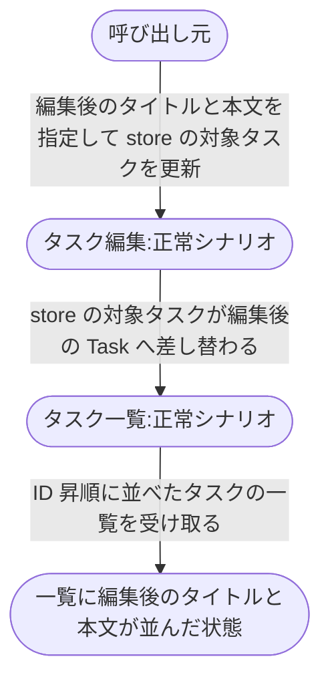
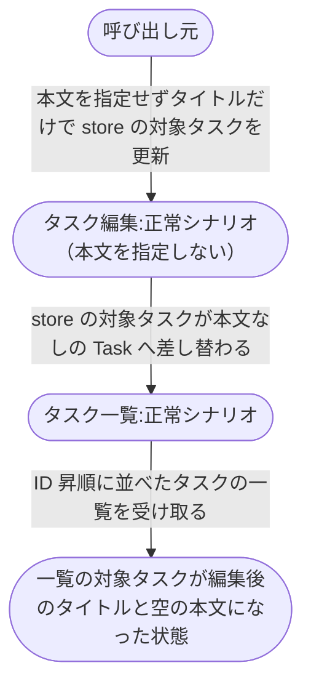
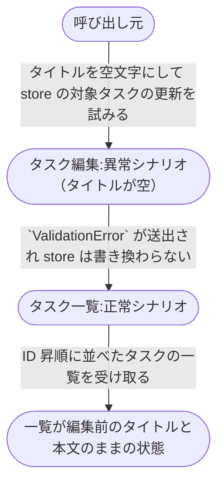
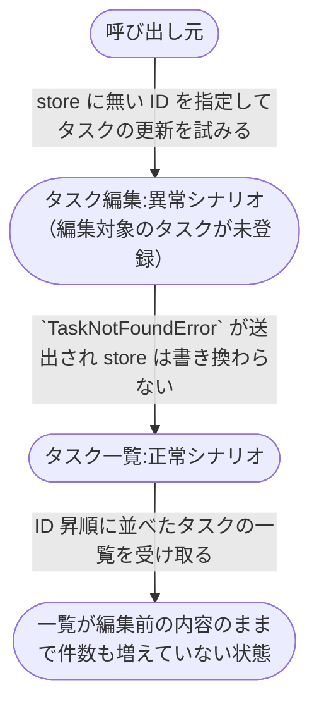

# タスク編集機能

登録済みタスクのタイトルと本文を編集し、タスク一覧に編集後の値が並ぶまでの複合ユースケース。
現状の実装（`src/tasks/service.py`）から起こした。

- 対応テストファイル: `tests/e2e/複合ユースケース/test_タスク編集から一覧反映.py`

## 正常シナリオ

### セットアップ

| セットアップ | 説明 | 補足 |
| --- | --- | --- |
| Mock | なし（実環境で実行） | - |
| `store` | `dict[str, Task]` のインメモリストア | 永続化層はなく、呼び出し元が保持する |
| `Task` | `store` に登録済みの編集対象タスク 1 件 | `id: "t1"` / `title: "旧タイトル"` / `content: "旧本文"` |

### フロー

### 期待値

- 一覧の対象タスクの `title` が編集後のタイトルになっている
- 一覧の対象タスクの `content` が編集後の本文になっている
- 一覧の対象タスクの `id` が編集前と同じ

## 正常シナリオ（本文を指定しない）

### セットアップ

| セットアップ | 説明 | 補足 |
| --- | --- | --- |
| Mock | なし（実環境で実行） | - |
| `store` | `dict[str, Task]` のインメモリストア | 永続化層はなく、呼び出し元が保持する |
| `Task` | `store` に登録済みの編集対象タスク 1 件 | `id: "t1"` / `title: "旧タイトル"` / `content: "旧本文"` |

### フロー

### 期待値

- 一覧の対象タスクの `title` が編集後のタイトルになっている
- 一覧の対象タスクの `content` が空文字になっている（編集前の本文は残らない）

## 異常シナリオ（タイトルが空）

### セットアップ

| セットアップ | 説明 | 補足 |
| --- | --- | --- |
| Mock | なし（実環境で実行） | - |
| `store` | `dict[str, Task]` のインメモリストア | 永続化層はなく、呼び出し元が保持する |
| `Task` | `store` に登録済みの編集対象タスク 1 件 | `id: "t1"` / `title: "旧タイトル"` / `content: "旧本文"` |
| 入力 | タイトルを空文字にして更新を試みる | タイトルの下限 1 文字を決定的に割る |

### フロー

### 期待値

- `ValidationError` が送出されている
- 一覧の対象タスクの `title` が編集前のタイトルのまま
- 一覧の対象タスクの `content` が編集前の本文のまま

## 異常シナリオ（編集対象のタスクが未登録）

### セットアップ

| セットアップ | 説明 | 補足 |
| --- | --- | --- |
| Mock | なし（実環境で実行） | - |
| `store` | `dict[str, Task]` のインメモリストア | 永続化層はなく、呼び出し元が保持する |
| `Task` | `store` に登録済みのタスク 1 件 | `id: "t1"` / `title: "旧タイトル"` / `content: "旧本文"` |
| 入力 | `store` に無い ID を指定して更新を試みる | 取得失敗を決定的に誘発する |

### フロー

### 期待値

- `TaskNotFoundError` が送出されている
- 一覧の件数が編集前と同じ（指定した ID のタスクは追加されていない）
- 一覧の既存タスクの `title` と `content` が編集前のまま
