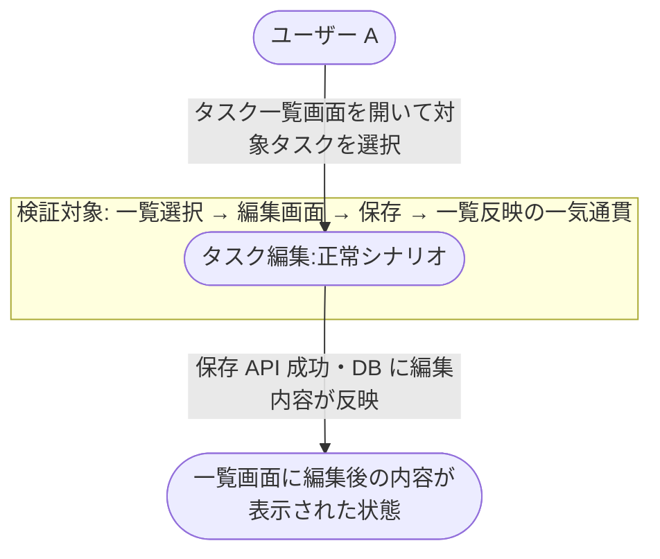
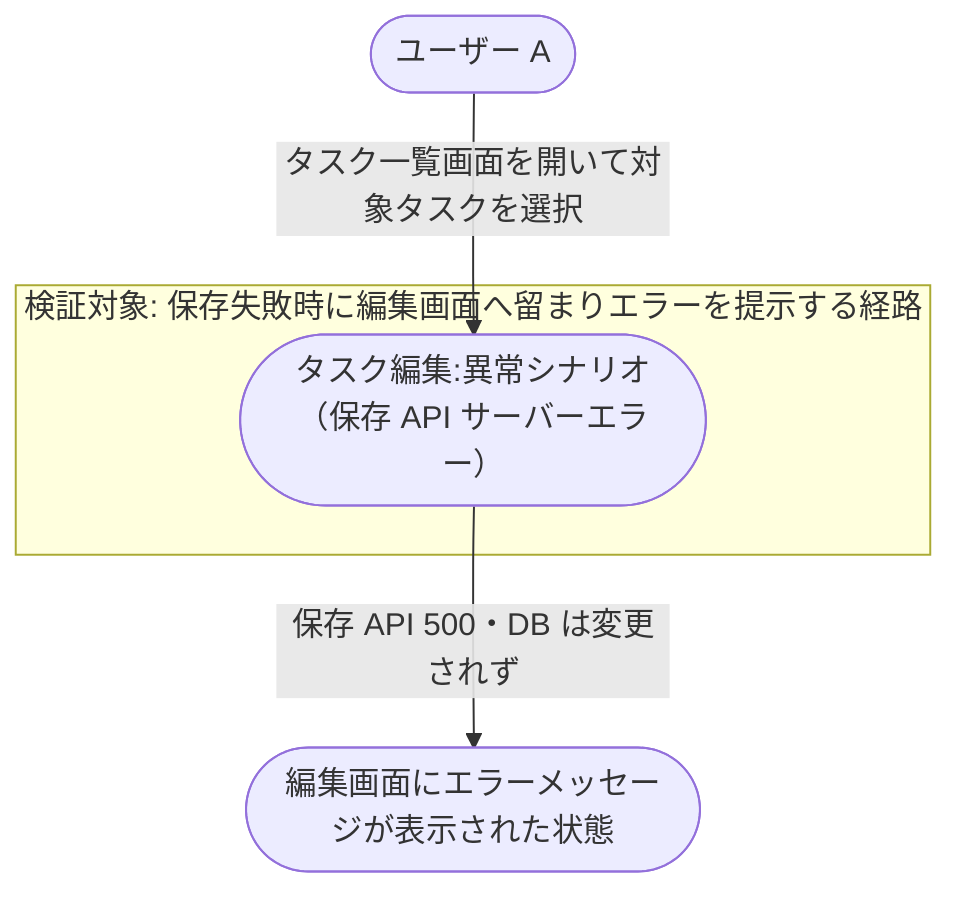

# 既存タスクの編集

ログイン済みユーザーが一覧上の既存タスクを選び、編集画面で内容を修正して保存する業務シナリオ。
epic「タスク編集機能」（#97）の [タスク編集] UC を業務フローに位置づけ、保存時に既存 API を利用する経路の妥当性を検証する。

- 対応テストファイル: `tests/e2e/複合ユースケース/task_edit.spec.ts`

## 正常シナリオ

### セットアップ

| セットアップ | 説明 | 補足 |
| --- | --- | --- |
| Mock | なし（実環境で実行） | - |
| `createUser` | ログイン中ユーザー A | - |
| `createTask` | userA が所有する編集対象タスク | 初期タイトル・本文あり |

### フロー

### 期待値

- タスク一覧画面に編集後のタイトル・本文が表示されている
- DB の対象タスクレコードが編集後の値になっている

### 補足

- セッション Cookie は全リクエストに含まれる前提
- 保存 API は既存の PUT `/tasks/{id}` を再利用する（epic 横断要件）
- 一覧 → 編集画面 → 一覧の遷移は タスク編集 UC 内で完結する（内部ステップは単一 UC 側の責務）

## 異常シナリオ（保存 API がサーバーエラーを返す）

### セットアップ

| セットアップ | 説明 | 補足 |
| --- | --- | --- |
| Mock | なし（実環境で実行） | - |
| `createUser` | ログイン中ユーザー A | - |
| `createTask` | userA が所有する編集対象タスク | 保存 API が 500 を返すよう仕込む |

### フロー

### 期待値

- 編集画面にサーバーエラー通知が表示されている
- 編集画面から遷移せず、入力中の編集内容が保持されている
- DB の対象タスクレコードが編集前の値のまま
