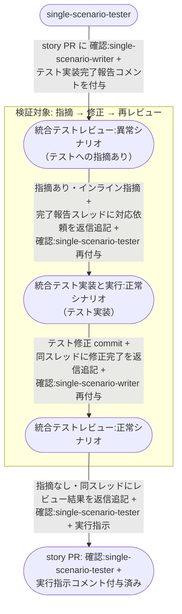

# 統合テストレビュー指摘からの修正

統合テストレビュー担当（scenario-writer）の指摘で差し戻された E2E テストコードを、指揮役と scenario-tester の直接ループで修正し、再レビューが指摘なしになるまで回す複合ユースケース。

**E2E テストの位置付け:** 指揮役と worker の AI 間ループ（指摘 → 差し戻し → 修正 → 再レビュー）がユーザー操作なしで収束することの確認。
`pytest -m e2e_recovery` 相当の個別確認で実行する。

図は単一 UC 統合テスト（story レベル）で代表する。
複合 UC 統合テスト（epic レベル）は以下を読み替えて同型。

| 図の表記 | 複合 UC での読み替え |
| --- | --- |
| single-scenario-writer | complex-scenario-writer |
| single-scenario-tester | complex-scenario-tester |
| story PR / story ブランチ | epic PR / epic ブランチ |

## 正常シナリオ

### セットアップ

| セットアップ | 説明 | 補足 |
| --- | --- | --- |
| Mock | なし（実環境で実行） | - |
| sandbox リポ状態 | story PR に `確認:single-scenario-writer` + tester のテスト実装完了報告コメント付与済み | 統合テストレビュー開始直前の状態 |
| 指摘の埋込 | E2E テストにシナリオ設計書との不整合を仕込む（回帰対象の漏れ） | 指摘 → 差し戻しを誘発 |
| ai-monitor 起動 | モニターが polling 中 | - |

### フロー

### 期待値

- 指摘 → 修正 → レビュー結果（指摘なし）の往復が tester のテスト実装完了報告コメントのスレッドに記録され、Resolve 済み
- インライン指摘が story PR に投稿されている
- E2E テストの修正 commit が story ブランチに積まれている
- story PR に `確認:single-scenario-tester` + 実行指示コメント（未解決）が付与・投稿されている
- ループ中に `議論中` / `assignee=ユーザー` の設定履歴がない（ユーザー操作なしで収束）

## 異常シナリオ

なし
