# 統合テスト失敗からのバグ修正

story レベル（単一UC E2E）の統合テスト実行時に fail が発生した場合、scenario-writer のトリアージを経て story-conductor が該当 subsystem Issue にバグを差し戻し、バグ修正フロー（修正用 PR）で修正 → 再テストで pass するまでの複合ユースケース。
epic レベル（複合UC E2E）の fail は [epic統合テスト失敗からのバグ修正](./epic統合テスト失敗からのバグ修正.md) が扱う（story を経由する 1 段ずつの中継が入るため別経路）。
バグ修正フローでは要件確定（現状調査・SA 確定・タスク一覧のユーザー確認）を通らず、差し戻し時の方針承認から修正用 PR の設計〜実装レビューに直行する。

**E2E テストの位置付け:** 「失敗経路が正しく循環すること」の確認。
実 Claude Code が「fail → バグ Issue 起票 → 修正 → pass」を回すのは非常に時間がかかるので、`pytest -m e2e_full` 側で兼ねて確認するか、`pytest -m e2e_recovery` で個別確認する。

## 正常シナリオ

### セットアップ

| セットアップ | 説明 | 補足 |
| --- | --- | --- |
| Mock | なし（実環境で実行） | - |
| sandbox リポ状態 | 全 subsystem PR が story ブランチへ merge 済み。story PR / epic PR 自体は **未マージ** で統合テスト待機中 | メインフローの統合テスト直前を想定 |
| ai-monitor プラグイン | marketplace 経由でインストール済みかつ最新版に更新済み | tmux 内の `claude "/ai-monitor:{skill}"` が前提 |
| バグ埋込 | 全 subsystem の実装に **意図的なバグ** を仕込む | E2E が fail するように |
| ai-monitor 起動 | モニターが polling 中 | - |
| ラベル状態 | story PR に `確認:single-scenario-tester` + 実行指示コメント付与済み（テスト実装 + 統合テストレビュー済み） | fail を誘発する起点 |

### フロー

```mermaid
flowchart TD
  A0([single-scenario-writer]) -->|story PR に 確認:single-scenario-tester +<br>実行指示コメントを付与| UC1

  subgraph FOCUS1["検証対象: fail → 差し戻し → 修正着手"]
    UC1([統合テスト実装と実行:異常シナリオ<br>（E2E テスト fail）]) -->|fail・確認:single-scenario-writer +<br>失敗報告| UC1B([統合テスト指揮:異常シナリオ<br>（fail・実装側の問題）])
    UC1B -->|トリアージ（実装側の問題）→<br>確認:story-conductor + 失敗報告| UC1C([統合テスト起動:正常シナリオ<br>（バグ差し戻し）])
    UC1C -->|方針承認後に該当 subsystem Issue を<br>reopen + バグ内容コメント +<br>確認:subsystem-conductor| UC2([バグ修正着手:正常シナリオ])
  end

  UC2 -->|修正用 Draft PR（base=story）+<br>確認:architect| UC4([SS設計:正常シナリオ])
  UC4 -->|設計確定 → architect が 確認:tester 付与| UC5([テスト作成:正常シナリオ])
  UC5 -->|完了報告 → architect が直接レビュー| UC5B([テストレビュー:正常シナリオ])
  UC5B -->|指摘なし → architect が<br>確認:implementer 付与| UC6([実装:正常シナリオ])
  UC6 -->|Ready 化 + 完了報告 →<br>architect が直接レビュー| UC7([実装レビュー:正常シナリオ])
  UC7 -->|一式完了報告 +<br>確認:subsystem-conductor| UC7B([マージ起動:正常シナリオ])
  UC7B -->|最終確認依頼 + 議論中 +<br>assignee=ユーザー → ユーザー承認| UC8([マージ:正常シナリオ<br>（subsystem レベル・ユーザー承認後）])
  UC8 -->|subsystem-conductor の完了報告<br>（バグ修正完了・全子 close）→<br>story-conductor が 確認:single-scenario-writer<br>付与（委任）| UC9A

  subgraph FOCUS2["検証対象: 修正マージ → 再テスト起動"]
    UC9A([統合テスト指揮:正常シナリオ<br>（再テストの実行指示）]) -->|確認:single-scenario-tester + 実行指示| UC9([統合テスト実装と実行:正常シナリオ<br>（テスト実行・全 pass）])
    UC9 -->|全 pass 報告 → writer| UC9B([統合テスト指揮:正常シナリオ<br>（全 pass の完了報告）])
  end

  UC9B -->|story-conductor へ全 pass 報告| UC10([マージ:正常シナリオ<br>（story レベル・自動）])
  UC10 -->|story-conductor がマージ実行| DONE([story PR: epic ブランチへ merged 済み])

  click UC1 "../単一ユースケース/統合テスト実装と実行.md#異常シナリオe2e-テスト-fail"
  click UC1B "../単一ユースケース/統合テスト指揮.md#異常シナリオfail実装側の問題"
  click UC1C "../単一ユースケース/統合テスト起動.md#正常シナリオバグ差し戻し"
  click UC2 "../単一ユースケース/バグ修正着手.md#正常シナリオ"
  click UC4 "../単一ユースケース/SS設計.md#正常シナリオ"
  click UC5 "../単一ユースケース/テスト作成.md#正常シナリオ"
  click UC5B "../単一ユースケース/テストレビュー.md#正常シナリオ"
  click UC6 "../単一ユースケース/実装.md#正常シナリオ"
  click UC7 "../単一ユースケース/実装レビュー.md#正常シナリオ"
  click UC7B "../単一ユースケース/マージ起動.md#正常シナリオ"
  click UC8 "../単一ユースケース/マージ.md#正常シナリオsubsystem-レベルユーザー承認後"
  click UC9A "../単一ユースケース/統合テスト指揮.md#正常シナリオ再テストの実行指示"
  click UC9 "../単一ユースケース/統合テスト実装と実行.md#正常シナリオテスト実行全-pass"
  click UC9B "../単一ユースケース/統合テスト指揮.md#正常シナリオ全-pass-の完了報告"
  click UC10 "../単一ユースケース/マージ.md#正常シナリオstory-レベル自動"
```

### 期待値

- 該当 subsystem Issue が reopen を経て再び close 済み（新規のバグ Issue は存在しない）
- 修正用 PR（`fix/{scope}/{ドメイン}/{UC名}/{変更内容}`）が story ブランチへ merge 済み
- story PR の `## 単一ユースケースシナリオテスト結果` に fail → pass の履歴が記録されている
- story PR が epic ブランチへ merged 状態になっている

## 異常シナリオ

なし
