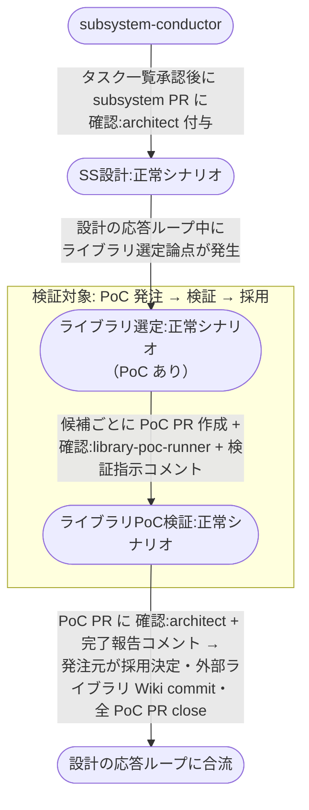

# 設計からライブラリ採用まで

subsystem の設計（SS設計）の応答ループ中にライブラリ選定論点が発生し、候補ごとの PoC を経て採用ライブラリが外部ライブラリ Wiki に反映され、設計に復帰するまでの複合ユースケース。

**E2E テストの位置付け:** architect → ライブラリ選定 → library-poc-runner の発注・完了報告・PoC PR ライフサイクル（作成 → close → セッション解放）が一気通しで回ることの確認。
`pytest -m e2e_recovery` 相当の個別確認で実行する。

## 正常シナリオ

### セットアップ

| セットアップ | 説明 | 補足 |
| --- | --- | --- |
| Mock | なし（実環境で実行） | - |
| sandbox リポ状態 | subsystem PR に `確認:architect` 付与済み・`## タスク一覧` 承認済み | SS設計 開始直前の状態 |
| ライブラリ選定論点 | SA に未経験ライブラリの採用が含まれる（PoC 要否判定カテゴリ該当） | 分岐を決定的に誘発。BE / UI ライブラリとも同経路 |
| ai-monitor 起動 | モニターが polling 中 | - |
| ユーザー役 | 観点合意 → 採用決定のコメントを pytest が投稿 | - |

### フロー

### 期待値

- 候補ごとの PoC PR が closed（マージなし）で存在し、本文に検証結果が記録されている
- 全候補の結果まとめコメントが subsystem PR に投稿されている
- `外部ライブラリ/README.md` の行と `外部ライブラリ/{lib名}.md` が subsystem ブランチに commit されている
- PoC ブランチ（ローカル / リモートとも）と PoC worktree が削除済み
- 全 library-poc-runner の tmux セッションが解放済み
- subsystem PR が `確認:architect` + `議論中` の設計応答ループ状態に戻っている

## 異常シナリオ

なし
