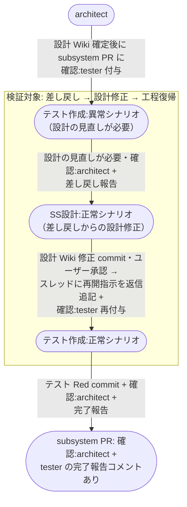
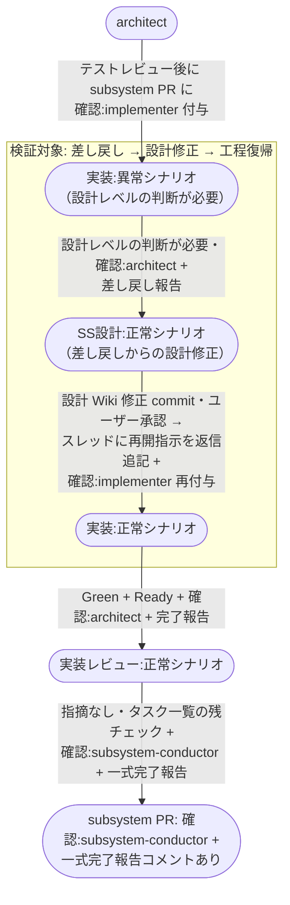

# 設計差し戻しからの設計修正

worker（tester / implementer）が設計 Wiki どおりに進められない構造問題を検知して指揮役の architect に直接差し戻し、architect が設計 Wiki を修正（ユーザー承認あり）してから元の工程に復帰するまでの複合ユースケース。

**E2E テストの位置付け:** worker 起点の差し戻し → 設計修正 → 工程復帰の循環が dead lock せず前進することの確認。
`pytest -m e2e_recovery` 相当の個別確認で実行する。

## 正常シナリオ（テスト作成の設計差し戻し）

### セットアップ

| セットアップ | 説明 | 補足 |
| --- | --- | --- |
| Mock | なし（実環境で実行） | - |
| sandbox リポ状態 | subsystem PR に `確認:tester` 付与済み・設計 Wiki 確定済み | テスト作成開始直前の状態 |
| 矛盾の埋込 | 設計 Wiki のモジュール構成に、テストを書けない構造矛盾を仕込む（呼び出し先のないシグネチャ） | 設計の見直しを誘発 |
| ai-monitor 起動 | モニターが polling 中 | - |
| ユーザー役 | 設計 Wiki 修正の承認（`議論中` 除去）を pytest が実施 | - |

### フロー

### 期待値

- tester の差し戻し報告コメントのスレッドに architect の修正内容（修正 commit の ID）と再開指示が返信追記され、tester の処理を経て Resolve 済み
- 設計 Wiki の修正 commit が subsystem ブランチに積まれている（修正はユーザー承認済み）
- 修正後の設計 Wiki に基づくテストコード（Red）とテスト結果表のファイル名行が存在する
- subsystem PR に `確認:architect` + tester の完了報告コメント（未解決）が付与・投稿されている
- 循環経路（差し戻し → 設計修正 → テスト再作成）の全ラベル遷移が完了している（`確認:tester` / `確認:architect` が多重に残っていない）

## 正常シナリオ（実装の設計差し戻し）

### セットアップ

| セットアップ | 説明 | 補足 |
| --- | --- | --- |
| Mock | なし（実環境で実行） | - |
| sandbox リポ状態 | subsystem PR に `確認:implementer` 付与済み・テスト Red + テストレビュー済み | 実装開始直前の状態 |
| 矛盾の埋込 | 設計 Wiki のモジュール構成に、実装できない設計矛盾を仕込む（相互参照するモジュール分割） | 設計レベルの判断を誘発。テストコードには影響しない範囲 |
| ai-monitor 起動 | モニターが polling 中 | - |
| ユーザー役 | 設計 Wiki 修正の承認（`議論中` 除去）を pytest が実施 | - |

### フロー

### 期待値

- implementer の差し戻し報告コメントのスレッドに architect の修正内容（修正 commit の ID）と再開指示が返信追記され、implementer の処理を経て Resolve 済み
- 設計 Wiki の修正 commit が subsystem ブランチに積まれている（修正はユーザー承認済み）
- 修正後の設計 Wiki に基づく実装 commit が積まれ、テスト結果表が全 ✅・PR が Ready 状態
- `## タスク一覧` の全行がチェック済み
- subsystem PR に `確認:subsystem-conductor` + 一式完了報告コメント（未解決）が付与・投稿されている
- 循環経路（差し戻し → 設計修正 → 実装再開）の全ラベル遷移が完了している（`確認:implementer` / `確認:architect` が多重に残っていない）

## 異常シナリオ

なし
