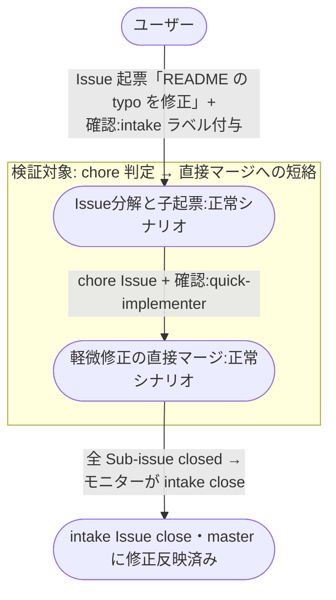

# 軽微修正の短絡マージ

typo 修正 / コメント修正 / ログレベル変更 等の軽微 Issue が intake で `chore` 判定され、`quick-implementer` によって epic / story / subsystem レイヤーを飛ばして直接 master にマージされるまでの複合ユースケース。

**E2E テストの位置付け:** メインフローよりずっと短い（5〜10 分程度）。
CI で回してもいい軽量シナリオ。
`pytest -m e2e_short` タグ。

## 正常シナリオ

### セットアップ

| セットアップ | 説明 | 補足 |
| --- | --- | --- |
| Mock | なし（実環境で実行） | - |
| sandbox リポ存在 | `shuhei1101/ai-monitor-e2e` が存在 | Pages 有効 |
| ai-monitor プラグイン | marketplace 経由でインストール済みかつ最新版に更新済み | tmux 内の `claude "/ai-monitor:{skill}"` が前提 |
| ラベル定義 | `AI_MONITOR_LABEL_*` 全て作成済み | - |
| 修正対象コード | sandbox に軽微修正対象のファイルが存在（例: typo を含む README） | テストで意図的に typo を仕込む |
| ai-monitor 起動 | モニターが sandbox を polling 中 | - |
| ユーザーログイン | write 権限あり | - |

### フロー

### 期待値

- intake Issue も chore Issue も close 済み
- sandbox master に対象修正の commit が入っている（`gh api repos/O/R/commits/master` の diff で確認）
- 対応 chore ブランチが sandbox から削除済み（`gh api repos/O/R/branches/chore/{分類}/{変更内容}` が 404）
- worktree ディレクトリが モニターローカルから削除済み

## 異常シナリオ

なし
