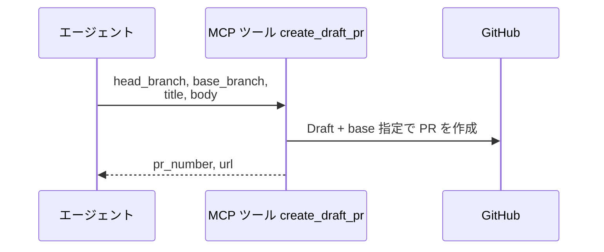
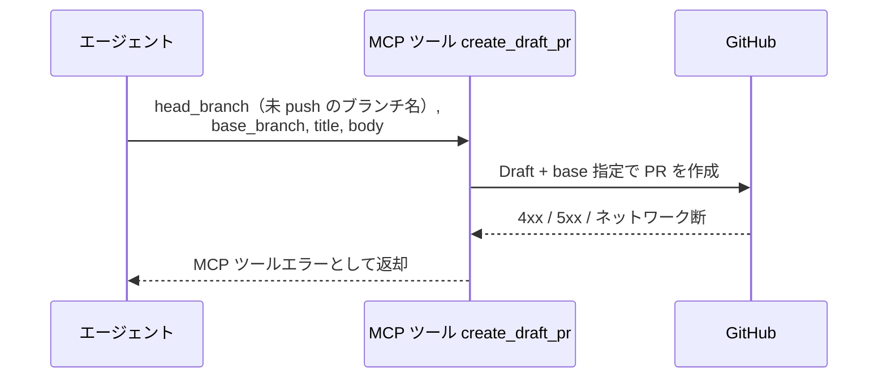

# DraftPR作成

MCP ツール: `create_draft_pr`

Draft PR を作成する（Stacked PR の base 明示に対応）。
conductor の完了処理での Draft PR 作成（`base=master` / `base=親ブランチ`）はこのツールを使う。

- 対応テストファイル: `tests/integration/mcp/test_create_draft_pr.py`

## インターフェース

### リクエスト

| パラメータ | 型 | 必須 | デフォルト | 説明 | 制限 | 補足 |
| --- | --- | --- | --- | --- | --- | --- |
| `head_branch` | str | ✅ | - | head ブランチ名 | - | 命名は `規約/ブランチ戦略.md`・リモート push 済みが前提 |
| `base_branch` | str | ✅ | - | base ブランチ名 | - | Stacked PR 用（epic は `master`・story は epic ブランチ・subsystem は story ブランチ） |
| `title` | str | ✅ | - | PR タイトル | - | - |
| `body` | str | ✅ | - | PR 本文 | - | 作成時は `## 紐づく Issue` のみの運用 |

リクエスト例:

```json
{
  "head_branch": "feat/backend/profile/edit/edit-api",
  "base_branch": "feat/story/profile/edit",
  "title": "プロフィール編集 API",
  "body": "## 紐づく Issue\n\n- #50"
}
```

### レスポンス

| フィールド | 型 | 説明 | 制限 | 補足 |
| --- | --- | --- | --- | --- |
| `pr_number` | int | 作成した PR 番号 | - | - |
| `url` | str | PR の html URL | - | - |

レスポンス例:

```json
{
  "pr_number": 52,
  "url": "https://github.com/{owner}/{repo}/pull/52"
}
```

## 制約

| 項目 | 制約 | 補足 |
| --- | --- | --- |
| タイムアウト | 制限なし | - |

## フロー一覧

| 分類 | フロー名 | 概要 | 補足 |
| --- | --- | --- | --- |
| 正常 | 正常系 | Draft + base 指定で PR を作成 → 番号 / URL 返却 | - |
| 異常 | 異常系（API エラー） | 認証切れ / 未 push ブランチ / ネットワーク断 | - |

## 正常系

### セットアップ

| セットアップ | 説明 | 補足 |
| --- | --- | --- |
| Mock | GitHub API を差し替え（正常応答を返す） | - |
| head ブランチ | commit を積んでリモートに push 済み | 空 commit push → 本ツールの順 |
| base ブランチ | リモートに存在 | Stacked PR の親 |

### フロー



### 期待値

- Draft 状態の PR が指定の base / head / タイトル / 本文で作成されている
- 戻り値の `pr_number` / `url` が作成した PR を指している

## 異常系（API エラー）

### セットアップ

| セットアップ | 説明 | 補足 |
| --- | --- | --- |
| Mock | GitHub API を差し替え（4xx / 5xx を返す） | - |
| 入力 | リモートに存在しない head ブランチ名を指定して呼び出す | API エラーを決定的に誘発 |

### フロー



### 期待値

- MCP ツールエラーが返る（HTTP ステータスと本文を含む）
- PR は作成されていない
