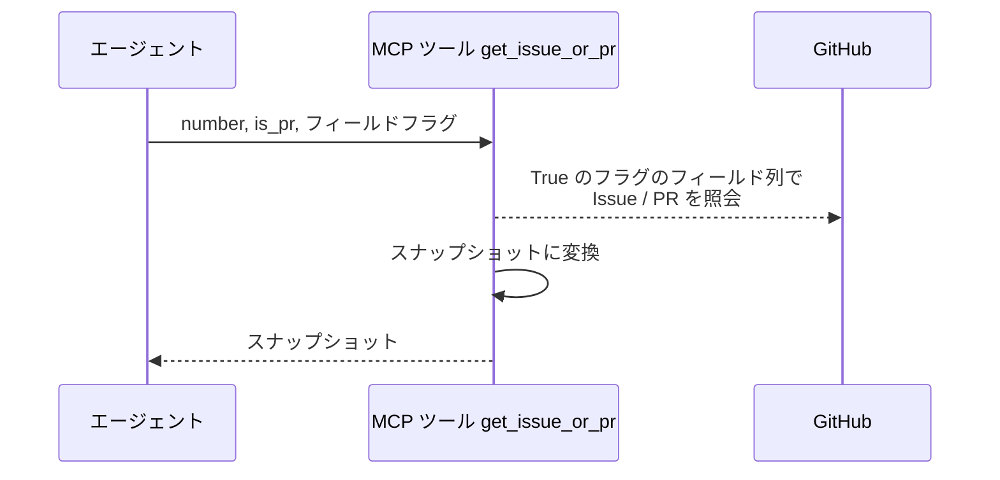
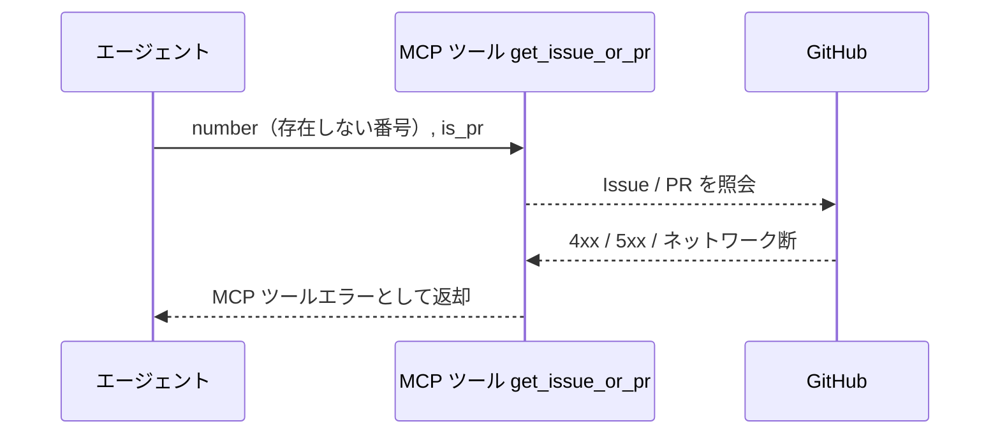

# Issue・PR情報取得

MCP ツール: `get_issue_or_pr`

Issue / PR の情報を 1 コマンドで取得する。
各 bool フラグで欲しいフィールドだけに絞れる（デフォルト全 `True`）。
エージェントの毎ターン再同期（最新の Issue / PR 状態の取得）はこのツールを使う。

- 対応テストファイル: `tests/integration/mcp/test_get_issue_or_pr.py`

## インターフェース

### リクエスト

| パラメータ | 型 | 必須 | デフォルト | 説明 | 制限 | 補足 |
| --- | --- | --- | --- | --- | --- | --- |
| `number` | int | ✅ | - | 対象の Issue / PR 番号 | - | - |
| `is_pr` | bool | ✅ | - | PR なら `True` | - | - |
| `title` | bool | - | `True` | title を取得するか | - | - |
| `body` | bool | - | `True` | body を取得するか | - | - |
| `url` | bool | - | `True` | url を取得するか | - | - |
| `state` | bool | - | `True` | state を取得するか | - | `open` / `closed` |
| `closed` | bool | - | `True` | closed を取得するか | - | - |
| `closed_at` | bool | - | `True` | closedAt を取得するか | - | - |
| `created_at` | bool | - | `True` | createdAt を取得するか | - | - |
| `updated_at` | bool | - | `True` | updatedAt を取得するか | - | - |
| `labels` | bool | - | `True` | labels を取得するか | - | - |
| `comments` | bool | - | `True` | comments を取得するか | - | - |
| `assignees` | bool | - | `True` | assignees を取得するか | - | - |
| `author` | bool | - | `True` | author を取得するか | - | - |
| `parent` | bool | - | `True` | parent を取得するか | - | Sub-issue リンクの親 |
| `sub_issues` | bool | - | `True` | subIssues を取得するか | - | Sub-issue リンクの子一覧 |
| `sub_issues_summary` | bool | - | `True` | subIssuesSummary を取得するか | - | 子の完了集計 |

リクエスト例:

```json
{
  "number": 35,
  "is_pr": false,
  "body": false,
  "comments": false
}
```

### レスポンス

指定しなかった / GitHub 側で欠落しているフィールドは `null`。

| フィールド | 型 | 説明 | 制限 | 補足 |
| --- | --- | --- | --- | --- |
| `number` | int | Issue / PR 番号 | - | - |
| `title` | str | タイトル | - | - |
| `body` | str | 本文 | - | - |
| `url` | str | html URL | - | - |
| `state` | `"OPEN"` \| `"CLOSED"` \| `"MERGED"` | 開閉状態 | - | `MERGED` は PR のみ |
| `closed` | bool | クローズ済みか | - | - |
| `closed_at` | str | クローズ日時（ISO 8601） | - | - |
| `created_at` | str | 作成日時 | - | - |
| `updated_at` | str | 更新日時 | - | - |
| `labels[].name` | str | ラベル名 | - | `id` / `color` / `description` も返る |
| `comments[].id` | str | コメントの node_id | - | Resolve / 返信の対象指定に使う |
| `comments[].body` | str | コメント本文 | - | - |
| `comments[].created_at` | str | 投稿日時 | - | - |
| `comments[].author.login` | str | 投稿者ログイン名 | - | - |
| `comments[].url` | str | コメントの html URL | - | - |
| `comments[].is_minimized` | bool | Resolved 済みか | - | - |
| `assignees[].login` | str | assignee のログイン名 | - | 空配列 = 未設定 |
| `author.login` | str | 起票者のログイン名 | - | - |
| `parent.number` | int | 親 Issue 番号 | - | `title` / `url` / `state` も返る |
| `sub_issues[].number` | int | 子 Issue 番号 | - | `title` / `url` / `state` も返る |
| `sub_issues_summary.total` | int | 子 Issue の総数 | - | - |
| `sub_issues_summary.completed` | int | クローズ済みの子 Issue 数 | - | - |
| `sub_issues_summary.percent_completed` | float | 完了率 | - | - |

レスポンス例:

```json
{
  "number": 35,
  "title": "プロフィール編集機能",
  "url": "https://github.com/{owner}/{repo}/issues/35",
  "state": "OPEN",
  "labels": [{ "name": "layer:epic" }, { "name": "確認:epic-conductor" }],
  "assignees": [],
  "author": { "login": "shuhei1101" },
  "parent": { "number": 12 },
  "sub_issues": [{ "number": 36, "state": "OPEN" }],
  "sub_issues_summary": { "total": 2, "completed": 1, "percent_completed": 50.0 }
}
```

## 制約

| 項目 | 制約 | 補足 |
| --- | --- | --- |
| タイムアウト | 制限なし | - |

## フロー一覧

| 分類 | フロー名 | 概要 | 補足 |
| --- | --- | --- | --- |
| 正常 | 正常系 | Issue / PR を取得 → スナップショット組み立て | - |
| 異常 | 異常系（API エラー） | 認証切れ / 対象不存在 / ネットワーク断 | - |

## 正常系

### セットアップ

| セットアップ | 説明 | 補足 |
| --- | --- | --- |
| Mock | GitHub API を差し替え（正常応答を返す） | - |
| 対象 Issue | ラベル・コメント・Sub-issue を持つ Issue が存在 | 各フィールドの検証用 |

### フロー



### 期待値

- `True` を指定したフィールドがスナップショットに入っている
- `False` を指定したフィールドが `null` になっている

## 異常系（API エラー）

### セットアップ

| セットアップ | 説明 | 補足 |
| --- | --- | --- |
| Mock | GitHub API を差し替え（4xx / 5xx を返す） | - |
| 対象番号 | 存在しない番号を指定して呼び出す | API エラーを決定的に誘発 |

### フロー



### 期待値

- MCP ツールエラーが返る（HTTP ステータスと本文を含む）
