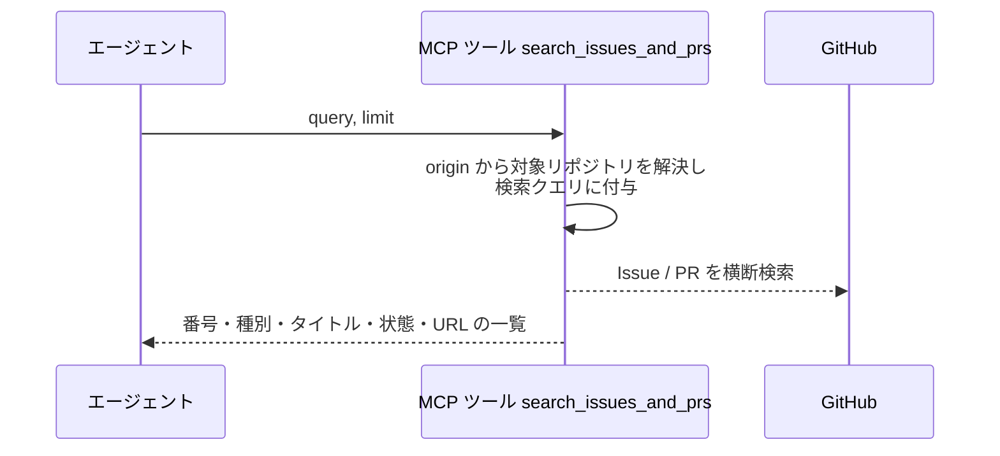
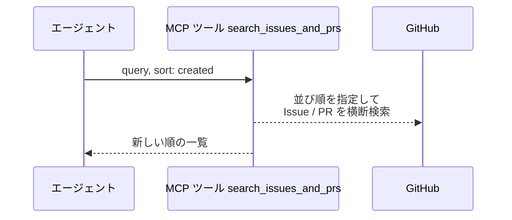
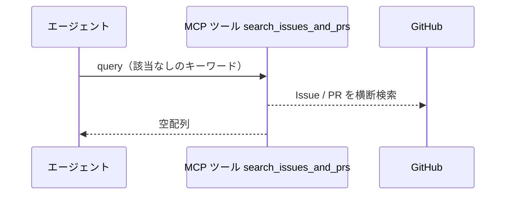
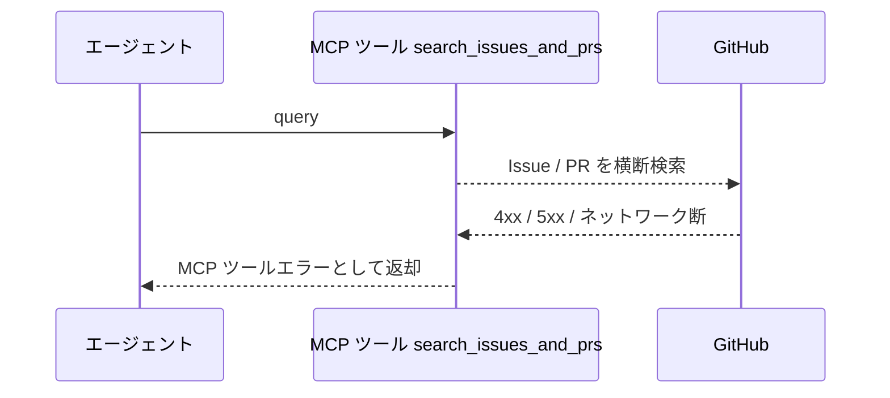

# Issue・PR検索

MCP ツール: `search_issues_and_prs`

キーワードでリポジトリ内の Issue / PR を横断検索し、関連度順の一覧を返す。
エージェントの関連 Issue / PR 調査（依存・重複候補の洗い出し）はこのツールを使う。

- 対応テストファイル: `tests/integration/mcp/test_search_issues_and_prs.py`

## インターフェース

### リクエスト

| パラメータ | 型 | 必須 | デフォルト | 説明 | 制限 | 補足 |
| --- | --- | --- | --- | --- | --- | --- |
| `query` | str | ✅ | - | 検索キーワード | OR・正規表現は不可（GitHub Issue 検索の仕様。別系統のキーワードは呼び出しを分ける） | スペース区切りは AND（例: `プロフィール 編集`）。`"..."` は語順込みのフレーズ一致。`in:title` / `label:` / `author:` 等の GitHub search 修飾子可。Issue だけ / PR だけに絞る場合は `is:issue` / `is:pr` を含める。対象リポジトリは CWD の origin から解決して自動付与する |
| `sort` | `"comments"` \| `"reactions"` \| `"reactions-+1"` \| `"reactions--1"` \| `"reactions-smile"` \| `"reactions-thinking_face"` \| `"reactions-heart"` \| `"reactions-tada"` \| `"interactions"` \| `"created"` \| `"updated"` | - | なし（関連度順） | 並び順 | - | 外部 API の `sort` をそのまま渡す |
| `order` | `"desc"` \| `"asc"` | - | `"desc"` | 昇順 / 降順 | - | `sort` 指定時のみ有効 |
| `limit` | int | - | `10` | 最大取得件数 | 1〜100 | 外部 API の `per_page` に渡す |
| `page` | int | - | `1` | ページ番号 | - | - |

リクエスト例:

```json
{
  "query": "\"プロフィール編集\" in:title is:issue",
  "sort": "created",
  "order": "desc",
  "limit": 10
}
```

### レスポンス

検索結果の配列（open / closed とも含む・並びは `sort` 指定に従う）。

| フィールド | 型 | 説明 | 制限 | 補足 |
| --- | --- | --- | --- | --- |
| `[].number` | int | Issue / PR 番号 | - | - |
| `[].is_pr` | bool | PR なら `true` | - | - |
| `[].title` | str | タイトル | - | - |
| `[].state` | `"open"` \| `"closed"` | 状態 | - | - |
| `[].url` | str | html URL | - | - |

レスポンス例:

```json
[
  { "number": 35, "is_pr": false, "title": "プロフィール編集機能", "state": "open", "url": "https://github.com/{owner}/{repo}/issues/35" },
  { "number": 52, "is_pr": true, "title": "プロフィール編集 API", "state": "closed", "url": "https://github.com/{owner}/{repo}/pull/52" }
]
```

## 制約

| 項目 | 制約 | 補足 |
| --- | --- | --- |
| タイムアウト | 制限なし | - |
| 検索範囲 | CWD の origin リポジトリのみ | クロスリポジトリ検索はしない |

## フロー一覧

| 分類 | フロー名 | 概要 | 補足 |
| --- | --- | --- | --- |
| 正常 | 正常系 | キーワード検索 → 関連度順の一覧返却 | - |
| 正常 | 正常系（並び順指定） | `sort` 指定が検索 API に渡り新しい順で返る | - |
| 正常 | 正常系（ヒットなし） | 該当なしで空配列を返す | - |
| 異常 | 異常系（API エラー） | 認証切れ / レート制限 / ネットワーク断 | - |

## 正常系

### セットアップ

| セットアップ | 説明 | 補足 |
| --- | --- | --- |
| Mock | GitHub API を差し替え（Issue 1 件 + PR 1 件の検索結果を返す） | - |

### フロー



### 期待値

- 検索クエリに対象リポジトリの絞り込みが付与されている
- Issue / PR が混在した一覧が関連度順で返り、各要素に番号・種別・タイトル・状態・URL が入っている

## 正常系（並び順指定）

### セットアップ

| セットアップ | 説明 | 補足 |
| --- | --- | --- |
| Mock | GitHub API を差し替え（作成日時の異なる 2 件の検索結果を返す） | - |
| 入力 | `sort: "created"` を指定して呼び出す | 並び順の分岐を決定的に誘発 |

### フロー



### 期待値

- 検索 API に並び順の指定（作成日時・降順）が渡っている
- 一覧が新しい順で返る

## 正常系（ヒットなし）

### セットアップ

| セットアップ | 説明 | 補足 |
| --- | --- | --- |
| Mock | GitHub API を差し替え（0 件の検索結果を返す） | - |
| 入力 | どの Issue / PR にも含まれないキーワードで呼び出す | ヒットなしを決定的に誘発 |

### フロー



### 期待値

- 空配列が返る（エラーにならない）

## 異常系（API エラー）

### セットアップ

| セットアップ | 説明 | 補足 |
| --- | --- | --- |
| Mock | GitHub API を差し替え（4xx / 5xx を返す） | - |

### フロー



### 期待値

- MCP ツールエラーが返る（HTTP ステータスと本文を含む）
