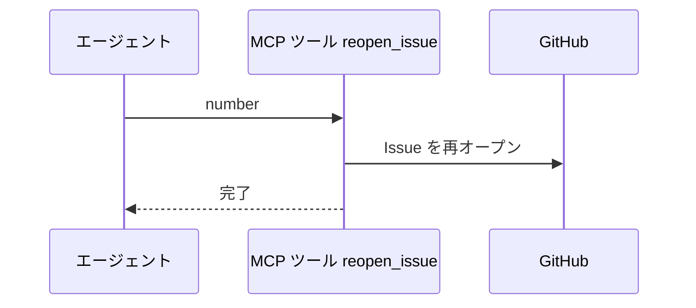
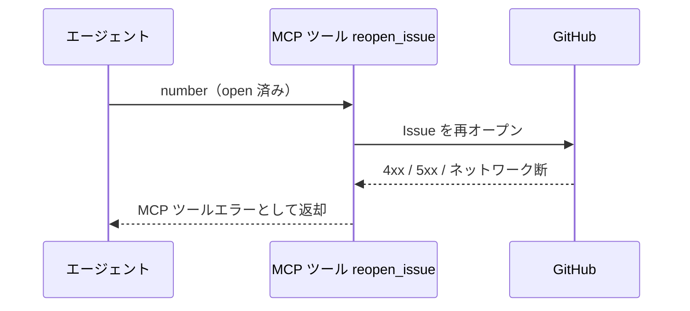

# Issue再オープン

MCP ツール: `reopen_issue`

クローズ済みの Issue を再オープンする。
統合テスト fail 時のバグ差し戻し（conductor が該当 subsystem Issue を reopen + バグ内容コメント + `確認:subsystem-conductor` 付与）はこのツールを使う。

- 対応テストファイル: `tests/integration/mcp/test_reopen_issue.py`

## インターフェース

### リクエスト

| パラメータ | 型 | 必須 | デフォルト | 説明 | 制限 | 補足 |
| --- | --- | --- | --- | --- | --- | --- |
| `number` | int | ✅ | - | 対象の Issue 番号 | - | Issue のみ対象（PR の reopen はワークフロー上存在しない） |

リクエスト例:

```json
{
  "number": 50
}
```

### レスポンス

| フィールド | 型 | 説明 | 制限 | 補足 |
| --- | --- | --- | --- | --- |
| なし | - | 空オブジェクト | - | 副作用のみ |

レスポンス例:

```json
{}
```

## 制約

| 項目 | 制約 | 補足 |
| --- | --- | --- |
| タイムアウト | 制限なし | - |

## フロー一覧

| 分類 | フロー名 | 概要 | 補足 |
| --- | --- | --- | --- |
| 正常 | 正常系 | state=open + state_reason=reopened で更新 | - |
| 異常 | 異常系（API エラー） | 認証切れ / open 済み / ネットワーク断 | - |

## 正常系

### セットアップ

| セットアップ | 説明 | 補足 |
| --- | --- | --- |
| Mock | GitHub API を差し替え（正常応答を返す） | - |
| 対象 Issue | closed の Issue が存在 | バグ差し戻しの対象 |

### フロー



### 期待値

- Issue が open に戻っている

## 異常系（API エラー）

### セットアップ

| セットアップ | 説明 | 補足 |
| --- | --- | --- |
| Mock | GitHub API を差し替え（4xx / 5xx を返す） | - |
| 入力 | open 済みの番号を指定して呼び出す | API エラーを決定的に誘発 |

### フロー



### 期待値

- MCP ツールエラーが返る（HTTP ステータスと本文を含む）
